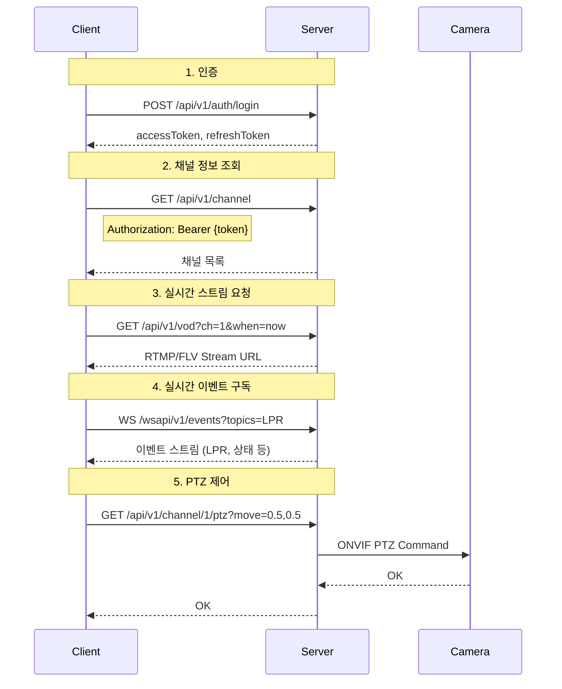
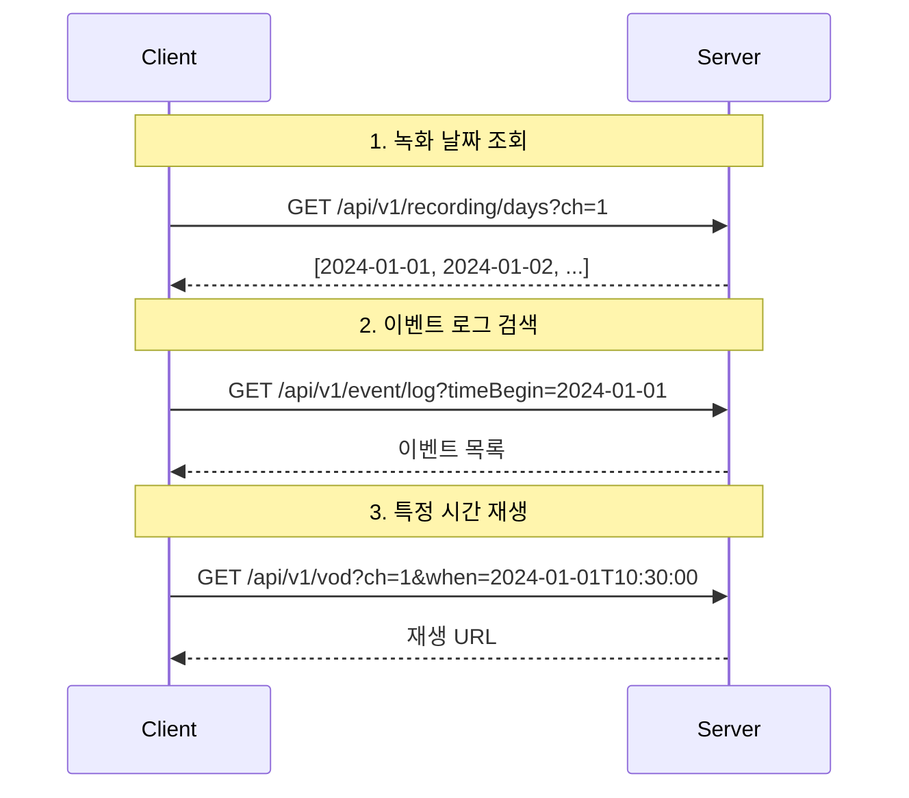
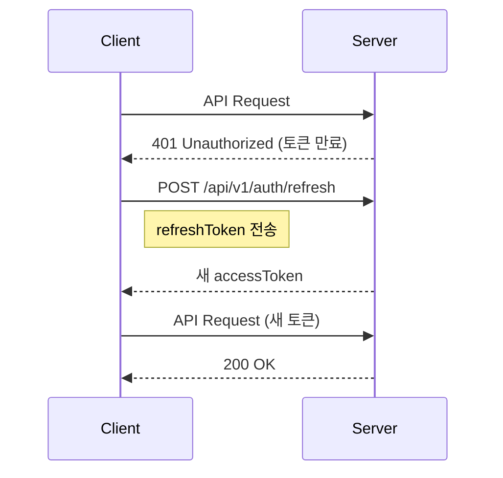
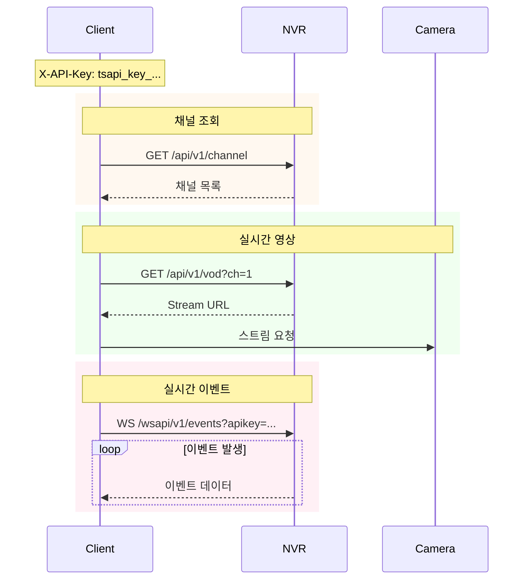
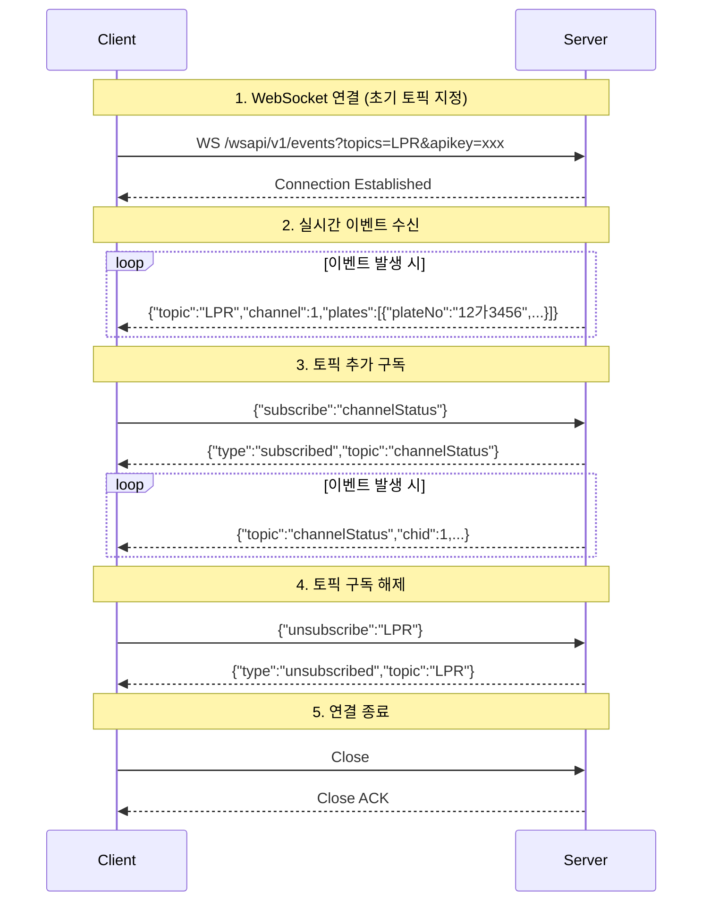
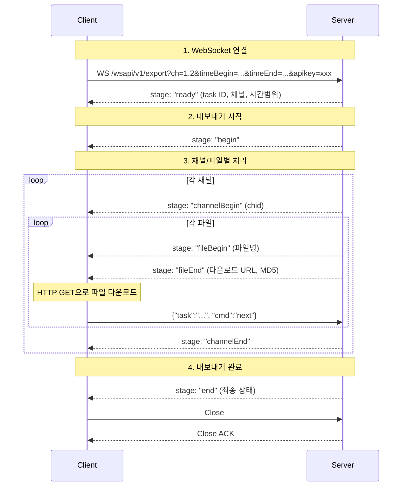

# TS-API v1 Programming Guide

[English](tsapi-v1.md) | **한국어**

> **관련 문서:** [마이그레이션 가이드](MIGRATION.ko.md) · [변경이력](CHANGELOG.ko.md)

## 목차

1. [개요](#1-개요)
2. [API 호출 흐름](#2-api-호출-흐름)
   - [2.1. 기본 흐름 (JWT 인증)](#21-기본-흐름-jwt-인증)
   - [2.2. 녹화 검색 및 재생 흐름](#22-녹화-검색-및-재생-흐름)
   - [2.3. 토큰 갱신 흐름](#23-토큰-갱신-흐름)
   - [2.4. API Key 흐름 (로그인 불필요)](#24-api-key-흐름-로그인-불필요)
3. [인증](#3-인증)
   - [3.1. 인증 방식별 적용 범위](#31-인증-방식별-적용-범위)
   - [3.2. API Key 권한 모델](#32-api-key-권한-모델)
   - [3.3. JWT 인증](#33-jwt-인증)
   - [3.4. Storage / 미디어 파일 인증](#34-storage--미디어-파일-인증)
   - [3.5. API Key 인증](#35-api-key-인증)
4. [서버 정보](#4-서버-정보)
5. [시스템](#5-시스템)
   - [5.1. 시스템 정보](#51-시스템-정보)
   - [5.2. 시스템 상태](#52-시스템-상태)
   - [5.3. HDD S.M.A.R.T](#53-hdd-smart)
   - [5.4. 시스템 제어](#54-시스템-제어)
6. [채널](#6-채널)
   - [6.1. 채널 목록](#61-채널-목록)
   - [6.2. 채널 상태](#62-채널-상태)
   - [6.3. 채널 정보](#63-채널-정보)
   - [6.4. 채널 추가](#64-채널-추가)
   - [6.5. 채널 삭제](#65-채널-삭제)
7. [채널 제어](#7-채널-제어)
   - [7.1. PTZ 제어](#71-ptz-제어)
   - [7.2. 프리셋](#72-프리셋)
   - [7.3. 릴레이 출력](#73-릴레이-출력)
   - [7.4. 보조 출력](#74-보조-출력)
   - [7.5. 카메라 재부팅](#75-카메라-재부팅)
8. [녹화](#8-녹화)
   - [8.1. 녹화 날짜](#81-녹화-날짜)
   - [8.2. 녹화 시간 (분 단위)](#82-녹화-시간-분-단위)
9. [이벤트](#9-이벤트)
   - [9.1. 이벤트 유형](#91-이벤트-유형)
   - [9.2. 실시간 이벤트 토픽](#92-실시간-이벤트-토픽)
   - [9.3. 이벤트 로그](#93-이벤트-로그)
   - [9.4. 이벤트 트리거 (이벤트 백업)](#94-이벤트-트리거-이벤트-백업)
10. [LPR (차량 번호 인식)](#10-lpr-차량-번호-인식)
    - [10.1. LPR 소스 (인식 지점/영역)](#101-lpr-소스-인식-지점영역)
    - [10.2. LPR 로그](#102-lpr-로그)
    - [10.3. 유사 번호판 검색](#103-유사-번호판-검색)
11. [객체 감지](#11-객체-감지)
    - [11.1. 객체 유형](#111-객체-유형)
    - [11.2. 객체 속성](#112-객체-속성)
    - [11.3. 객체 로그](#113-객체-로그)
12. [얼굴 검색](#12-얼굴-검색)
    - [12.1. 이미지로 검색](#121-이미지로-검색)
    - [12.2. 시간 범위로 검색](#122-시간-범위로-검색)
13. [VOD](#13-vod)
    - [13.1. 스트림 URL](#131-스트림-url)
    - [13.2. 재생 URL](#132-재생-url)
    - [13.3. Watch 페이지 (임베드 플레이어)](#133-watch-페이지-임베드-플레이어)
14. [비상호출](#14-비상호출)
    - [14.1. 비상 호출 장치 목록](#141-비상-호출-장치-목록)
15. [Push (LPR 카메라, 비상벨 연동)](#15-push-lpr-카메라-비상벨-연동)
    - [15.1. 푸시 이벤트 전송](#151-푸시-이벤트-전송)
16. [주차](#16-주차)
    - [16.1. 주차장 목록](#161-주차장-목록)
    - [16.2. 주차장 상태](#162-주차장-상태)
    - [16.3. 주차면 목록](#163-주차면-목록)
    - [16.4. 주차면 상태](#164-주차면-상태)
17. [실시간 이벤트 구독 (WebSocket API)](#17-실시간-이벤트-구독-websocket-api)
    - [17.1. 연결 흐름](#171-websocket-연결-흐름)
    - [17.2. 엔드포인트](#172-엔드포인트)
    - [17.3. 인증](#173-인증)
    - [17.4. 이벤트 구독](#174-이벤트-구독)
18. [데이터 내보내기 — 녹화 데이터 백업 (WebSocket API)](#18-데이터-내보내기--녹화-데이터-백업-websocket-api)
    - [18.1. 내보내기 흐름](#181-내보내기-흐름)
    - [18.2. 엔드포인트](#182-엔드포인트)

**부록**
- [A. 오류 코드](#a-오류-코드)
- [B. 시간 형식](#b-시간-형식)
- [C. 예제 코드](#c-예제-코드)
  - [curl](#curl)
  - [JavaScript](#javascript)
  - [Python](#python)
  - [C#](#c-sharp)
  - [Go](#go)
  - [Java](#java)
  - [Kotlin](#kotlin)
  - [Swift](#swift)
  - [PowerShell](#powershell)

---

## 1. 개요

TS-API v1은 RESTful 경로 기반의 API입니다.

**Base URL**: `http://{host}:{port}/api/v1`

**Content-Type**: `application/json`

> **참고**: API 전체에서 채널 번호(`ch`, `chid`)는 1부터 시작합니다 (1-based).

---

## 2. API 호출 흐름

### 2.1. 기본 흐름 (JWT 인증)



**단계별 설명:**

| 단계 | 설명 |
|------|------|
| **1. 인증** | 사용자 ID와 비밀번호로 로그인합니다. 서버는 `accessToken`(API 호출용)과 `refreshToken`(토큰 갱신용)을 반환합니다. |
| **2. 채널 정보 조회** | `Authorization: Bearer {accessToken}` 헤더를 포함하여 등록된 카메라 채널 목록을 조회합니다. |
| **3. 실시간 스트림 요청** | VOD API로 특정 채널의 실시간 영상 스트림 URL을 요청합니다. 반환된 URL로 FLV/RTMP 플레이어에서 재생합니다. |
| **4. 실시간 이벤트 구독** | WebSocket으로 실시간 이벤트(LPR, 상태변경 등)를 수신합니다. 연결 시 `topics` 파라미터로 구독할 이벤트를 지정합니다. |
| **5. PTZ 제어** | 카메라의 팬/틸트/줌을 제어합니다. 서버가 ONVIF 프로토콜로 카메라에 명령을 전달합니다. |

### 2.2. 녹화 검색 및 재생 흐름



**단계별 설명:**

| 단계 | 설명 |
|------|------|
| **1. 녹화 날짜 조회** | 특정 채널의 녹화가 존재하는 날짜 목록을 조회합니다. 캘린더 UI 등에서 녹화 유무를 표시할 때 사용합니다. |
| **2. 이벤트 로그 검색** | 시간 범위를 지정하여 발생한 이벤트(모션, LPR 등) 목록을 검색합니다. 검색 결과의 타임스탬프로 특정 시점 재생이 가능합니다. |
| **3. 특정 시간 재생** | `when` 파라미터에 재생 시작 시각을 ISO 8601 형식으로 지정하면, 해당 시점의 녹화 영상 재생 URL을 반환합니다. |

### 2.3. 토큰 갱신 흐름



**단계별 설명:**

| 단계 | 설명 |
|------|------|
| **토큰 만료** | `accessToken`이 만료되면 서버가 `401 Unauthorized`를 반환합니다. |
| **토큰 갱신** | `refreshToken`을 사용하여 새로운 `accessToken`을 발급받습니다. 클라이언트는 재로그인 없이 API 호출을 계속할 수 있습니다. |
| **재요청** | 새로 발급받은 `accessToken`으로 실패했던 API를 다시 호출합니다. |

> **참고**: `accessToken`은 1시간, `refreshToken`은 7일 유효합니다. `refreshToken`도 만료된 경우 재로그인이 필요합니다.

### 2.4. API Key 흐름 (로그인 불필요)

로그인 불필요. 서버 간 연동, VMS, 상황실, 상시 운영 서비스에 적합합니다.



**단계별 설명:**

| 단계 | 설명 |
|------|------|
| **API Key** | 모든 요청에 `X-API-Key` 헤더 또는 `?apikey=` 쿼리 파라미터를 포함합니다. 로그인/토큰 갱신이 불필요하여 서버 간 연동에 적합합니다. |
| **채널 조회** | REST API로 채널 목록을 조회합니다. JWT 인증과 동일한 엔드포인트를 사용합니다. |
| **실시간 영상** | VOD API로 스트림 URL을 받아 카메라에서 직접 영상을 수신합니다. |
| **실시간 이벤트** | WebSocket으로 연결하여 이벤트를 실시간 수신합니다. `apikey` 쿼리 파라미터로 인증합니다. |

---

## 3. 인증

v1 API는 두 가지 인증 방식을 지원합니다:
1. **JWT** - 웹 브라우저, 모바일 앱용 (토큰 만료 있음)
2. **API Key** - 외부 시스템 연동용 (장기/영구 토큰)

| 방식 | 사용 사례 | 만료 | 토큰 관리 |
|------|----------|------|-----------|
| API Key | 외부 연동 (VMS, 상황실, IoT) | 없음 (관리자가 폐기 전까지 유효) | 관리 불필요 |
| JWT 로그인 | 웹 대시보드, 모바일 앱, 대화형 클라이언트 | Access: 1시간, Refresh: 7일 | 만료 전 갱신 필요 |

### 3.1. 인증 방식별 적용 범위

| 인증 방식 | v1 데이터 엔드포인트 | v1 WebSocket | Storage/미디어 | v0 엔드포인트 |
|-----------|:-----------------:|:------------:|:-------------:|:------------:|
| JWT (Bearer Token) | ✅ | ✅ | ✅ | ✅ |
| API Key (X-API-Key) | ✅ | ✅ | ✅ | ❌ |
| Session Cookie | ✅ | ❌ | ❌ | ✅ |

> **참고**: 모든 **v1** 엔드포인트는 JWT Bearer Token과 API Key 인증을 모두 지원합니다.
>
> ⚠️ **v0 엔드포인트는 API Key 거부**: API Key 인증(`X-API-Key` 헤더)은 v0 엔드포인트(`/api/info`, `/api/enum`, `/api/system`, `/api/find` 등)에서 **허용되지 않습니다**. v0 엔드포인트는 세션 쿠키 인증만 지원합니다. 외부 연동 시 API Key와 함께 v1 엔드포인트를 사용하세요.
>
> 외부 시스템 연동에는 **API Key** 방식을 권장합니다. 웹/모바일 클라이언트에는 **JWT**를 권장합니다.
>
> ⚠️ **지원 중단**: `GET /api/v1/auth?login=...` (URL에 크레덴셜 노출)은 보안상의 이유로 v1에서 **deprecated 및 차단됨**. `POST /api/v1/auth/login`만 지원됩니다.

### 3.2. API Key 권한 모델

API Key의 권한에 따라 접근 가능한 엔드포인트가 결정됩니다:

| 권한 | 접근 가능 엔드포인트 |
|------|---------------------|
| Remote | Channel, VOD, Event (realtime/type), LPR (source), Parking, System, Info |
| Playback | Recording, Event (log), LPR (log), Object (log) |
| Settings | API Key CRUD (`/api/v1/auth/apikey`) |
| Control | PTZ 제어, 릴레이 출력, 이벤트 트리거 |
| DataExport | 녹화 데이터 내보내기 |

> API Key에 필요한 권한이 없는 엔드포인트는 `403 Forbidden`을 반환합니다.

---

### 3.3. JWT 인증

#### 로그인
```http
POST /api/v1/auth/login
Content-Type: application/json

{"auth": "YWRtaW46MTIzNA=="}
```
> **참고:** `auth` 필드는 `username:password`를 Base64 인코딩한 값입니다. 예: `base64("admin:1234")` = `"YWRtaW46MTIzNA=="`. 실제 NVR 계정 정보를 사용하세요.

**응답:**
```json
{
  "accessToken": "eyJhbGc...",
  "refreshToken": "eyJhbGc...",
  "expiresIn": 3600,
  "tokenType": "Bearer",
  "user": {"username": "admin", "role": "admin"}
}
```

#### API 호출
```http
GET /api/v1/channel
Authorization: Bearer eyJhbGc...
```

#### 토큰 갱신
```http
POST /api/v1/auth/refresh
Content-Type: application/json

{"refreshToken": "eyJhbGc..."}
```

**응답:**
```json
{
  "accessToken": "eyJhbGc...",
  "refreshToken": "eyJhbGc...",
  "expiresIn": 3600,
  "tokenType": "Bearer"
}
```

> ⚠️ **토큰 순환(Rotation)**: refresh 요청 시 기존 refresh token은 무효화되고 새로운 refresh token이 반환됩니다. 응답의 `refreshToken`을 항상 저장하세요.

#### 로그아웃
```http
POST /api/v1/auth/logout
Content-Type: application/json

{"refreshToken": "eyJhbGc..."}
```

---

### 3.4. Storage / 미디어 파일 인증

미디어 파일 경로 (`/storage`, `/event-storage`, `/download`)는 URL 쿼리 파라미터로 인증합니다.

**지원 방식:**
- `?token={accessToken}` — JWT access token
- `?apikey={apiKey}` — API Key

> ⚠️ ``, `<video>` src 속성에서는 `Authorization` 헤더를 사용할 수 없으므로 URL 쿼리 파라미터를 사용합니다.

**예제:**
```
GET /storage/r/0/0/0/31/31103.mp4?token=eyJhbGc...
GET /storage/snapshot/1/latest.jpg?apikey=tsapi_key_a1b2c3d4...
GET /event-storage/lpr/2024/01/01/event001.jpg?token=eyJhbGc...
GET /download/export_20240101.mp4?token=eyJhbGc...
```

| 경로 | 설명 |
|------|------|
| `/storage/r/{path}` | 녹화 영상 파일 |
| `/storage/snapshot/{ch}/latest.jpg` | 최신 스냅샷 이미지 |
| `/event-storage/{path}` | 이벤트 관련 미디어 (LPR 이미지 등) |
| `/download/{file}` | 내보내기 파일 |

---

### 3.5. API Key 인증

API Key는 외부 시스템 연동(상황실 모니터링, VMS 등)에 적합합니다.
만료 없이 영구적으로 사용 가능하며, 관리자가 언제든 폐기할 수 있습니다.

> ⚠️ API Key 인증은 **v1 엔드포인트에서만** 지원됩니다. v0 엔드포인트(`/api/*`)는 `X-API-Key`를 `401 Unauthorized`로 거부합니다.

#### API Key 발급 (관리자 전용)

> **참고**: 웹 페이지에서 관리자로 로그인한 후 **"API Key"** 페이지에서도 API Key를 발급할 수 있습니다.

```http
POST /api/v1/auth/apikey
Authorization: Bearer {admin_token}
Content-Type: application/json

{
  "name": "상황실 모니터링",
  "permissions": ["remote", "playback"],
  "channels": [1, 2, 3, 4],
  "ipWhitelist": ["192.168.1.0/24"],
  "expiresAt": null
}
```

**권한 값:**

| 값 | 설명 |
|----|------|
| `remote` | 기본 접근 (채널, VOD, 이벤트 type/realtime, LPR source, 주차, 시스템, 정보) |
| `playback` | 녹화 검색, 이벤트/LPR/객체 로그 |
| `settings` | API Key CRUD, 시스템 설정 |
| `control` | PTZ 제어, 릴레이 출력, 이벤트 트리거 |
| `dataExport` | 녹화 데이터 내보내기 |
| `*` | 모든 권한 (super) |

> `channel:read`, `vod:read`는 `remote`의 별칭입니다. `admin`은 `settings`의 별칭입니다.

**응답:**
```json
{
  "id": "key_abc123",
  "key": "tsapi_key_a1b2c3d4e5f6...",
  "name": "상황실 모니터링",
  "message": "Store this API key securely. It will not be shown again."
}
```

#### API Key 사용

**헤더 방식:**
```http
GET /api/v1/channel
X-API-Key: tsapi_key_a1b2c3d4e5f6...
```

**URL 파라미터 방식 (비디오 스트림용):**
```
http://server/api/v1/vod?ch=1&apikey=tsapi_key_a1b2c3d4...
```

#### API Key 목록 조회
```http
GET /api/v1/auth/apikey
Authorization: Bearer {admin_token}
```

#### API Key 폐기
```http
DELETE /api/v1/auth/apikey/{keyId}
Authorization: Bearer {admin_token}
```

> **예제:** [JavaScript](examples/javascript/01-login.js) · [Python](examples/python/01_login.py) · [C#](examples/csharp/01_Login.cs) · [Go](examples/go/01_login/) · [Java](examples/java/V1_01_Login.java) · [Kotlin](examples/kotlin/V1_01_Login.kt) · [Swift](examples/swift/01-login.swift) · [PowerShell](examples/powershell/01-login.ps1) · [curl](examples/curl/01-login.sh)

---

## 4. 서버 정보

서버 및 제품 정보를 조회합니다.

> **인증 불필요** — `whoAmI` 파라미터를 제외한 모든 정보는 인증 없이 조회할 수 있습니다. `whoAmI`는 JWT 또는 세션 인증이 필요합니다.

| 엔드포인트 | 인증 | 설명 |
|----------|:----:|-------------|
| `GET /api/v1/info?apiVersion` | - | API 버전 조회 (예: "TS-API@1.0.1") |
| `GET /api/v1/info?siteName` | - | 사이트 이름 조회 |
| `GET /api/v1/info?timezone` | - | 서버 타임존 조회 (name, bias) |
| `GET /api/v1/info?product` | - | 제품 정보 조회 (name, version) |
| `GET /api/v1/info?license` | - | 라이선스 정보 조회 (type, maxChannels) |
| `GET /api/v1/info?whoAmI` | ✅ | 현재 로그인 사용자 정보 |
| `GET /api/v1/info?all` | ✅* | 모든 정보 한번에 조회 |

> \* `?all`은 `whoAmI`를 포함하므로 사용자 정보를 얻으려면 인증이 필요합니다. 미인증 시 `whoAmI`는 응답에서 제외되며 HTTP 401 상태를 반환합니다.

**파라미터**:

| 파라미터 | 타입 | 설명 |
|----------|------|------|
| `all` | Flag | 모든 정보 포함 |
| `apiVersion` | Flag | API 버전 |
| `siteName` | Flag | 사이트 이름 |
| `product` | Flag | 제품 정보 |
| `license` | Flag | 라이선스 정보 |
| `whoAmI` | Flag | 인증된 사용자 정보 |
| `timezone` | Flag | 타임존 정보 |

**예제** (인증 불필요):
```bash
curl "http://localhost/api/v1/info?apiVersion&product&license"
```

**예제** (whoAmI 조회 시 인증 필요):
```bash
curl "http://localhost/api/v1/info?all" -H "Authorization: Bearer eyJhbGc..."
```

**응답**:
```json
{
  "apiVersion": "TS-API@1.0.1",
  "siteName": "Main Office",
  "timezone": {"name": "Asia/Seoul", "bias": "+09:00"},
  "product": {"name": "TS-NVR", "version": "2.14.1"},
  "license": {"type": "genuine", "maxChannels": 64}
}
```

**응답 필드**:

| 필드 | 타입 | 설명 |
|------|------|------|
| `apiVersion` | String | API 버전 |
| `siteName` | String | NVR 사이트 이름 |
| `timezone.name` | String | 타임존 이름 |
| `timezone.bias` | String | 타임존 오프셋 |
| `product.name` | String | 제품 이름 |
| `product.version` | String | 제품 버전 |
| `license.type` | String | `freeware`, `genuine`, `limited`, `trial` |
| `license.maxChannels` | Int | 최대 채널 수 |
| `license.extension` | Array | 확장 기능 목록 |
| `whoAmI.uid` | String | 사용자 ID |
| `whoAmI.name` | String | 사용자 이름 |
| `whoAmI.accessRights` | Object | 접근 권한 |

---

## 5. 시스템

시스템 정보 조회 및 제어 API입니다.

### 5.1. 시스템 정보

시스템 하드웨어 및 소프트웨어 정보를 조회합니다.

| 엔드포인트 | 설명 |
|----------|-------------|
| `GET /api/v1/system/info` | 전체 시스템 정보 조회 |
| `GET /api/v1/system/info?item=os` | OS 정보 (이름, 버전, 아키텍처) |
| `GET /api/v1/system/info?item=cpu` | CPU 정보 (모델, 코어 수, 클럭) |
| `GET /api/v1/system/info?item=storage` | 저장장치 정보 (디스크 목록, 용량) |
| `GET /api/v1/system/info?item=network` | 네트워크 정보 (인터페이스, IP) |
| `GET /api/v1/system/info?item=storage,network` | 여러 항목 동시 조회 |

**파라미터**:

| 파라미터 | 타입 | 필수 | 기본값 | 설명 |
|---------|------|------|--------|------|
| `item` | String | N | 전체 | 조회할 항목 (쉼표 구분: `os`, `cpu`, `storage`, `network`) |

> **참고**: 응답에서 저장장치 정보는 `disk` 필드로 반환됩니다 (`item=storage`로 요청하지만 응답 필드명은 `disk`). 네트워크 정보 요청 시 `lastUpdate` 필드도 함께 반환됩니다.

**응답 필드**:

| 필드 | 타입 | 설명 |
|------|------|------|
| `os` | Object | OS 정보 (이름, 버전, 아키텍처) |
| `cpu` | Object | CPU 정보 (모델, 코어 수, 클럭) |
| `mainboard` | Object | 메인보드 정보 |
| `memory` | Object | 메모리 정보 |
| `graphicAdapter` | Object | 그래픽 어댑터 정보 |
| `monitor` | Object | 모니터 정보 |
| `storage` | Object | 스토리지 정보 |
| `networkAdapter` | Object | 네트워크 어댑터 정보 |

### 5.2. 시스템 상태

시스템 실시간 상태를 조회합니다.

| 엔드포인트 | 설명 |
|----------|-------------|
| `GET /api/v1/system/health` | 전체 시스템 상태 |
| `GET /api/v1/system/health?item=cpu` | CPU 사용률 (%) |
| `GET /api/v1/system/health?item=memory` | 메모리 사용량 (total, used, free) |
| `GET /api/v1/system/health?item=disk` | 디스크 사용량 (total, used, free) |
| `GET /api/v1/system/health?item=memory,disk` | 여러 항목 동시 조회 |

**파라미터**:

| 파라미터 | 타입 | 필수 | 설명 |
|----------|------|------|------|
| `item` | String | N | 조회 항목 (쉼표 구분): `cpu`, `memory`, `disk`, `recording`, `network`, `all`, `supported` |

**응답 필드**:

| 필드 | 타입 | 설명 |
|------|------|------|
| `lastUpdate` | String | 마지막 갱신 시각 (ISO 8601) |
| `cpu` | Array | CPU 상태 목록 (`item`에 `cpu` 포함 시) |
| `cpu[].usage.total` | Int | 전체 CPU 사용률 (%) |
| `cpu[].usage.threads` | Array | 코어별 사용률 (%) |
| `cpu[].temperatureKelvin.current` | Float | 현재 온도 (K) |
| `cpu[].temperatureKelvin.critical` | Float | 임계 온도 (K) |
| `memory` | Object | 메모리 상태 (`item`에 `memory` 포함 시) |
| `memory.totalPhysical` | Int | 전체 물리 메모리 (bytes) |
| `memory.freePhysical` | Int | 여유 물리 메모리 (bytes) |
| `memory.totalVirtual` | Int | 전체 가상 메모리 (bytes) |
| `memory.freeVirtual` | Int | 여유 가상 메모리 (bytes) |
| `disk` | Array | 디스크(파티션) 상태 목록 (`item`에 `disk` 포함 시) |
| `disk[].mount` | String | 마운트 경로 (예: `"C:"`) |
| `disk[].fileSystem` | String | 파일 시스템 (예: `"NTFS"`) |
| `disk[].volumeName` | String | 볼륨 이름 |
| `disk[].totalSpace` | Int | 전체 용량 (bytes) |
| `disk[].freeSpace` | Int | 여유 용량 (bytes) |
| `disk[].totalTimePercent` | Int | 디스크 전체 사용 시간 (%) |
| `disk[].readTimePercent` | Int | 읽기 시간 (%) |
| `disk[].writeTimePercent` | Int | 쓰기 시간 (%) |
| `disk[].totalBytesPerSec` | Int | 전체 전송 속도 (bytes/sec) |
| `disk[].readBytesPerSec` | Int | 읽기 속도 (bytes/sec) |
| `disk[].writeBytesPerSec` | Int | 쓰기 속도 (bytes/sec) |
| `recording` | Object | 녹화 스토리지 상태 (`item`에 `recording` 포함 시) |
| `recording.current` | String | 현재 녹화 경로 |
| `recording.storage` | Array | 녹화 스토리지 목록 |
| `recording.storage[].path` | String | 스토리지 경로 |
| `recording.storage[].usage` | Int | 사용 상태 코드 |
| `recording.storage[].comment` | String | 상태 설명 |
| `network` | Array | 네트워크 인터페이스 상태 (`item`에 `network` 포함 시) |
| `network[].name` | String | 인터페이스 이름 |
| `network[].totalBytesPerSec` | Int | 전체 전송 속도 (bytes/sec) |
| `network[].recvBytesPerSec` | Int | 수신 속도 (bytes/sec) |
| `network[].sendBytesPerSec` | Int | 송신 속도 (bytes/sec) |
| `network[].curBandwidth` | Int | 현재 대역폭 (bps) |

### 5.3. HDD S.M.A.R.T

디스크 S.M.A.R.T 상태를 조회합니다.

| 엔드포인트 | 설명 |
|----------|-------------|
| `GET /api/v1/system/hddsmart` | 전체 디스크 S.M.A.R.T 정보 |
| `GET /api/v1/system/hddsmart?disk=1` | 특정 디스크 S.M.A.R.T 정보 |

**파라미터**:

| 파라미터 | 타입 | 필수 | 설명 |
|----------|------|------|------|
| `disk` | Int | N | 디스크 번호 (생략 시 전체) |

**응답**: 배열 형태로 각 디스크의 S.M.A.R.T 정보를 반환합니다.

| 필드 | 타입 | 설명 |
|------|------|------|
| `[].name` | String | 디스크 이름 (예: `"PhysicalDrive0"`) |
| `[].model` | String | 디스크 모델명 |
| `[].code` | Int | S.M.A.R.T 지원 상태 코드 (0: 미검사, 1: 미지원, 2: 지원) |
| `[].message` | String | 상태 메시지 (`"Not tested yet"`, `"Not supported"`, `"Supported"`) |
| `[].smart` | Array | S.M.A.R.T 속성 목록 (지원 시에만 포함) |
| `[].smart[].id` | Int | 속성 ID |
| `[].smart[].attribute` | String | 속성 이름 |
| `[].smart[].critical` | Boolean | 치명적 속성 여부 |
| `[].smart[].value` | Int | 현재 값 |
| `[].smart[].worst` | Int | 최저 값 |
| `[].smart[].threshold` | Int | 임계 값 |
| `[].smart[].raw` | Int | Raw 값 |
| `[].smart[].rawHex` | String | Raw 값 (16진수 문자열) |

### 5.4. 시스템 제어

시스템 제어 명령입니다. **관리자 권한 필요**

| 엔드포인트 | 설명 |
|----------|-------------|
| `POST /api/v1/system/restart` | NVR 서버 프로세스 재시작 |
| `POST /api/v1/system/reboot` | 시스템(OS) 재부팅 |

**응답**:

| 필드 | 타입 | 설명 |
|------|------|------|
| `code` | Int | 결과 코드 (0: 성공) |
| `message` | String | 결과 메시지 |

> **예제:** [JavaScript](examples/javascript/08-system-info.js) · [Python](examples/python/08_system_info.py) · [C#](examples/csharp/08_SystemInfo.cs) · [Go](examples/go/08_system/) · [Java](examples/java/V1_08_SystemInfo.java) · [Kotlin](examples/kotlin/V1_08_SystemInfo.kt) · [Swift](examples/swift/08-system-info.swift) · [PowerShell](examples/powershell/08-system-info.ps1) · [curl](examples/curl/08-system-info.sh)

---

## 6. 채널

채널(카메라) 목록 조회 및 관리 API입니다.

### 6.1. 채널 목록

등록된 채널 목록을 조회합니다.

| 엔드포인트 | 설명 |
|----------|-------------|
| `GET /api/v1/channel` | 채널 목록 조회 (기본 정보) |
| `GET /api/v1/channel?staticSrc` | 고정 소스 정보 포함 (RTSP URL 등) |
| `GET /api/v1/channel?caps` | 카메라 기능 정보 포함 (PTZ, 릴레이 등) |

**응답**:
```json
[
  {
    "chid": 1,
    "displayName": "CH1. Front Door",
    "title": "Front Door",
    "caps": {"pantilt": true, "zoom": true}
  },
  {
    "chid": 2,
    "displayName": "CH2. Parking Lot",
    "title": "Parking Lot"
  }
]
```

| 필드 | 타입 | 설명 |
|------|------|------|
| `chid` | Int | 채널 ID (1부터 시작) |
| `title` | String | 채널 이름 (사용자 설정 또는 카메라 주소) |
| `displayName` | String | 표시용 이름 (`"CH{N}. {title}"` 형식) |
| `src` | Object | 고정 소스 URL (`staticSrc` 요청 시에만 포함) |
| `caps` | Object | 카메라 기능 정보 (`caps` 요청 시에만 포함) |

**`caps` 객체 필드** (`?caps` 요청 시):

| 필드 | 타입 | 설명 |
|------|------|------|
| `caps.pantilt` | Boolean | 팬/틸트 지원 |
| `caps.zoom` | Boolean | 줌 지원 |
| `caps.focus` | Boolean | 포커스 지원 |
| `caps.iris` | Boolean | 조리개 지원 |
| `caps.home` | Boolean | 홈 포지션 지원 |
| `caps.maxPreset` | Int | 최대 프리셋 수 |
| `caps.aux` | Int | 보조 출력 수 |
| `caps.relayOutputs` | Int | 릴레이 출력 수 |
| `caps.reboot` | Boolean | 원격 재부팅 지원 |

**`src` 배열 항목 필드** (`?staticSrc` 요청 시):

| 필드 | 타입 | 설명 |
|------|------|------|
| `src[].protocol` | String | 프로토콜 (`rtmp`, `flv` 등) |
| `src[].profile` | String | 프로파일 (`main`, `sub`) |
| `src[].src` | String | 스트림 URL |
| `src[].type` | String | 스트림 타입 |
| `src[].label` | String | 해상도 라벨 |
| `src[].size` | Array | `[width, height]` |

### 6.2. 채널 상태

채널 연결 상태를 조회합니다.

| 엔드포인트 | 설명 |
|----------|-------------|
| `GET /api/v1/channel/status` | 전체 채널 상태 조회 |
| `GET /api/v1/channel/status?ch=1,2,3` | 특정 채널만 조회 |
| `GET /api/v1/channel/status?verbose=true` | 상세 상태 정보 포함 (에러 메시지 등) |
| `GET /api/v1/channel/status?recordingStatus` | 녹화 상태 포함 |

**파라미터**:

| 파라미터 | 타입 | 필수 | 기본값 | 설명 |
|---------|------|------|--------|------|
| `ch` | String | N | 전체 | 채널 번호 (쉼표 구분, 예: `"1,2,3"`) |
| `verbose` | Boolean | N | false | 상세 상태 정보 포함 (에러 메시지 등) |
| `recordingStatus` | Flag | N | - | 녹화 상태 포함 (값 없이 키만 전달) |

**응답**:
```json
[
  {
    "chid": 1,
    "status": {"code": 0, "message": "Connected"},
    "recording": true
  },
  {
    "chid": 2,
    "status": {"code": -1, "message": "Disconnected"},
    "recording": false
  }
]
```

**응답 필드**:

| 필드 | 타입 | 설명 |
|------|------|------|
| `chid` | Int | 채널 번호 |
| `title` | String | 채널 이름 |
| `displayName` | String | 표시 이름 |
| `status.code` | Int | 상태 코드 |
| `status.message` | String | 상태 메시지 |

**상태 코드**:

| code | 설명 |
|------|------|
| 0 | Connected (정상 연결) |
| -1 | Disconnected (연결 끊김) |
| -2 | Connecting (연결 시도 중) |
| -3 | Authentication Failed (인증 실패) |

### 6.3. 채널 정보

채널 상세 정보 및 카메라 기능을 조회합니다.

| 엔드포인트 | 설명 |
|----------|-------------|
| `GET /api/v1/channel/info` | 전체 채널 상세 정보 |
| `GET /api/v1/channel/info?caps` | 카메라 기능 정보 포함 |
| `GET /api/v1/channel/info?caps&reload` | 카메라에서 기능 정보 다시 조회 |
| `GET /api/v1/channel/{id}/info?caps` | 특정 채널 상세 정보 |

**예제**:
```bash
curl "http://localhost/api/v1/channel/1/info?caps"
```

### 6.4. 채널 추가

새 채널을 등록합니다. **관리자 권한 필요**

```http
POST /api/v1/channel
Content-Type: application/json

{
  "name": "New Camera",
  "source": "rtsp://192.168.1.100/stream"
}
```

### 6.5. 채널 삭제

채널을 삭제합니다. **관리자 권한 필요**

| 엔드포인트 | 설명 |
|----------|-------------|
| `DELETE /api/v1/channel/{id}` | 단일 채널 삭제 |
| `DELETE /api/v1/channel/1,2,3` | 여러 채널 동시 삭제 |

> **예제:** [JavaScript](examples/javascript/02-channels.js) · [Python](examples/python/02_channels.py) · [C#](examples/csharp/02_Channels.cs) · [Go](examples/go/02_channels/) · [Java](examples/java/V1_02_Channels.java) · [Kotlin](examples/kotlin/V1_02_Channels.kt) · [Swift](examples/swift/02-channels.swift) · [PowerShell](examples/powershell/02-channels.ps1) · [curl](examples/curl/02-channels.sh)

---

## 7. 채널 제어

카메라 PTZ, 프리셋, 릴레이 제어 API입니다.

### 7.1. PTZ 제어

카메라 Pan/Tilt/Zoom을 제어합니다.

| 엔드포인트 | 설명 |
|----------|-------------|
| `GET /api/v1/channel/{id}/ptz?home` | 홈 포지션으로 이동 |
| `GET /api/v1/channel/{id}/ptz?move=x,y` | Pan/Tilt 이동 (x,y: -1.0 ~ 1.0) |
| `GET /api/v1/channel/{id}/ptz?zoom=z` | 줌 제어 (z: -1.0=줌아웃, 1.0=줌인) |
| `GET /api/v1/channel/{id}/ptz?focus=f` | 초점 제어 (f: -1.0=near, 1.0=far) |
| `GET /api/v1/channel/{id}/ptz?iris=i` | 조리개 제어 (i: -1.0=close, 1.0=open) |
| `GET /api/v1/channel/{id}/ptz?stop` | PTZ 동작 정지 |

**파라미터**:

| 파라미터 | 타입 | 설명 |
|---------|------|------|
| `home` | Flag | 홈 포지션으로 이동 (값 없이 키만 전달) |
| `move` | String | Pan/Tilt 이동 (형식: `"x,y"`, 범위: -1.0 ~ 1.0) |
| `zoom` | Float | 줌 제어 (-1.0=줌아웃, 0=정지, 1.0=줌인) |
| `focus` | Float | 초점 제어 (-1.0=near, 0=정지, 1.0=far) |
| `iris` | Float | 조리개 제어 (-1.0=close, 0=정지, 1.0=open) |
| `stop` | Flag | 모든 PTZ 동작 정지 (값 없이 키만 전달) |

```
              0,-1
               ↑
               |
   -1,0 ←── (0,0) ──→ 1,0        -1 ←──── 0 ────→ 1
               |                         zoom
               ↓                         focus
              0,1                         iris
             move
```

> **참고**: PTZ 명령은 카메라의 ONVIF 서비스를 통해 실행됩니다. 카메라가 ONVIF를 지원하지 않거나 연결이 불안정한 경우 500 에러가 반환될 수 있습니다.

**예제**:
```bash
# Move camera 1 to home position
curl "http://localhost/api/v1/channel/1/ptz?home"

# Pan/Tilt (오른쪽 위로 이동)
curl "http://localhost/api/v1/channel/1/ptz?move=0.3,-0.2"

# Zoom in
curl "http://localhost/api/v1/channel/1/ptz?zoom=0.5"

# Stop all PTZ movement
curl "http://localhost/api/v1/channel/1/ptz?stop"
```

**응답:**

| 필드 | 타입 | 설명 |
|------|------|------|
| `code` | Int | 결과 코드 (0: 성공) |
| `message` | String | 오류 메시지 |

### 7.2. 프리셋

카메라 프리셋(저장된 위치)을 관리합니다.

| 엔드포인트 | 설명 |
|----------|-------------|
| `GET /api/v1/channel/{id}/preset` | 프리셋 목록 조회 |
| `GET /api/v1/channel/{id}/preset?reload` | 카메라에서 프리셋 목록 다시 조회 |
| `POST /api/v1/channel/{id}/preset?name=xxx` | 현재 위치를 프리셋으로 저장 |
| `PUT /api/v1/channel/{id}/preset/{token}` | 프리셋 위치 업데이트 (현재 위치로) |
| `DELETE /api/v1/channel/{id}/preset/{token}` | 프리셋 삭제 |
| `GET /api/v1/channel/{id}/preset/{token}/go` | 해당 프리셋으로 이동 |

**예제**:
```bash
# List presets of channel 1
curl "http://localhost/api/v1/channel/1/preset"

# Go to preset
curl "http://localhost/api/v1/channel/1/preset/preset1/go"
```

**GET /api/v1/channel/{id}/preset 응답:**

| 필드 | 타입 | 설명 |
|------|------|------|
| `chid` | Int | 채널 번호 |
| `preset` | Array | 프리셋 목록 |
| `preset[].token` | String | 프리셋 토큰 |
| `preset[].name` | String | 사용자 정의 이름 |
| `preset[].devName` | String | 장치 정의 이름 |

**POST /api/v1/channel/{id}/preset 파라미터:**

| 파라미터 | 타입 | 필수 | 설명 |
|----------|------|------|------|
| `name` | String | Y | 프리셋 이름 (쿼리 파라미터) |

**PUT /api/v1/channel/{id}/preset/{token} 파라미터:**

| 파라미터 | 타입 | 필수 | 설명 |
|----------|------|------|------|
| `name` | String | Y | 새 프리셋 이름 (쿼리 파라미터) |

### 7.3. 릴레이 출력

카메라의 릴레이 출력을 제어합니다 (도어락, 경광등 등).

| 엔드포인트 | 설명 |
|----------|-------------|
| `GET /api/v1/channel/{id}/relay` | 릴레이 출력 목록 조회 |
| `PUT /api/v1/channel/{id}/relay/{uuid}?state=on` | 릴레이 ON |
| `PUT /api/v1/channel/{id}/relay/{uuid}?state=off` | 릴레이 OFF |

**GET 응답:**

| 필드 | 타입 | 설명 |
|------|------|------|
| `chid` | Int | 채널 번호 |
| `relay` | Array | 릴레이 목록 |
| `relay[].token` | String | 릴레이 토큰 |
| `relay[].name` | String | 릴레이 이름 |

**PUT 파라미터:**

| 파라미터 | 타입 | 필수 | 설명 |
|----------|------|------|------|
| `state` | String | Y | `on` 또는 `off` |

### 7.4. 보조 출력

카메라의 보조 출력을 제어합니다.

| 엔드포인트 | 설명 |
|----------|-------------|
| `PUT /api/v1/channel/{id}/aux/{port}?state=on` | 보조 출력 ON |
| `PUT /api/v1/channel/{id}/aux/{port}?state=off` | 보조 출력 OFF |

**파라미터:**

| 파라미터 | 타입 | 필수 | 설명 |
|----------|------|------|------|
| `state` | String | Y | `on` 또는 `off` |

### 7.5. 카메라 재부팅

카메라를 원격으로 재부팅합니다. **관리자 권한 필요**

| 엔드포인트 | 설명 |
|----------|-------------|
| `POST /api/v1/channel/{id}/reboot` | 카메라 재부팅 (ONVIF) |

**응답:**

| 필드 | 타입 | 설명 |
|------|------|------|
| `code` | Int | 결과 코드 (0: 성공) |
| `message` | String | 결과 메시지 |

> **예제:** [JavaScript](examples/javascript/03-ptz-control.js) · [Python](examples/python/03_ptz_control.py) · [C#](examples/csharp/03_PtzControl.cs) · [Go](examples/go/03_ptz/) · [Java](examples/java/V1_03_PtzControl.java) · [Kotlin](examples/kotlin/V1_03_PtzControl.kt) · [Swift](examples/swift/03-ptz-control.swift) · [PowerShell](examples/powershell/03-ptz-control.ps1) · [curl](examples/curl/03-ptz-control.sh)

---

## 8. 녹화

녹화 데이터 검색 API입니다. 캘린더 UI 구현에 사용됩니다.

### 8.1. 녹화 날짜

녹화가 존재하는 날짜를 조회합니다.

| 엔드포인트 | 설명 |
|----------|-------------|
| `GET /api/v1/recording/days` | 전체 채널의 녹화 날짜 |
| `GET /api/v1/recording/days?ch=1` | 특정 채널의 녹화 날짜 |
| `GET /api/v1/recording/days?ch=1,2,3` | 여러 채널의 녹화 날짜 |
| `GET /api/v1/recording/days?timeBegin=...&timeEnd=...` | 특정 기간 내 녹화 날짜 |

**파라미터**:

| 파라미터 | 타입 | 필수 | 기본값 | 설명 |
|---------|------|------|--------|------|
| `ch` | String | N | 전체 | 채널 번호 (쉼표 구분, 예: `"1,2,3"`) |
| `timeBegin` | DateTime | N | - | 검색 시작 시간 (ISO 8601) |
| `timeEnd` | DateTime | N | - | 검색 종료 시간 (ISO 8601) |

> **참고**: `X-Host` 헤더가 필요합니다. 일반적인 웹 브라우저 접속 시 자동으로 설정됩니다.

**응답**:
```json
{
  "timeBegin": "2024-01-01T00:00:00",
  "timeEnd": "2024-01-31T23:59:59",
  "data": [
    {"year": 2024, "month": 1, "days": [1, 2, 3, 5, 8, 10]}
  ]
}
```

| 필드 | 타입 | 설명 |
|------|------|------|
| `timeBegin` | DateTime | 조회 시작 시간 |
| `timeEnd` | DateTime | 조회 종료 시간 |
| `data` | Array | 채널별 녹화 데이터 |
| `data[].chid` | Int | 채널 번호 |
| `data[].data[].year` | Int | 연도 |
| `data[].data[].month` | Int | 월 |
| `data[].data[].days` | Array\<Int\> | 녹화가 존재하는 일 목록 |

### 8.2. 녹화 시간 (분 단위)

녹화가 존재하는 분 단위 시간을 조회합니다. 타임라인 UI에 사용됩니다.

| 엔드포인트 | 설명 |
|----------|-------------|
| `GET /api/v1/recording/minutes?timeBegin=...&timeEnd=...` | 녹화 구간 조회 (분 단위) |
| `GET /api/v1/recording/minutes?ch=1&timeBegin=...&timeEnd=...` | 특정 채널 녹화 구간 |

**파라미터**:

| 파라미터 | 타입 | 필수 | 기본값 | 설명 |
|---------|------|------|--------|------|
| `ch` | String | N | 전체 | 채널 번호 (쉼표 구분) |
| `timeBegin` | DateTime | Y | - | 검색 시작 시간 (ISO 8601) |
| `timeEnd` | DateTime | Y | - | 검색 종료 시간 (ISO 8601) |

**응답**:
```json
{
  "timeBegin": "2024-01-01T00:00:00",
  "timeEnd": "2024-01-01T23:59:59",
  "data": [
    {"chid": 1, "minutes": "111111110000..."}
  ]
}
```

`minutes`는 조회 기간의 각 분을 한 글자로 표현한 문자열입니다.
- 문자열의 첫 번째 글자(인덱스 0)가 `timeBegin` 시각의 분, 두 번째 글자가 그 다음 분에 해당합니다.
- `'1'` = 해당 분에 녹화가 존재함, `'0'` = 녹화 없음
- 하루(24시간) 조회 시 문자열 길이는 1440자 (24 × 60분)

예를 들어, `timeBegin`이 `2024-01-01T00:00:00`이고 `minutes`가 `"111111110000..."`이면:

| 인덱스 | 시각 | 값 | 의미 |
|--------|------|----|------|
| 0 | 00:00 | `1` | 녹화 있음 |
| 1 | 00:01 | `1` | 녹화 있음 |
| ... | ... | `1` | ... |
| 7 | 00:07 | `1` | 녹화 있음 |
| 8 | 00:08 | `0` | 녹화 없음 |
| ... | ... | `0` | ... |
| 1439 | 23:59 | `0` | 녹화 없음 |

즉, 이 예시에서 채널 1은 00:00~00:07 구간에만 녹화가 존재합니다.

| 필드 | 타입 | 설명 |
|------|------|------|
| `timeBegin` | DateTime | 조회 시작 시간 |
| `timeEnd` | DateTime | 조회 종료 시간 |
| `data` | Array | 채널별 녹화 데이터 |
| `data[].chid` | Int | 채널 번호 |
| `data[].minutes` | String | 분 단위 녹화 비트맵 문자열 (`'1'`=녹화 있음, `'0'`=없음) |

> **예제:** [JavaScript](examples/javascript/04-recording-search.js) · [Python](examples/python/04_recording_search.py) · [C#](examples/csharp/04_RecordingSearch.cs) · [Go](examples/go/04_recording/) · [Java](examples/java/V1_04_RecordingSearch.java) · [Kotlin](examples/kotlin/V1_04_RecordingSearch.kt) · [Swift](examples/swift/04-recording-search.swift) · [PowerShell](examples/powershell/04-recording-search.ps1) · [curl](examples/curl/04-recording-search.sh)

---

## 9. 이벤트

이벤트 조회, 구독, 트리거 API입니다.

### 9.1. 이벤트 유형

시스템에서 지원하는 이벤트 유형 목록을 조회합니다.

| 엔드포인트 | 설명 |
|----------|-------------|
| `GET /api/v1/event/type` | 이벤트 유형 목록 (기본 언어) |
| `GET /api/v1/event/type?lang=en-US` | 특정 언어로 이벤트 유형 조회 |
| `GET /api/v1/event/type?lang=ko-KR` | 한국어 이벤트 유형 조회 |

**파라미터:**

| 파라미터 | 타입 | 필수 | 설명 |
|----------|------|------|------|
| `lang` | String | N | 언어 코드 |

**응답**:
```json
[
  {
    "id": 0,
    "name": "시스템 로그",
    "code": [
      {"id": 1, "name": "시스템 시작"},
      {"id": 2, "name": "시스템 종료"}
    ]
  },
  {
    "id": 1,
    "name": "카메라",
    "code": [
      {"id": 100, "name": "연결됨"},
      {"id": 101, "name": "연결 끊김"}
    ]
  }
]
```

| 필드 | 타입 | 설명 |
|------|------|------|
| `id` | Int | 이벤트 유형 ID |
| `name` | String | 이벤트 유형 이름 (언어별) |
| `code` | Array | 해당 유형의 하위 이벤트 코드 목록 |
| `code[].id` | Int | 이벤트 코드 ID |
| `code[].name` | String | 이벤트 코드 이름 (언어별) |

### 9.2. 실시간 이벤트 토픽

실시간 이벤트 구독에 사용 가능한 토픽 목록을 조회합니다.

| 엔드포인트 | 설명 |
|----------|-------------|
| `GET /api/v1/event/realtime` | 구독 가능한 토픽 목록 |

**응답**:
```json
[
  "channelStatus",
  "emergencyCall",
  "LPR",
  "systemEvent",
  "motionChanges",
  "recordingStatus",
  "parkingCount",
  "parkingSpot",
  "object",
  "bodyTemperature",
  "vehicleTracking"
]
```

> 구독 가능한 토픽 이름의 문자열 배열을 반환합니다. 이 토픽 이름은 실시간 이벤트 구독(SSE) 시 필터로 사용됩니다.

### 9.3. 이벤트 로그

저장된 이벤트 로그를 검색합니다.

| 엔드포인트 | 설명 |
|----------|-------------|
| `GET /api/v1/event/log` | 최근 이벤트 목록 |
| `GET /api/v1/event/log?timeBegin=...&timeEnd=...` | 특정 기간 이벤트 검색 |
| `GET /api/v1/event/log?at=10&maxCount=20` | 페이지네이션 (10번부터 20개) |
| `GET /api/v1/event/log?sort=asc` | 오래된 순 정렬 (기본: desc) |
| `GET /api/v1/event/log?type=0` | 특정 이벤트 타입만 검색 |
| `GET /api/v1/event/log?ch=1,2` | 특정 채널만 검색 |

**파라미터**:

| 파라미터 | 타입 | 필수 | 기본값 | 설명 |
|---------|------|------|--------|------|
| `timeBegin` | DateTime | N | - | 검색 시작 시간 (ISO 8601) |
| `timeEnd` | DateTime | N | - | 검색 종료 시간 (ISO 8601) |
| `at` | Int | N | 0 | 시작 인덱스 (페이지네이션) |
| `maxCount` | Int | N | 50 | 최대 결과 수 |
| `sort` | String | N | `"desc"` | 정렬 순서 (`"asc"` 또는 `"desc"`) |
| `type` | Int | N | - | 이벤트 유형 ID 필터 |
| `ch` | String | N | - | 채널 필터 (쉼표 구분, 예: `"1,2,3"`) |

**응답**:
```json
{
  "totalCount": 100,
  "at": 0,
  "data": [
    {
      "id": 1,
      "type": 1,
      "typeName": "Camera",
      "code": 100,
      "codeName": "Connected",
      "chid": 1,
      "timeRange": ["2024-01-01T10:00:00"]
    }
  ]
}
```

| 필드 | 타입 | 설명 |
|------|------|------|
| `totalCount` | Int | 총 검색 결과 수 |
| `at` | Int | 현재 시작 인덱스 |
| `data[].id` | Int | 이벤트 ID |
| `data[].type` | Int | 이벤트 유형 ID |
| `data[].typeName` | String | 이벤트 유형 이름 |
| `data[].code` | Int | 이벤트 코드 |
| `data[].codeName` | String | 이벤트 코드 이름 |
| `data[].chid` | Int | 관련 채널 ID |
| `data[].timeRange` | Array | 이벤트 발생 시간 범위 |

### 9.4. 이벤트 트리거 (이벤트 백업)

지정 채널의 PTZ 프리셋 이동 및/또는 이벤트 백업 녹화를 트리거합니다. 외부 시스템 연동(출입 통제, 화재 감지, 침입 감지 등)에 사용됩니다.

> **이벤트 백업** 라이선스가 필요합니다. 라이선스가 설치되지 않은 경우 `404`를 반환합니다.

| 엔드포인트 | 설명 | 권한 |
|----------|-------------|------|
| `PUT /api/v1/event/trigger` | PTZ 프리셋 이동 및/또는 이벤트 백업 트리거 | `Control` |

**요청**:

```http
PUT /api/v1/event/trigger
Content-Type: application/json

{
  "chid": 1,
  "timestamp": "2024-01-15T14:30:00",
  "tasks": [
    {
      "command": "presetGo",
      "token": "preset_token_1"
    },
    {
      "command": "eventBackup",
      "preAlarm": "30s",
      "postAlarm": "2m",
      "chids": [1, 2, 3]
    }
  ]
}
```

**요청 필드**:

| 필드 | 타입 | 필수 | 설명 |
|------|------|------|------|
| `chid` | Int | Y | 주 채널 ID (1-based) |
| `timestamp` | DateTime | N | 이벤트 발생 시간 (ISO 8601). 생략 시 서버 현재 시간 사용 |
| `tasks` | Array | Y | 실행할 작업 객체 배열 |

**작업 명령**:

| 명령 | 설명 |
|------|------|
| `presetGo` | 카메라를 PTZ 프리셋 위치로 이동 |
| `eventBackup` | 녹화를 시작하고 이벤트 스토리지에 백업 예약 |

**`presetGo` 요청 필드**:

| 필드 | 타입 | 필수 | 설명 |
|------|------|------|------|
| `command` | String | Y | `"presetGo"` |
| `token` | String | Y | PTZ 프리셋 토큰 (ONVIF 프리셋 목록에서 취득) |

**`eventBackup` 요청 필드**:

| 필드 | 타입 | 필수 | 설명 |
|------|------|------|------|
| `command` | String | Y | `"eventBackup"` |
| `preAlarm` | String/Int | N | 이벤트 이전 녹화 기간. 문자열(`"30s"`, `"5m"`) 또는 초 단위 숫자. 기본값: 5분, 최대: 1시간 |
| `postAlarm` | String/Int | N | 이벤트 이후 녹화 기간. 문자열(`"30s"`, `"5m"`) 또는 초 단위 숫자. 기본값: 60분, 최대: 1시간 |
| `chids` | Array\<Int\> | N | 백업 대상 채널 ID (1-based). 생략 시 `[chid]` 사용 |

> 기간 형식: 숫자(초 단위) 또는 접미사 포함 문자열 — `s`(초), `m`(분), `h`(시간). 예: `30`, `"30s"`, `"5m"`, `"1h"`.

**응답**:

```json
{
  "eventId": 12345,
  "videoURLs": [
    "/event-storage/c/20240115/143000/ch1-20240115-143000.mp4",
    "/event-storage/c/20240115/143000/ch2-20240115-143000.mp4",
    "/event-storage/c/20240115/143000/ch3-20240115-143000.mp4"
  ]
}
```

| 필드 | 타입 | 설명 |
|------|------|------|
| `eventId` | Int | 이벤트 로그 ID |
| `videoURLs` | Array\<String\> | 백업 영상 URL (post-alarm 녹화 완료 후 접근 가능) |

> 백업은 비동기로 실행됩니다. `videoURLs`는 즉시 반환되지만, 실제 영상 파일은 post-alarm 기간이 경과하고 백업이 완료된 후에 접근할 수 있습니다.

> **예제:** [JavaScript](examples/javascript/05-event-log.js) · [Python](examples/python/05_event_log.py) · [C#](examples/csharp/05_EventLog.cs) · [Go](examples/go/05_events/) · [Java](examples/java/V1_05_EventLog.java) · [Kotlin](examples/kotlin/V1_05_EventLog.kt) · [Swift](examples/swift/05-event-log.swift) · [PowerShell](examples/powershell/05-event-log.ps1) · [curl](examples/curl/05-event-log.sh)

---

## 10. LPR (차량 번호 인식)

차량 번호 인식 관련 API입니다.

### 10.1. LPR 소스 (인식 지점/영역)

LPR 소스(인식 지점/영역) 목록을 조회합니다.

| 엔드포인트 | 설명 |
|----------|-------------|
| `GET /api/v1/lpr/source` | LPR 소스 목록 조회 |

**응답**:
```json
[
  {
    "id": 1,
    "code": "GATE-IN",
    "name": "Entrance Gate",
    "linkedChannel": [1, 2],
    "tag": "Normal"
  }
]
```

**응답 필드:**

| 필드 | 타입 | 설명 |
|------|------|------|
| `id` | Int | 소스 ID |
| `code` | String | 소스 코드 |
| `name` | String | 소스 이름 |
| `linkedChannel` | Array\<Int\> | 연결된 채널 목록 |
| `tag` | String | 상태 태그 (`Normal`, `ReadOnly`, `NotUsed`) |

### 10.2. LPR 로그

차량 번호 인식 기록을 검색합니다.

| 엔드포인트 | 설명 |
|----------|-------------|
| `GET /api/v1/lpr/log` | 최근 인식 기록 |
| `GET /api/v1/lpr/log?keyword=1234` | 번호판 검색 (부분 일치) |
| `GET /api/v1/lpr/log?timeBegin=...&timeEnd=...` | 특정 기간 검색 |
| `GET /api/v1/lpr/log?src=1,2` | 특정 LPR 소스만 검색 |
| `GET /api/v1/lpr/log?at=0&maxCount=50` | 페이지네이션 |
| `GET /api/v1/lpr/log?sort=asc` | 오래된 순 정렬 |
| `GET /api/v1/lpr/log?export=true` | CSV 내보내기 형식 |

**파라미터**:

| 파라미터 | 타입 | 필수 | 기본값 | 설명 |
|---------|------|------|--------|------|
| `keyword` | String | N | - | 번호판 검색어 (부분 일치) |
| `timeBegin` | DateTime | Y | - | 검색 시작 시간 (ISO 8601) |
| `timeEnd` | DateTime | Y | - | 검색 종료 시간 (ISO 8601) |
| `src` | String | N | - | LPR 소스 필터 (쉼표 구분) |
| `at` | Int | N | 0 | 시작 인덱스 (페이지네이션) |
| `maxCount` | Int | N | 50 | 최대 결과 수 |
| `sort` | String | N | `"desc"` | 정렬 순서 (`"asc"` 또는 `"desc"`) |
| `export` | Boolean | N | false | true 시 CSV 내보내기 형식으로 반환 |

> **참고**: `timeBegin`과 `timeEnd`는 필수입니다. `export=true` 요청은 큰 데이터셋에서 시간이 오래 걸릴 수 있으므로 적절한 타임아웃을 설정하세요.

**응답**:
```json
{
  "totalCount": 50,
  "at": 0,
  "data": [
    {
      "id": 1,
      "plateNo": "12가3456",
      "score": 95.5,
      "timeRange": ["2024-01-01T10:00:00"],
      "srcCode": "GATE-IN",
      "srcName": "Entrance Gate",
      "direction": "entry",
      "image": ["http://host/lpr/image1.jpg"],
      "vod": [{"chid": 1, "videoSrc": "http://host/watch?ch=1&when=..."}]
    }
  ]
}
```

**응답 필드:**

| 필드 | 타입 | 설명 |
|------|------|------|
| `totalCount` | Int | 전체 결과 수 |
| `at` | Int | 현재 오프셋 |
| `data` | Array | 인식 결과 목록 |
| `data[].id` | Int | 레코드 ID |
| `data[].plateNo` | String | 차량 번호 |
| `data[].score` | Float | 인식 신뢰도 |
| `data[].timeRange` | Array | `[시작시간, 종료시간]` (ISO 8601) |
| `data[].srcCode` | String | LPR 소스 코드 |
| `data[].srcName` | String | LPR 소스 이름 |
| `data[].direction` | String | 방향 (`entry`, `exit`) |
| `data[].image` | Array\<String\> | 이미지 URL 목록 |
| `data[].vod` | Array | 연결된 영상 정보 |
| `data[].vod[].chid` | Int | 채널 번호 |
| `data[].vod[].videoSrc` | String | 영상 URL |

### 10.3. 유사 번호판 검색

번호판의 일부 또는 전체를 키워드로 검색합니다. 키워드를 포함하는 모든 번호판을 반환하므로, 부분 번호 검색이나 오인식 대응에 활용할 수 있습니다.

예를 들어, 차량 번호의 네 자리 숫자 `1234`만 알고 있는 경우 `keyword=1234`로 검색하면 `"12가1234"`, `"56나1234"` 등 해당 숫자를 포함하는 모든 인식 기록을 찾을 수 있습니다.

| 엔드포인트 | 설명 |
|----------|-------------|
| `GET /api/v1/lpr/similar?keyword=1234` | `1234`를 포함하는 번호판 검색 |
| `GET /api/v1/lpr/similar?keyword=12가` | `12가`를 포함하는 번호판 검색 |

**파라미터**:

| 파라미터 | 타입 | 필수 | 설명 |
|---------|------|------|------|
| `keyword` | String | Y | 검색할 번호판 키워드 (일부 또는 전체). 입력한 문자열을 포함하는 번호판을 검색합니다. |

**응답:** 키워드를 포함하는 번호판 문자열 배열 (최근 인식순)
```json
["12가1234", "56나1234", "78다1234", ...]
```

> **예제:** [JavaScript](examples/javascript/06-lpr-search.js) · [Python](examples/python/06_lpr_search.py) · [C#](examples/csharp/06_LprSearch.cs) · [Go](examples/go/06_lpr/) · [Java](examples/java/V1_06_LprSearch.java) · [Kotlin](examples/kotlin/V1_06_LprSearch.kt) · [Swift](examples/swift/06-lpr-search.swift) · [PowerShell](examples/powershell/06-lpr-search.ps1) · [curl](examples/curl/06-lpr-search.sh)

---

## 11. 객체 감지

객체 감지 기능이 탑재된 AI 카메라로부터 출력되는 메타데이터를 기록하고, 녹화 데이터를 조회하는 API입니다. 이 기능을 사용하려면 객체 감지를 지원하는 AI 카메라가 연동되어 있어야 합니다.

> **참고**: Object Detection은 해당 라이선스가 필요합니다. 라이선스가 활성화되지 않은 경우 404를 반환합니다.

### 11.1. 객체 유형

시스템에서 감지 가능한 객체 유형을 조회합니다.

| 엔드포인트 | 설명 |
|----------|-------------|
| `GET /api/v1/object/type` | 감지 가능한 객체 유형 목록 |

**응답**:
```json
[
  "face",
  "human",
  "vehicle"
]
```

### 11.2. 객체 속성

객체 유형별 검색 가능한 속성을 조회합니다.

| 엔드포인트 | 설명 |
|----------|-------------|
| `GET /api/v1/object/attr` | 전체 객체 속성 |
| `GET /api/v1/object/attr?type=face` | 얼굴 객체 속성 |
| `GET /api/v1/object/attr?type=human` | 사람 객체 속성 |
| `GET /api/v1/object/attr?type=vehicle` | 차량 객체 속성 |

**파라미터:**

| 파라미터 | 타입 | 필수 | 설명 |
|----------|------|------|------|
| `type` | String | N | 객체 유형 필터 (`face`, `human`, `vehicle`). 생략 시 전체. |

**응답**:
```json
{
  "face": {
    "gender": ["female", "male"],
    "age": ["young", "adult", "middle", "senior"],
    "hat": [true, false],
    "glasses": [true, false],
    "mask": [true, false]
  }
}
```

### 11.3. 객체 로그

감지된 객체를 속성으로 검색합니다.

| 엔드포인트 | 설명 |
|----------|-------------|
| `GET /api/v1/object/log` | 전체 객체 검색 |
| `GET /api/v1/object/log?objectType=face` | 얼굴만 검색 |
| `GET /api/v1/object/log?objectType=human&gender=male` | 남성만 검색 |
| `GET /api/v1/object/log?objectType=human&upper=red` | 상의 빨간색 검색 |
| `GET /api/v1/object/log?objectType=vehicle&vehicleType=car` | 승용차만 검색 |
| `GET /api/v1/object/log?objectType=vehicle&color=white` | 흰색 차량 검색 |
| `GET /api/v1/object/log?timeBegin=...&timeEnd=...` | 특정 기간 검색 |
| `GET /api/v1/object/log?ch=1,2` | 특정 채널만 검색 |

**파라미터:**

| 파라미터 | 타입 | 필수 | 기본값 | 설명 |
|----------|------|------|--------|------|
| `timeBegin` | DateTime | N | - | 검색 시작 시간 (ISO 8601) |
| `timeEnd` | DateTime | N | - | 검색 종료 시간 (ISO 8601) |
| `ch` | String | N | 전체 | 채널 번호 (쉼표 구분) |
| `objectType` | String | N | 전체 | `human`, `face`, `vehicle` |
| `gender` | String | N | - | `male`, `female` |
| `vehicleType` | String | N | - | `car`, `truck`, `bus`, `bicycle`, `motorcycle` |
| `at` | Int | N | 0 | 페이지 오프셋 |
| `maxCount` | Int | N | 100 | 최대 결과 수 |
| `sort` | String | N | `desc` | `asc` 또는 `desc` |

**응답 필드:**

| 필드 | 타입 | 설명 |
|------|------|------|
| `totalCount` | Int | 전체 결과 수 |
| `at` | Int | 현재 오프셋 |
| `data` | Array | 객체 목록 |
| `data[].timestamp` | DateTime | 감지 시간 |
| `data[].chid` | Int | 채널 번호 |
| `data[].type` | String | 객체 유형 |
| `data[].attributes` | Object | 객체 속성 |
| `data[].image` | String | 이미지 URL |

---

## 12. 얼굴 검색

사진 이미지로 녹화 영상에서 해당 인물을 찾을 수 있는 API입니다. 딥러닝 기반 얼굴 특징 벡터를 비교하여 유사한 얼굴을 검색합니다. 객체 인식 기능이 탑재된 AI 카메라가 연동되어 있어야 사용할 수 있습니다.

> **참고**: Face Search는 해당 라이선스가 필요합니다. 라이선스가 활성화되지 않은 경우 404를 반환합니다.

### 12.1. 이미지로 검색

업로드한 얼굴 이미지와 유사한 얼굴을 검색합니다.

| 엔드포인트 | 설명 |
|----------|-------------|
| `POST /api/v1/face/search` | 이미지 기반 얼굴 검색 |

```http
POST /api/v1/face/search
Content-Type: multipart/form-data

file: <image_file>
threshold: 0.7
timeBegin: 2024-01-01
timeEnd: 2024-01-31
ch: 1,2,3
```

**파라미터**:
| 파라미터 | 타입 | 설명 |
|-----------|------|-------------|
| `file` | File | 검색할 얼굴 이미지 (JPEG, PNG) |
| `threshold` | Float | 유사도 임계값 (0.0~1.0, 기본 0.7) |
| `timeBegin` | DateTime | 검색 시작 시간 |
| `timeEnd` | DateTime | 검색 종료 시간 |
| `ch` | String | 채널 필터 (쉼표 구분) |
| `maxCount` | Int | 최대 결과 수 |

**응답 필드:**

| 필드 | 타입 | 설명 |
|------|------|------|
| `totalCount` | Int | 검색 결과 수 |
| `code` | Int | 결과 코드 |
| `data` | Array | 검색 결과 목록 |
| `data[].chid` | Int | 채널 번호 |
| `data[].timestamp` | DateTime | 감지 시간 |
| `data[].threshold` | Float | 유사도 점수 |
| `data[].faceImg` | String | 얼굴 이미지 URL |
| `data[].orgImg` | String | 원본 이미지 URL |

### 12.2. 시간 범위로 검색

특정 기간에 감지된 모든 얼굴을 조회합니다.

| 엔드포인트 | 설명 |
|----------|-------------|
| `GET /api/v1/face/search?timeBegin=...&timeEnd=...` | 기간별 얼굴 목록 |
| `GET /api/v1/face/search?ch=1&timeBegin=...&timeEnd=...` | 특정 채널 얼굴 목록 |

**파라미터:**

| 파라미터 | 타입 | 필수 | 설명 |
|----------|------|------|------|
| `ch` | String | N | 채널 번호 (쉼표 구분) |
| `timeBegin` | DateTime | Y | 검색 시작 시간 |
| `timeEnd` | DateTime | Y | 검색 종료 시간 |

---

## 13. VOD

실시간 스트림 및 녹화 재생 URL을 조회합니다.

### 13.1. 스트림 URL

| 엔드포인트 | 설명 |
|----------|-------------|
| `GET /api/v1/vod` | 전체 채널 실시간 스트림 URL |
| `GET /api/v1/vod?when=now` | 실시간 스트림 (명시적) |
| `GET /api/v1/vod?ch=1` | 특정 채널 스트림 |
| `GET /api/v1/vod?ch=1,2,3` | 여러 채널 스트림 |
| `GET /api/v1/vod?protocol=rtmp` | RTMP 스트림만 조회 |
| `GET /api/v1/vod?protocol=flv` | HTTP-FLV 스트림만 조회 |
| `GET /api/v1/vod?stream=sub` | 서브스트림 (저해상도) |
| `GET /api/v1/vod?stream=main` | 메인스트림 (고해상도) |

### 13.2. 재생 URL

녹화 영상 재생 URL을 조회합니다.

| 엔드포인트 | 설명 |
|----------|-------------|
| `GET /api/v1/vod?ch=1&when=2024-01-08T09:30:00` | 특정 시간 녹화 재생 |
| `GET /api/v1/vod?id=1304&next` | 다음 녹화 세그먼트 |
| `GET /api/v1/vod?id=1304&prev` | 이전 녹화 세그먼트 |

**응답**:
```json
[
  {
    "chid": 1,
    "title": "Front Door",
    "displayName": "CH1. Front Door",
    "src": [
      {
        "protocol": "rtmp",
        "profile": "main",
        "src": "rtmp://host/live/ch1main",
        "type": "rtmp/mp4",
        "label": "1080p",
        "size": [1920, 1080]
      },
      {
        "protocol": "flv",
        "profile": "main",
        "src": "https://host/live?port=1935&app=live&stream=ch1main",
        "type": "video/x-flv",
        "label": "1080p",
        "size": [1920, 1080]
      },
      {
        "protocol": "rtmp",
        "profile": "sub",
        "src": "rtmp://host/live/ch1sub",
        "type": "rtmp/mp4",
        "label": "VGA",
        "size": [640, 480]
      },
      {
        "protocol": "flv",
        "profile": "sub",
        "src": "https://host/live?port=1935&app=live&stream=ch1sub",
        "type": "video/x-flv",
        "label": "VGA",
        "size": [640, 480]
      }
    ]
  }
]
```

**파라미터**:

| 파라미터 | 타입 | 필수 | 기본값 | 설명 |
|---------|------|------|--------|------|
| `ch` | String | N | 전체 | 채널 번호 (쉼표 구분, 예: `"1,2,3"`) |
| `when` | String | N | `"now"` | `"now"`=실시간, ISO 8601=녹화 재생 |
| `protocol` | String | N | 전체 | 프로토콜 필터 (아래 표 참조) |
| `stream` | String | N | 전체 | 스트림 종류 (`"main"`=고해상도, `"sub"`=저해상도) |
| `id` | Int | N | - | VOD 세그먼트 ID (녹화 탐색용) |
| `next` | Flag | N | - | 다음 녹화 세그먼트 (`id`와 함께 사용) |
| `prev` | Flag | N | - | 이전 녹화 세그먼트 (`id`와 함께 사용) |

| 응답 필드 | 타입 | 설명 |
|----------|------|------|
| `chid` | Int | 채널 ID |
| `title` | String | 채널 이름 |
| `src` | Array | 스트림 URL 목록 |
| `src[].protocol` | String | 프로토콜 이름 |
| `src[].profile` | String | 스트림 프로파일 (`"main"`, `"sub"`) |
| `src[].src` | String | 스트림 URL |
| `src[].type` | String | MIME 타입 |
| `src[].label` | String | 해상도 라벨 (예: `"1080p"`) |
| `src[].size` | number[] | 해상도 `[width, height]` |

**사용 가능한 프로토콜**:
| 프로토콜 | 설명 | 조건 |
|----------|-------------|-----------|
| `rtmp` | RTMP 스트림 | 항상 |
| `flv` | HTTP-FLV 스트림 | HTTP-FLV 활성화 시 |

> **참고**: `X-Host` 헤더가 필요합니다. 일반적인 웹 브라우저 접속 시 자동으로 설정됩니다. 직접 호출 시 `X-Host: {host}:{port}` 헤더를 포함하세요.

> **예제:** [JavaScript](examples/javascript/07-vod-stream.js) · [Python](examples/python/07_vod_stream.py) · [C#](examples/csharp/07_VodStream.cs) · [Go](examples/go/07_vod/) · [Java](examples/java/V1_07_VodStream.java) · [Kotlin](examples/kotlin/V1_07_VodStream.kt) · [Swift](examples/swift/07-vod-stream.swift) · [PowerShell](examples/powershell/07-vod-stream.ps1) · [curl](examples/curl/07-vod-stream.sh)

### 13.3. Watch 페이지 (임베드 플레이어)

비디오 플레이어가 포함된 HTML 페이지를 반환합니다. 외부 시스템에 실시간 또는 녹화 영상을 임베드(iframe, 알림 링크 등)할 때 유용합니다.

| 엔드포인트 | 설명 |
|----------|-------------|
| `GET /watch?ch=1` | 채널 1 실시간 영상 |
| `GET /watch?ch=1&when=2024-01-01T10:30:00` | 특정 시간 녹화 영상 |
| `GET /watch?ch=1&id=1304` | 세그먼트 ID로 녹화 영상 |

**파라미터**:

| 파라미터 | 타입 | 필수 | 기본값 | 설명 |
|---------|------|------|--------|------|
| `ch` | String | N | `"1"` | 채널 번호 (1부터 시작) |
| `when` | DateTime | N | - | 녹화 재생 시간 (ISO 8601, 생략 시 실시간) |
| `id` | String | N | - | 녹화 재생용 VOD 세그먼트 ID |
| `duration` | String | N | `"1h"` | 녹화 검색 구간 |
| `showTitle` | Boolean | N | false | 영상 제목 오버레이 표시 |
| `showPlaytime` | Boolean | N | false | 현재 재생 시간 오버레이 표시 |
| `noContextMenu` | Boolean | N | false | 우클릭 컨텍스트 메뉴 비활성화 |
| `token` | String | N | - | JWT 인증 토큰 |
| `apikey` | String | N | - | API Key 인증 |

> **Note**: 인증 없이 URL을 열 수 있습니다. 유효한 세션이 없으면 로그인 대화상자가 표시됩니다. `token` 또는 `apikey` 파라미터로 사전 인증할 수 있습니다.

**응답**: `text/html` — 비디오 플레이어가 포함된 HTML 페이지

**예제** (iframe 임베드):
```html
<iframe src="http://nvr-host/watch?ch=1&showTitle=true&noContextMenu=true&apikey=tsapi_key_..."
        width="640" height="360" frameborder="0"></iframe>
```

---

## 14. 비상호출

비상 호출 관련 API입니다.

> **참고**: Emergency API는 해당 라이선스가 필요합니다. 라이선스가 활성화되지 않은 경우 404를 반환합니다.

### 14.1. 비상 호출 장치 목록

등록된 비상 호출 장치 목록을 조회합니다.

| 엔드포인트 | 설명 |
|----------|-------------|
| `GET /api/v1/emergency` | 비상 호출 장치 목록 |

**응답**:
```json
[
  {
    "id": 1,
    "code": "EM-001",
    "name": "Fire Alarm",
    "linkedChannel": [1, 2, 3]
  }
]
```

| 필드 | 타입 | 설명 |
|------|------|------|
| `id` | Int | 장치 ID |
| `code` | String | 장치 코드 |
| `name` | String | 장치 이름 |
| `linkedChannel` | Array | 연동된 카메라 채널 ID 목록 |

> **예제:** [JavaScript](examples/javascript/11-emergency.js) · [Python](examples/python/11_emergency.py) · [C#](examples/csharp/11_Emergency.cs) · [Go](examples/go/11_emergency/) · [Java](examples/java/V1_11_Emergency.java) · [Kotlin](examples/kotlin/V1_11_Emergency.kt) · [Swift](examples/swift/11-emergency.swift) · [PowerShell](examples/powershell/11-emergency.ps1) · [curl](examples/curl/11-emergency.sh)

---

## 15. Push (LPR 카메라, 비상벨 연동)

외부에서 이벤트를 NVR로 전송합니다. LPR 카메라, 비상벨 등 외부 장치 연동에 사용됩니다.

> **참고**: Push API는 해당 라이선스가 필요합니다. 라이선스가 활성화되지 않은 경우 404를 반환합니다.

### 15.1. 푸시 이벤트 전송

| 엔드포인트 | 설명 |
|----------|-------------|
| `POST /api/v1/push` | 이벤트 데이터 전송 |

**지원 토픽**:
| 토픽 | 설명 |
|-------|-------------|
| `LPR` | 차량 번호 인식 데이터 |
| `emergencyCall` | 비상 호출 이벤트 (알람 시작/종료) |

#### LPR 푸시

외부 LPR 카메라에서 인식된 차량 번호를 전송합니다.

```http
POST /api/v1/push
Content-Type: application/json

{
  "topic": "LPR",
  "src": "1",
  "plateNo": "12가3456",
  "when": "2024-01-01T12:00:00"
}
```

| 필드 | 타입 | 필수 | 설명 |
|------|------|------|------|
| `topic` | String | Y | `"LPR"` 고정 |
| `src` | String | Y | LPR 소스 ID |
| `plateNo` | String | Y | 인식된 차량 번호 |
| `when` | DateTime | Y | 인식 시간 (ISO 8601) |

#### 비상 호출 푸시

비상 호출 장치의 상태를 전송합니다.

```http
POST /api/v1/push
Content-Type: application/json

{
  "topic": "emergencyCall",
  "device": "dev1",
  "src": "1",
  "event": "callStart",
  "camera": "1,2",
  "when": "2024-01-01T10:00:00"
}
```

| 필드 | 타입 | 필수 | 설명 |
|------|------|------|------|
| `topic` | String | Y | `"emergencyCall"` 고정 |
| `device` | String | Y | 장치 식별자 |
| `src` | String | Y | 소스 ID |
| `event` | String | Y | `"callStart"` (알람 시작) 또는 `"callEnd"` (알람 종료) |
| `camera` | String | Y | 연동 카메라 채널 (쉼표 구분, 예: `"1,2"`) |
| `when` | DateTime | Y | 이벤트 발생 시간 (ISO 8601) |

> ⚠️ **주의**: `callStart`를 전송하면 실제 비상벨이 울립니다. 반드시 `callEnd`를 전송하여 알람을 종료하세요.

> **예제:** [JavaScript](examples/javascript/09-push-notification.js) · [Python](examples/python/09_push.py) · [C#](examples/csharp/09_Push.cs) · [Go](examples/go/09_push/) · [Java](examples/java/V1_09_Push.java) · [Kotlin](examples/kotlin/V1_09_Push.kt) · [Swift](examples/swift/09-push.swift) · [PowerShell](examples/powershell/09-push.ps1) · [curl](examples/curl/09-push.sh)

---

## 16. 주차

주차 관리 API입니다. 주차장(Parking Lot)과 주차면(Parking Spot) 두 가지 개념을 지원합니다.

### 16.1. 주차장 목록

주차장별 카운터 기반 입출차 관리.

| 엔드포인트 | 설명 |
|----------|-------------|
| `GET /api/v1/parking/lot` | 주차장 목록 조회 |

**응답**:
```json
[
  {
    "id": 1,
    "name": "Main Lot",
    "type": "counter",
    "maxCount": 100,
    "parkingSpots": [101, 102, 103]
  },
  {
    "id": 2,
    "name": "All",
    "type": "group",
    "maxCount": 300,
    "member": [1, 3]
  }
]
```

| 필드 | 타입 | 설명 |
|-------|------|-------------|
| `id` | number | 주차장 ID |
| `name` | string | 주차장 이름 |
| `type` | string | `"counter"` (입출차 카운팅) 또는 `"group"` (그룹 집계) |
| `maxCount` | number | 최대 주차 용량 |
| `member` | number[] | (group 전용) 멤버 주차장 ID |
| `parkingSpots` | number[] | (선택) 연결된 주차면 ID 목록 (CountBySpots 모드용 LprSrc ID) |

### 16.2. 주차장 상태

주차장별 주차 현황을 반환합니다.

| 엔드포인트 | 설명 |
|----------|-------------|
| `GET /api/v1/parking/lot/status` | 전체 주차장 상태 |
| `GET /api/v1/parking/lot/status?id=1,2` | 특정 주차장 상태 |

**파라미터:**

| 파라미터 | 타입 | 필수 | 설명 |
|----------|------|------|------|
| `id` | String | N | 주차장 ID (쉼표 구분, 생략 시 전체) |

**응답**:
```json
[
  {
    "id": 1,
    "name": "Main Lot",
    "maxCount": 100,
    "count": 45,
    "available": 55
  }
]
```

**응답 필드:**

| 필드 | 타입 | 설명 |
|------|------|------|
| `id` | Int | 주차장 ID |
| `name` | String | 주차장 이름 |
| `maxCount` | Int | 최대 주차 가능 수 |
| `count` | Int | 현재 주차 수 |
| `available` | Int | 잔여 주차 가능 수 |

### 16.3. 주차면 목록

시스템에 구성된 모든 번호인식 영역을 조회합니다. 주차면, 입구, 출구, 주차금지, 인식 전용 등 모든 유형을 반환합니다.

| 엔드포인트 | 설명 |
|----------|-------------|
| `GET /api/v1/parking/spot` | 전체 번호인식 영역 (모든 유형) |
| `GET /api/v1/parking/spot?ch=1` | 특정 채널의 영역 |
| `GET /api/v1/parking/spot?id=1,2,3` | 특정 영역 조회 |
| `GET /api/v1/parking/spot?category=disabled` | 카테고리 필터링 |

**파라미터:**

| 파라미터 | 타입 | 필수 | 설명 |
|----------|------|------|------|
| `ch` | String | N | 채널 번호 (쉼표 구분) |
| `id` | String | N | 영역 ID (쉼표 구분) |

**응답**:
```json
[
  {
    "id": 1,
    "chid": 1,
    "name": "A-001",
    "type": "spot",
    "category": "normal",
    "occupied": true,
    "vehicle": {
      "plateNo": "12가3456",
      "score": 95
    }
  },
  {
    "id": 2,
    "chid": 1,
    "name": "Main Gate",
    "type": "entrance",
    "category": null
  }
]
```

> 주차면(`type:"spot"`)의 경우 현재 점유 상태와 차량 번호도 함께 반환됩니다. 더 상세한 점유 정보(주차 시작 시간, 차량 이미지 등)는 [주차면 상태](#주차면-상태) API를 사용하세요.

| 필드 | 타입 | 설명 |
|-------|------|-------------|
| `id` | number | 영역 ID |
| `chid` | number | 채널 ID |
| `name` | string | 영역 이름 |
| `type` | string | 영역 유형 (아래 표 참조) |
| `category` | string\|null | 주차면 카테고리 (`type:"spot"`만 해당, 아래 표 참조). 비주차면 유형은 `null`. |
| `occupied` | boolean | (spot 전용) 점유 여부 |
| `vehicle` | object\|null | (spot 전용) 점유 차량 정보. 비점유 시 생략. |
| `vehicle.plateNo` | string | 차량 번호 |
| `vehicle.score` | number | 인식 점수 |

**`type` 영역 유형:**

| 값 | 설명 |
|----|------|
| `spot` | 주차면 — 차량 점유 상태를 추적하는 영역 |
| `entrance` | 입구 — 진입 차량을 인식하는 영역 |
| `exit` | 출구 — 출차 차량을 인식하는 영역 |
| `noParking` | 주차금지 — 주차 불가 영역 (위반 감지용) |
| `recognition` | 인식 전용 — 번호 인식만 수행하고 주차 상태를 추적하지 않는 영역 |

**`category` 주차면 카테고리** (`type:"spot"`인 경우):

| 값 | 설명 |
|----|------|
| `normal` | 일반 주차면 |
| `disabled` | 장애인 전용 |
| `compact` | 경차 전용 |
| `eco_friendly` | 친환경차 전용 |
| `ev_charging` | 전기차 충전 |
| `women_family` | 여성·가족 전용 |

### 16.4. 주차면 상태

실시간 주차면 점유 상태를 조회합니다. 주차면(`type:"spot"`)만 반환합니다.

| 엔드포인트 | 설명 |
|----------|-------------|
| `GET /api/v1/parking/spot/status` | 전체 주차면 상태 |
| `GET /api/v1/parking/spot/status?ch=1` | 특정 채널 주차면 상태 (1-based) |
| `GET /api/v1/parking/spot/status?image=true` | 썸네일 이미지 포함 |
| `GET /api/v1/parking/spot/status?occupied=true` | 점유된 주차면만 |
| `GET /api/v1/parking/spot/status?occupied=false` | 비어있는 주차면만 |

**파라미터:**

| 파라미터 | 타입 | 필수 | 설명 |
|----------|------|------|------|
| `ch` | String | N | 채널 번호 (쉼표 구분) |
| `id` | String | N | 주차면 ID (쉼표 구분) |
| `image` | Boolean | N | 이미지 포함 여부 |

**응답**:
```json
[
  {
    "id": 1,
    "chid": 1,
    "name": "A-001",
    "category": "normal",
    "occupied": true,
    "vehicle": {
      "plateNo": "12가3456",
      "score": 95,
      "ev": false,
      "bike": false,
      "since": "2024-01-01T10:00:00"
    }
  }
]
```

**응답 필드:**

| 필드 | 타입 | 설명 |
|------|------|------|
| `id` | Int | 주차면 ID |
| `chid` | Int | 채널 번호 |
| `name` | String | 주차면 이름 |
| `category` | String | 카테고리 (`normal`, `disabled`, `ev_charging` 등) |
| `occupied` | Boolean | 점유 여부 |
| `vehicle` | Object\|null | 차량 정보 |
| `vehicle.plateNo` | String | 차량 번호 |
| `vehicle.score` | Float | 인식 신뢰도 |
| `vehicle.ev` | Boolean | 전기차 여부 |
| `vehicle.bike` | Boolean | 이륜차 여부 |
| `vehicle.since` | DateTime\|null | 주차 시작 시간 |
| `vehicle.image` | String | (`image=true` 시) 차량 이미지 경로 |
| `vehicle.plate` | Object | (`image=true` 시) 번호판 좌표 (`left`, `top`, `right`, `bottom`) |
| `vehicle.imageSize` | Object | (`image=true` 시) 이미지 크기 (`width`, `height`) |

> **예제:** [JavaScript](examples/javascript/10-parking.js) · [Python](examples/python/10_parking.py) · [C#](examples/csharp/10_Parking.cs) · [Go](examples/go/10_parking/) · [Java](examples/java/V1_10_Parking.java) · [Kotlin](examples/kotlin/V1_10_Parking.kt) · [Swift](examples/swift/10-parking.swift) · [PowerShell](examples/powershell/10-parking.ps1) · [curl](examples/curl/10-parking.sh)

---

## 17. 실시간 이벤트 구독 (WebSocket API)

실시간 이벤트를 구독하기 위한 WebSocket API입니다.

### 17.1. WebSocket 연결 흐름



**단계별 설명:**

| 단계 | 설명 |
|------|------|
| **1. WebSocket 연결** | WebSocket 엔드포인트에 연결합니다. URL 쿼리 파라미터 `topics`로 초기 구독 토픽을 지정하고, `apikey` 또는 `token`으로 인증합니다. |
| **2. 실시간 이벤트 수신** | 구독한 토픽의 이벤트가 발생하면 서버가 JSON 메시지를 자동으로 푸시합니다. |
| **3. 토픽 추가 구독** | 연결 중에 추가 토픽을 구독할 수 있습니다. `{"subscribe":"토픽명"}` 메시지를 전송하면 서버가 `{"type":"subscribed"}` 응답과 함께 해당 토픽의 초기 데이터를 전송합니다. 필터 파라미터(`ch`, `lot`, `spot` 등)를 함께 지정할 수 있습니다. |
| **4. 토픽 구독 해제** | `{"unsubscribe":"토픽명"}` 메시지를 전송하면 해당 토픽의 이벤트 수신이 중단됩니다. 서버는 `{"type":"unsubscribed"}` 응답을 반환합니다. |
| **5. 연결 종료** | 클라이언트가 WebSocket을 닫으면 모든 구독이 자동으로 해제됩니다. |

### 17.2. 엔드포인트

| 엔드포인트 | 설명 |
|----------|-------------|
| `/wsapi/v1/events` | 실시간 이벤트 구독 (LPR, 상태변경, 객체감지 등) |
| `/wsapi/v1/export` | 녹화 데이터 내보내기 (백업) |

### 17.3. 인증

WebSocket v1 API는 다음 인증 방식을 지원합니다:

| 방식 | 헤더 | 쿼리 파라미터 |
|------|------|---------------|
| JWT Bearer 토큰 | `Authorization: Bearer {token}` | `?token={accessToken}` |
| API Key | `X-API-Key: {apiKey}` | `?apikey={apiKey}` |

> **참고**: 브라우저 WebSocket API는 커스텀 헤더를 지원하지 않으므로, 쿼리 파라미터(`?token=`, `?apikey=`)를 대안으로 사용합니다. 브라우저 외 클라이언트(Node.js, Python, Go 등)는 헤더 또는 쿼리 파라미터 모두 사용 가능합니다.
>
> **중요**: `?session=`과 `?auth=`는 v1 WebSocket에서 **지원하지 않습니다** (v0 전용).

### 17.4. 이벤트 구독

```
ws://{host}:{port}/wsapi/v1/events?topics={topics}&token={accessToken}
ws://{host}:{port}/wsapi/v1/events?topics={topics}&apikey={apiKey}
```

**파라미터:**

| 파라미터 | 설명 |
|-----------|-------------|
| `topics` | 구독할 이벤트 토픽 (쉼표로 구분) |
| `ch` | 채널 필터 (선택) |
| `lot` | 주차장 ID 필터 (선택, v1 전용) |
| `spot` | 주차면 ID 필터 (선택, v1 전용) |
| `verbose` | 상세 정보 포함 (true/false) |
| `indent` | JSON 들여쓰기 (0-8) |
| `lang` | 언어 코드 (en-US, ko-KR 등) |
| `objectTypes` | 객체 타입 필터 (human, face, vehicle) |

**토픽:**

| 토픽 | 설명 | 조건 |
|-------|-------------|-----------|
| `channelStatus` | 채널 연결 상태 변경 | 항상 |
| `emergencyCall` | 비상 호출 이벤트 | 비상 호출 라이선스 |
| `LPR` | 차량 번호 인식 이벤트 | 항상 |
| `systemEvent` | 시스템 이벤트 (시작, 종료, 오류 등) | 항상 |
| `motionChanges` | 모션 감지 상태 변경 | 항상 |
| `recordingStatus` | 녹화 상태 변경 | 녹화 활성화 시 |
| `parkingCount` | 주차장 카운트 변동 | 주차 안내 라이선스 |
| `parkingSpot` | 개별 주차면 점유 변동 | 주차면 라이선스 |
| `object` | 객체 감지 (얼굴, 사람, 차량) | 객체 감지 라이선스 |
| `bodyTemperature` | 체온 측정 이벤트 | 체온 측정 라이선스 |
| `vehicleTracking` | 차량 추적 이벤트 | 차량 추적 라이선스 |

**런타임 토픽 구독/해제:**

연결 후에도 WebSocket 메시지로 토픽을 추가하거나 해제할 수 있습니다.

구독 추가:
```json
{"subscribe": "channelStatus", "ch": [1, 2]}
```

구독 해제:
```json
{"unsubscribe": "channelStatus"}
```

**응답:**

| 응답 | 설명 |
|------|------|
| `{"type":"subscribed","topic":"..."}` | 구독 성공. 토픽에 따라 초기 상태 데이터가 함께 전송될 수 있습니다. |
| `{"type":"unsubscribed","topic":"..."}` | 구독 해제 성공. |
| `{"type":"error","topic":"...","message":"..."}` | 알 수 없는 토픽이거나 잘못된 요청. |

> **참고**: 동일 토픽을 다시 subscribe하면 기존 구독이 자동으로 교체됩니다 (필터 변경 시 유용).

**주차면 이벤트 필터:**

`parkingSpot` 토픽은 OR 로직으로 결합할 수 있는 세 가지 필터 유형을 지원합니다:
- `ch=1,2` — 지정된 채널에 속한 구역 (1-based)
- `lot=1,2` — 지정된 주차장의 구역
- `spot=100,200` — 특정 구역 ID

필터를 지정하지 않으면 모든 구역이 포함됩니다.

**parkingSpot 응답 형식:**

초기 연결 시 `event`는 `"currentStatus"` — 모든 구역 유형이 포함됩니다 (spot, entrance, exit, noParking, recognition).
이후 업데이트는 `event: "statusChanged"` 사용 — 주차면(`type:"spot"`)만 상태 변경 이벤트를 트리거합니다.

```json
{
  "timestamp": "2024-01-01T10:00:00+09:00",
  "topic": "parkingSpot",
  "event": "currentStatus",
  "spots": [
    {
      "id": 123,
      "chid": 1,
      "name": "A-001",
      "type": "spot",
      "category": "normal",
      "occupied": true,
      "vehicle": {
        "plateNo": "12가3456",
        "score": 95.5,
        "ev": false,
        "bike": false,
        "since": "2024-01-01T09:30:00+09:00"
      }
    },
    {
      "id": 200,
      "chid": 1,
      "name": "Main Gate",
      "type": "entrance",
      "category": null,
      "vehicle": null
    }
  ]
}
```

| 필드 | 타입 | 설명 |
|-------|------|-------------|
| `type` | string | 구역 유형: `"spot"`, `"entrance"`, `"exit"`, `"noParking"`, `"recognition"` |
| `category` | string\|null | 주차면 카테고리 (`type:"spot"`만 해당). 비주차면 유형은 `null`. |
| `occupied` | boolean | (spot 전용) 점유 여부 |
| `vehicle` | object\|null | 차량 정보. 주차면: 점유 시 전체 차량 객체. 비주차면 유형: 마지막 인식의 `plateNo`와 `score`를 포함할 수 있음. |

**예제:**

```javascript
// API Key 인증으로 LPR 및 채널 상태 구독
const ws = new WebSocket(
  'ws://localhost/wsapi/v1/events?topics=LPR,channelStatus&apikey=tsapi_key_...'
);

ws.onopen = () => {
  console.log('Connected');
};

ws.onmessage = (event) => {
  const data = JSON.parse(event.data);

  switch(data.topic) {
    case 'LPR':
      // v1.0.1: data.plates (배열), v1.0.0: data (단일 객체) — 양쪽 모두 호환
      (data.plates || [data]).forEach(p => console.log('Plate:', p.plateNo, 'Score:', p.score));
      break;
    case 'channelStatus':
      console.log('Channel', data.chid, 'Status:', data.status);
      break;
  }
};

ws.onclose = () => {
  console.log('Disconnected');
};
```

**주차면 모니터링 예제:**

```javascript
// 모든 주차면 모니터링
const ws1 = new WebSocket(
  'ws://localhost/wsapi/v1/events?topics=parkingSpot&apikey=tsapi_key_...'
);

// 특정 채널의 주차면 모니터링
const ws2 = new WebSocket(
  'ws://localhost/wsapi/v1/events?topics=parkingSpot&ch=1,2&apikey=tsapi_key_...'
);

// 특정 주차장의 주차면 모니터링
const ws3 = new WebSocket(
  'ws://localhost/wsapi/v1/events?topics=parkingSpot&lot=1,2&apikey=tsapi_key_...'
);

// 특정 주차면 모니터링
const ws4 = new WebSocket(
  'ws://localhost/wsapi/v1/events?topics=parkingSpot&spot=100,200&apikey=tsapi_key_...'
);
```

> **예제:**
> - 이벤트: [JavaScript](examples/javascript/12-websocket-events.js) · [Python](examples/python/12_websocket_events.py) · [C#](examples/csharp/12_WebSocketEvents.cs) · [Go](examples/go/12_ws_events/) · [Java](examples/java/V1_12_WebSocketEvents.java) · [Kotlin](examples/kotlin/V1_12_WebSocketEvents.kt) · [Swift](examples/swift/12-websocket-events.swift) · [PowerShell](examples/powershell/12-websocket-events.ps1) · [curl](examples/curl/12-websocket-events.sh)
> - 주차장: [JavaScript](examples/javascript/13-websocket-parking-lot.js) · [Python](examples/python/13_websocket_parking_lot.py) · [C#](examples/csharp/13_WebSocketParkingLot.cs) · [Go](examples/go/13_ws_parking_lot/) · [Java](examples/java/V1_13_WebSocketParkingLot.java) · [Kotlin](examples/kotlin/V1_13_WebSocketParkingLot.kt) · [Swift](examples/swift/13-websocket-parking-lot.swift) · [PowerShell](examples/powershell/13-websocket-parking-lot.ps1) · [curl](examples/curl/13-websocket-parking-lot.sh)
> - 주차면: [JavaScript](examples/javascript/14-websocket-parking-spot.js) · [Python](examples/python/14_websocket_parking_spot.py) · [C#](examples/csharp/14_WebSocketParkingSpot.cs) · [Go](examples/go/14_ws_parking_spot/) · [Java](examples/java/V1_14_WebSocketParkingSpot.java) · [Kotlin](examples/kotlin/V1_14_WebSocketParkingSpot.kt) · [Swift](examples/swift/14-websocket-parking-spot.swift) · [PowerShell](examples/powershell/14-websocket-parking-spot.ps1) · [curl](examples/curl/14-websocket-parking-spot.sh)

---

## 18. 데이터 내보내기 — 녹화 데이터 백업 (WebSocket API)

녹화 영상을 동영상 파일로 백업 받는 WebSocket API입니다.

### 18.1. 내보내기 흐름



**단계별 설명:**

| 단계 | stage | 설명 |
|------|-------|------|
| **1. 연결** | `ready` | WebSocket 연결 후 서버가 파라미터를 검증하고 작업 ID를 발급합니다. `status.code`가 0이 아니면 오류입니다. |
| **2. 시작** | `begin` | 내보내기 작업이 시작됩니다. |
| **3-1. 채널 시작** | `channelBegin` | 해당 채널의 녹화 데이터 처리를 시작합니다. |
| **3-2. 채널 건너뛰기** | `channelSkip` | 해당 채널에 지정된 시간 범위의 녹화 데이터가 없을 때 전송됩니다. |
| **3-3. 파일 시작** | `fileBegin` | 새 동영상 파일 생성을 시작합니다. `mediaSize`로 분할된 경우 여러 번 발생합니다. |
| **3-4. 파일 쓰기 중** | `fileWriting` | `statusInterval` 파라미터 설정 시 주기적으로 진행률을 전송합니다. |
| **3-5. 파일 완료** | `fileEnd` | 파일 생성이 완료되어 다운로드할 수 있습니다. **서버는 클라이언트 응답을 대기합니다.** `ttl` 시간 내에 `next`, `wait`, `cancel` 중 하나를 전송해야 합니다. |
| **3-6. 채널 완료** | `channelEnd` | 해당 채널의 모든 파일 처리가 완료되었습니다. |
| **4. 완료** | `end` | 모든 채널 처리가 완료되었습니다. `status.code`로 최종 결과를 확인합니다. |

#### 서버 메시지 (서버 → 클라이언트)

**`ready` — 작업 준비 완료:**

```json
{
  "stage": "ready",
  "status": {
    "code": 0,
    "message": "Success"
  },
  "task": {
    "id": "task-uuid",
    "ch": [1, 2],
    "timeRange": ["2024-01-01T00:00:00", "2024-01-01T01:00:00"],
    "mediaSize": 1073741824,
    "subtitleFormat": "srt"
  }
}
```

**`ready` 오류 코드:**

| code | 설명 |
|------|------|
| `0` | 성공 |
| `-1` | 지정된 시간 범위에 녹화 데이터 없음 |
| `-2` | 잘못된 파라미터 |
| `-3` | 녹화 저장소에 저장 불가 |
| `-4` | 폴더 생성/쓰기 불가 |
| `-5` | 디스크 여유 공간 부족 |

**`fileEnd` — 파일 다운로드 준비:**

```json
{
  "stage": "fileEnd",
  "overallProgress": "30%",
  "timestamp": "2024-01-01T12:40:00",
  "channel": {
    "chid": 1,
    "progress": "100%",
    "file": {
      "fid": 0,
      "ttl": 10000,
      "download": [
        {
          "fileName": "CH01_20240101_120000.mp4",
          "src": "http://host/download/task-uuid/CH01_20240101_120000.mp4",
          "md5": "abc123..."
        },
        {
          "fileName": "CH01_20240101_120000.srt",
          "src": "http://host/download/task-uuid/CH01_20240101_120000.srt",
          "md5": "def456..."
        }
      ]
    }
  }
}
```

| 필드 | 설명 |
|------|------|
| `overallProgress` | 전체 진행률 |
| `channel.chid` | 채널 번호 |
| `channel.progress` | 해당 채널 진행률 |
| `channel.file.fid` | 파일 순번 (0부터) |
| `channel.file.ttl` | 응답 제한 시간 (ms). 이 시간 내에 클라이언트 명령을 전송해야 합니다. |
| `channel.file.download` | 다운로드 가능한 파일 목록 (동영상 + 자막) |
| `download[].fileName` | 파일명 |
| `download[].src` | 다운로드 URL (HTTP GET) |
| `download[].md5` | MD5 체크섬 (`md5=true` 요청 시) |

**`end` — 내보내기 완료:**

```json
{
  "stage": "end",
  "overallProgress": "100%",
  "timestamp": "2024-01-01T13:00:00",
  "status": {
    "code": 0,
    "message": "Success"
  }
}
```

#### 클라이언트 명령 (클라이언트 → 서버)

`fileEnd` 메시지를 수신한 후, `ttl` 시간 내에 다음 명령 중 하나를 전송해야 합니다:

```json
{"task": "{taskId}", "cmd": "next"}
```

| cmd | 설명 |
|-----|------|
| `next` | 현재 파일 다운로드를 완료하고 다음 파일로 진행합니다. 서버는 임시 파일을 정리하고 다음 파일 처리를 시작합니다. |
| `wait` | 다운로드 시간이 더 필요할 때 전송합니다. 서버는 `ttl`을 초기화하고 다시 대기합니다. 대용량 파일 다운로드 시 사용합니다. |
| `cancel` | 내보내기 작업을 취소합니다. 서버는 진행 중인 처리를 중단하고 `end` 메시지를 전송합니다. |

> **참고**: `ttl` 시간 내에 응답하지 않으면 서버가 `timeoutAlert` 메시지를 전송하며, 계속 응답이 없으면 작업이 자동 취소됩니다.

### 18.2. 엔드포인트

```
ws://{host}:{port}/wsapi/v1/export?ch={channels}&timeBegin={start}&timeEnd={end}&apikey={apiKey}
```

**파라미터:**

| 파라미터 | 설명 |
|-----------|-------------|
| `ch` | 채널 목록 (쉼표로 구분) |
| `timeBegin` | 시작 시간 (ISO 8601) |
| `timeEnd` | 종료 시간 (ISO 8601) |
| `md5` | MD5 체크섬 포함 (true/false) |
| `password` | 암호화 비밀번호 (base64) |
| `mediaSize` | 미디어 파일 크기 제한 (예: `1GB`, `100MB`) |
| `subtitleFormat` | 자막 형식 (srt, vtt, ass, ssa) |
| `statusInterval` | 파일 쓰기 중 진행률 전송 주기 (예: `5s`, `1m`. 기본값: 비활성) |
| `lang` | 언어 코드 (예: `ko-KR`, `en-US`) |
| `indent` | JSON 들여쓰기 (0-8) |

**예제:**

```javascript
const params = new URLSearchParams({
  ch: '1,2',
  timeBegin: '2024-01-01T00:00:00',
  timeEnd: '2024-01-01T01:00:00',
  apikey: 'tsapi_key_...'
});

const ws = new WebSocket(`ws://localhost/wsapi/v1/export?${params}`);

ws.onmessage = (event) => {
  const data = JSON.parse(event.data);

  switch(data.stage) {
    case 'ready':
      if (data.status.code !== 0) {
        console.error('Error:', data.status.message);
        ws.close();
        return;
      }
      console.log('Task ID:', data.task.id);
      break;
    case 'fileEnd':
      // 파일 다운로드
      data.channel.file.download.forEach(f => {
        console.log('Download:', f.src);
      });
      // 다음 파일 요청
      ws.send(JSON.stringify({ task: data.task.id, cmd: 'next' }));
      break;
    case 'end':
      console.log('Export complete, code:', data.status.code);
      ws.close();
      break;
  }
};
```

> **예제:** [JavaScript](examples/javascript/15-websocket-export.js) · [Python](examples/python/15_websocket_export.py) · [C#](examples/csharp/15_WebSocketExport.cs) · [Go](examples/go/15_ws_export/) · [Java](examples/java/V1_15_WebSocketExport.java) · [Kotlin](examples/kotlin/V1_15_WebSocketExport.kt) · [Swift](examples/swift/15-websocket-export.swift) · [PowerShell](examples/powershell/15-websocket-export.ps1) · [curl](examples/curl/15-websocket-export.sh)

---

## 부록

### A. 오류 코드

| HTTP 상태 | 설명 |
|-------------|-------------|
| 200 | 성공 |
| 400 | 잘못된 요청 |
| 401 | 인증 필요 |
| 403 | 접근 거부 |
| 404 | 찾을 수 없음 |
| 500 | 내부 서버 오류 |

오류 발생 시 HTTP 상태 코드와 함께 다음 형식의 JSON 응답 본문이 반환됩니다:

```json
{
  "code": -1,
  "message": "Invalid channel"
}
```

### B. 시간 형식

API의 모든 시간 파라미터와 응답은 [ISO 8601](https://ko.wikipedia.org/wiki/ISO_8601) 형식을 사용합니다.

| 형식 | 예시 | 설명 |
|------|------|------|
| 로컬 시간 | `2024-01-01T10:30:00` | 타임존 오프셋이 없으면 서버의 로컬 시간으로 해석됩니다. |
| UTC | `2024-01-01T10:30:00Z` | `Z` 접미사는 UTC(협정 세계시)를 의미합니다. |
| 타임존 명시 | `2024-01-01T10:30:00+09:00` | `+HH:MM` 또는 `-HH:MM`으로 UTC 오프셋을 명시합니다. |

> **참고**: `timeBegin`, `timeEnd`, `when` 등 시간 파라미터에 타임존 오프셋을 생략하면 **서버 로컬 시간**으로 처리됩니다.

### C. 예제 코드

각 API 기능별 예제 코드입니다. 9개 언어로 제공됩니다.

[curl](#curl) · [JavaScript](#javascript) · [Python](#python) · [C#](#c-sharp) · [Go](#go) · [Java](#java) · [Kotlin](#kotlin) · [Swift](#swift) · [PowerShell](#powershell)

<a id="javascript"></a>**JavaScript** (`examples/javascript/`)

| # | 기능 | 파일 |
|---|------|------|
| 01 | 인증 (로그인) | [01-login.js](examples/javascript/01-login.js) |
| 02 | 채널 목록 | [02-channels.js](examples/javascript/02-channels.js) |
| 03 | PTZ 제어 | [03-ptz-control.js](examples/javascript/03-ptz-control.js) |
| 04 | 녹화 검색 | [04-recording-search.js](examples/javascript/04-recording-search.js) |
| 05 | 이벤트 로그 | [05-event-log.js](examples/javascript/05-event-log.js) |
| 06 | LPR 검색 | [06-lpr-search.js](examples/javascript/06-lpr-search.js) |
| 07 | VOD 스트림 | [07-vod-stream.js](examples/javascript/07-vod-stream.js) |
| 08 | 시스템 정보 | [08-system-info.js](examples/javascript/08-system-info.js) |
| 09 | Push 알림 | [09-push-notification.js](examples/javascript/09-push-notification.js) |
| 10 | 주차 | [10-parking.js](examples/javascript/10-parking.js) |
| 11 | 비상호출 | [11-emergency.js](examples/javascript/11-emergency.js) |
| 12 | WS 이벤트 구독 | [12-websocket-events.js](examples/javascript/12-websocket-events.js) |
| 13 | WS 주차장 모니터링 | [13-websocket-parking-lot.js](examples/javascript/13-websocket-parking-lot.js) |
| 14 | WS 주차면 모니터링 | [14-websocket-parking-spot.js](examples/javascript/14-websocket-parking-spot.js) |
| 15 | WS 데이터 내보내기 | [15-websocket-export.js](examples/javascript/15-websocket-export.js) |

<a id="python"></a>**Python** (`examples/python/`)

| # | 기능 | 파일 |
|---|------|------|
| 01 | 인증 (로그인) | [01_login.py](examples/python/01_login.py) |
| 02 | 채널 목록 | [02_channels.py](examples/python/02_channels.py) |
| 03 | PTZ 제어 | [03_ptz_control.py](examples/python/03_ptz_control.py) |
| 04 | 녹화 검색 | [04_recording_search.py](examples/python/04_recording_search.py) |
| 05 | 이벤트 로그 | [05_event_log.py](examples/python/05_event_log.py) |
| 06 | LPR 검색 | [06_lpr_search.py](examples/python/06_lpr_search.py) |
| 07 | VOD 스트림 | [07_vod_stream.py](examples/python/07_vod_stream.py) |
| 08 | 시스템 정보 | [08_system_info.py](examples/python/08_system_info.py) |
| 09 | Push 알림 | [09_push.py](examples/python/09_push.py) |
| 10 | 주차 | [10_parking.py](examples/python/10_parking.py) |
| 11 | 비상호출 | [11_emergency.py](examples/python/11_emergency.py) |
| 12 | WS 이벤트 구독 | [12_websocket_events.py](examples/python/12_websocket_events.py) |
| 13 | WS 주차장 모니터링 | [13_websocket_parking_lot.py](examples/python/13_websocket_parking_lot.py) |
| 14 | WS 주차면 모니터링 | [14_websocket_parking_spot.py](examples/python/14_websocket_parking_spot.py) |
| 15 | WS 데이터 내보내기 | [15_websocket_export.py](examples/python/15_websocket_export.py) |

<a id="c-sharp"></a>**C#** (`examples/csharp/`)

| # | 기능 | 파일 |
|---|------|------|
| 01 | 인증 (로그인) | [01_Login.cs](examples/csharp/01_Login.cs) |
| 02 | 채널 목록 | [02_Channels.cs](examples/csharp/02_Channels.cs) |
| 03 | PTZ 제어 | [03_PtzControl.cs](examples/csharp/03_PtzControl.cs) |
| 04 | 녹화 검색 | [04_RecordingSearch.cs](examples/csharp/04_RecordingSearch.cs) |
| 05 | 이벤트 로그 | [05_EventLog.cs](examples/csharp/05_EventLog.cs) |
| 06 | LPR 검색 | [06_LprSearch.cs](examples/csharp/06_LprSearch.cs) |
| 07 | VOD 스트림 | [07_VodStream.cs](examples/csharp/07_VodStream.cs) |
| 08 | 시스템 정보 | [08_SystemInfo.cs](examples/csharp/08_SystemInfo.cs) |
| 09 | Push 알림 | [09_Push.cs](examples/csharp/09_Push.cs) |
| 10 | 주차 | [10_Parking.cs](examples/csharp/10_Parking.cs) |
| 11 | 비상호출 | [11_Emergency.cs](examples/csharp/11_Emergency.cs) |
| 12 | WS 이벤트 구독 | [12_WebSocketEvents.cs](examples/csharp/12_WebSocketEvents.cs) |
| 13 | WS 주차장 모니터링 | [13_WebSocketParkingLot.cs](examples/csharp/13_WebSocketParkingLot.cs) |
| 14 | WS 주차면 모니터링 | [14_WebSocketParkingSpot.cs](examples/csharp/14_WebSocketParkingSpot.cs) |
| 15 | WS 데이터 내보내기 | [15_WebSocketExport.cs](examples/csharp/15_WebSocketExport.cs) |

<a id="go"></a>**Go** (`examples/go/`)

| # | 기능 | 디렉토리 |
|---|------|----------|
| 01 | 인증 (로그인) | [01_login/](examples/go/01_login/) |
| 02 | 채널 목록 | [02_channels/](examples/go/02_channels/) |
| 03 | PTZ 제어 | [03_ptz/](examples/go/03_ptz/) |
| 04 | 녹화 검색 | [04_recording/](examples/go/04_recording/) |
| 05 | 이벤트 로그 | [05_events/](examples/go/05_events/) |
| 06 | LPR 검색 | [06_lpr/](examples/go/06_lpr/) |
| 07 | VOD 스트림 | [07_vod/](examples/go/07_vod/) |
| 08 | 시스템 정보 | [08_system/](examples/go/08_system/) |
| 09 | Push 알림 | [09_push/](examples/go/09_push/) |
| 10 | 주차 | [10_parking/](examples/go/10_parking/) |
| 11 | 비상호출 | [11_emergency/](examples/go/11_emergency/) |
| 12 | WS 이벤트 구독 | [12_ws_events/](examples/go/12_ws_events/) |
| 13 | WS 주차장 모니터링 | [13_ws_parking_lot/](examples/go/13_ws_parking_lot/) |
| 14 | WS 주차면 모니터링 | [14_ws_parking_spot/](examples/go/14_ws_parking_spot/) |
| 15 | WS 데이터 내보내기 | [15_ws_export/](examples/go/15_ws_export/) |

<a id="java"></a>**Java** (`examples/java/`)

| # | 기능 | 파일 |
|---|------|------|
| 01 | 인증 (로그인) | [V1_01_Login.java](examples/java/V1_01_Login.java) |
| 02 | 채널 목록 | [V1_02_Channels.java](examples/java/V1_02_Channels.java) |
| 03 | PTZ 제어 | [V1_03_PtzControl.java](examples/java/V1_03_PtzControl.java) |
| 04 | 녹화 검색 | [V1_04_RecordingSearch.java](examples/java/V1_04_RecordingSearch.java) |
| 05 | 이벤트 로그 | [V1_05_EventLog.java](examples/java/V1_05_EventLog.java) |
| 06 | LPR 검색 | [V1_06_LprSearch.java](examples/java/V1_06_LprSearch.java) |
| 07 | VOD 스트림 | [V1_07_VodStream.java](examples/java/V1_07_VodStream.java) |
| 08 | 시스템 정보 | [V1_08_SystemInfo.java](examples/java/V1_08_SystemInfo.java) |
| 09 | Push 알림 | [V1_09_Push.java](examples/java/V1_09_Push.java) |
| 10 | 주차 | [V1_10_Parking.java](examples/java/V1_10_Parking.java) |
| 11 | 비상호출 | [V1_11_Emergency.java](examples/java/V1_11_Emergency.java) |
| 12 | WS 이벤트 구독 | [V1_12_WebSocketEvents.java](examples/java/V1_12_WebSocketEvents.java) |
| 13 | WS 주차장 모니터링 | [V1_13_WebSocketParkingLot.java](examples/java/V1_13_WebSocketParkingLot.java) |
| 14 | WS 주차면 모니터링 | [V1_14_WebSocketParkingSpot.java](examples/java/V1_14_WebSocketParkingSpot.java) |
| 15 | WS 데이터 내보내기 | [V1_15_WebSocketExport.java](examples/java/V1_15_WebSocketExport.java) |

<a id="kotlin"></a>**Kotlin** (`examples/kotlin/`)

| # | 기능 | 파일 |
|---|------|------|
| 01 | 인증 (로그인) | [V1_01_Login.kt](examples/kotlin/V1_01_Login.kt) |
| 02 | 채널 목록 | [V1_02_Channels.kt](examples/kotlin/V1_02_Channels.kt) |
| 03 | PTZ 제어 | [V1_03_PtzControl.kt](examples/kotlin/V1_03_PtzControl.kt) |
| 04 | 녹화 검색 | [V1_04_RecordingSearch.kt](examples/kotlin/V1_04_RecordingSearch.kt) |
| 05 | 이벤트 로그 | [V1_05_EventLog.kt](examples/kotlin/V1_05_EventLog.kt) |
| 06 | LPR 검색 | [V1_06_LprSearch.kt](examples/kotlin/V1_06_LprSearch.kt) |
| 07 | VOD 스트림 | [V1_07_VodStream.kt](examples/kotlin/V1_07_VodStream.kt) |
| 08 | 시스템 정보 | [V1_08_SystemInfo.kt](examples/kotlin/V1_08_SystemInfo.kt) |
| 09 | Push 알림 | [V1_09_Push.kt](examples/kotlin/V1_09_Push.kt) |
| 10 | 주차 | [V1_10_Parking.kt](examples/kotlin/V1_10_Parking.kt) |
| 11 | 비상호출 | [V1_11_Emergency.kt](examples/kotlin/V1_11_Emergency.kt) |
| 12 | WS 이벤트 구독 | [V1_12_WebSocketEvents.kt](examples/kotlin/V1_12_WebSocketEvents.kt) |
| 13 | WS 주차장 모니터링 | [V1_13_WebSocketParkingLot.kt](examples/kotlin/V1_13_WebSocketParkingLot.kt) |
| 14 | WS 주차면 모니터링 | [V1_14_WebSocketParkingSpot.kt](examples/kotlin/V1_14_WebSocketParkingSpot.kt) |
| 15 | WS 데이터 내보내기 | [V1_15_WebSocketExport.kt](examples/kotlin/V1_15_WebSocketExport.kt) |

<a id="swift"></a>**Swift** (`examples/swift/`)

| # | 기능 | 파일 |
|---|------|------|
| 01 | 인증 (로그인) | [01-login.swift](examples/swift/01-login.swift) |
| 02 | 채널 목록 | [02-channels.swift](examples/swift/02-channels.swift) |
| 03 | PTZ 제어 | [03-ptz-control.swift](examples/swift/03-ptz-control.swift) |
| 04 | 녹화 검색 | [04-recording-search.swift](examples/swift/04-recording-search.swift) |
| 05 | 이벤트 로그 | [05-event-log.swift](examples/swift/05-event-log.swift) |
| 06 | LPR 검색 | [06-lpr-search.swift](examples/swift/06-lpr-search.swift) |
| 07 | VOD 스트림 | [07-vod-stream.swift](examples/swift/07-vod-stream.swift) |
| 08 | 시스템 정보 | [08-system-info.swift](examples/swift/08-system-info.swift) |
| 09 | Push 알림 | [09-push.swift](examples/swift/09-push.swift) |
| 10 | 주차 | [10-parking.swift](examples/swift/10-parking.swift) |
| 11 | 비상호출 | [11-emergency.swift](examples/swift/11-emergency.swift) |
| 12 | WS 이벤트 구독 | [12-websocket-events.swift](examples/swift/12-websocket-events.swift) |
| 13 | WS 주차장 모니터링 | [13-websocket-parking-lot.swift](examples/swift/13-websocket-parking-lot.swift) |
| 14 | WS 주차면 모니터링 | [14-websocket-parking-spot.swift](examples/swift/14-websocket-parking-spot.swift) |
| 15 | WS 데이터 내보내기 | [15-websocket-export.swift](examples/swift/15-websocket-export.swift) |

<a id="powershell"></a>**PowerShell** (`examples/powershell/`)

| # | 주제 | 파일 |
|---|------|------|
| 01 | 인증 (로그인) | [01-login.ps1](examples/powershell/01-login.ps1) |
| 02 | 채널 목록 | [02-channels.ps1](examples/powershell/02-channels.ps1) |
| 03 | PTZ 제어 | [03-ptz-control.ps1](examples/powershell/03-ptz-control.ps1) |
| 04 | 녹화 검색 | [04-recording-search.ps1](examples/powershell/04-recording-search.ps1) |
| 05 | 이벤트 로그 | [05-event-log.ps1](examples/powershell/05-event-log.ps1) |
| 06 | LPR 검색 | [06-lpr-search.ps1](examples/powershell/06-lpr-search.ps1) |
| 07 | VOD 스트림 | [07-vod-stream.ps1](examples/powershell/07-vod-stream.ps1) |
| 08 | 시스템 정보 | [08-system-info.ps1](examples/powershell/08-system-info.ps1) |
| 09 | Push 알림 | [09-push.ps1](examples/powershell/09-push.ps1) |
| 10 | 주차 | [10-parking.ps1](examples/powershell/10-parking.ps1) |
| 11 | 비상호출 | [11-emergency.ps1](examples/powershell/11-emergency.ps1) |
| 12 | WS 이벤트 구독 | [12-websocket-events.ps1](examples/powershell/12-websocket-events.ps1) |
| 13 | WS 주차장 모니터링 | [13-websocket-parking-lot.ps1](examples/powershell/13-websocket-parking-lot.ps1) |
| 14 | WS 주차면 모니터링 | [14-websocket-parking-spot.ps1](examples/powershell/14-websocket-parking-spot.ps1) |
| 15 | WS 데이터 내보내기 | [15-websocket-export.ps1](examples/powershell/15-websocket-export.ps1) |

<a id="curl"></a>**curl / Shell** (`examples/curl/`)

| # | 주제 | 파일 |
|----|------|------|
| 01 | 인증 (로그인) | [01-login.sh](examples/curl/01-login.sh) |
| 02 | 채널 목록 | [02-channels.sh](examples/curl/02-channels.sh) |
| 03 | PTZ 제어 | [03-ptz-control.sh](examples/curl/03-ptz-control.sh) |
| 04 | 녹화 검색 | [04-recording-search.sh](examples/curl/04-recording-search.sh) |
| 05 | 이벤트 로그 | [05-event-log.sh](examples/curl/05-event-log.sh) |
| 06 | LPR 검색 | [06-lpr-search.sh](examples/curl/06-lpr-search.sh) |
| 07 | VOD 스트림 | [07-vod-stream.sh](examples/curl/07-vod-stream.sh) |
| 08 | 시스템 정보 | [08-system-info.sh](examples/curl/08-system-info.sh) |
| 09 | Push 알림 | [09-push.sh](examples/curl/09-push.sh) |
| 10 | 주차 | [10-parking.sh](examples/curl/10-parking.sh) |
| 11 | 비상호출 | [11-emergency.sh](examples/curl/11-emergency.sh) |
| 12 | WS 이벤트 구독 | [12-websocket-events.sh](examples/curl/12-websocket-events.sh) |
| 13 | WS 주차장 모니터링 | [13-websocket-parking-lot.sh](examples/curl/13-websocket-parking-lot.sh) |
| 14 | WS 주차면 모니터링 | [14-websocket-parking-spot.sh](examples/curl/14-websocket-parking-spot.sh) |
| 15 | WS 데이터 내보내기 | [15-websocket-export.sh](examples/curl/15-websocket-export.sh) |
