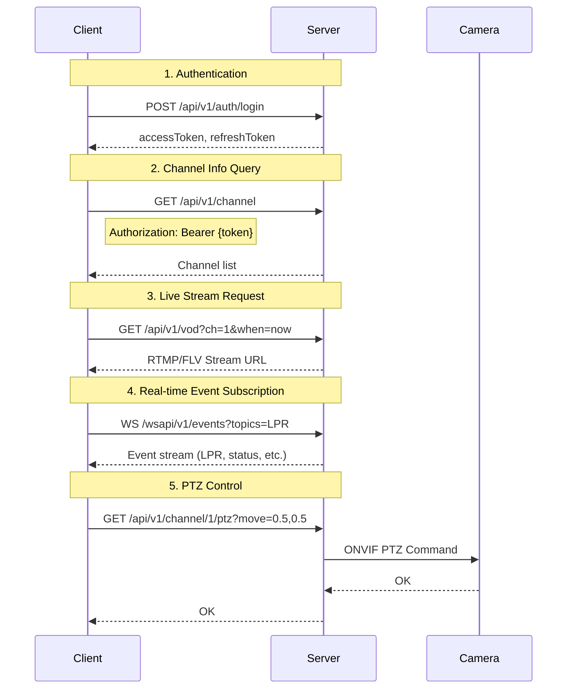
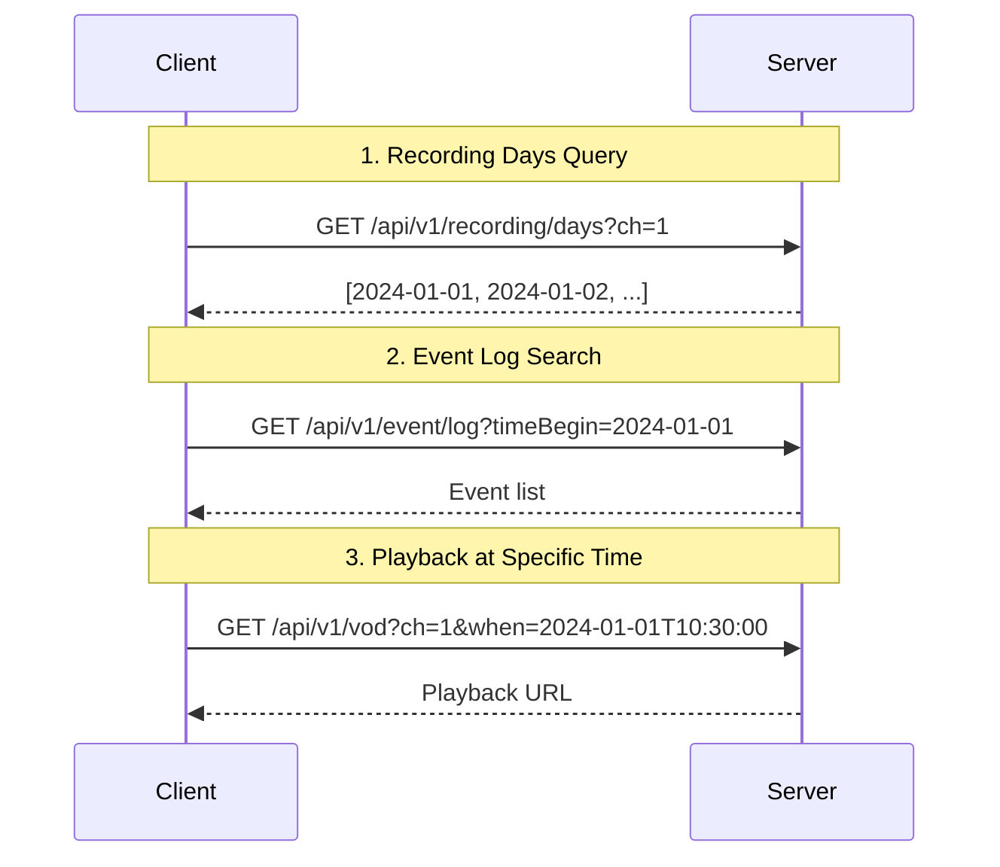
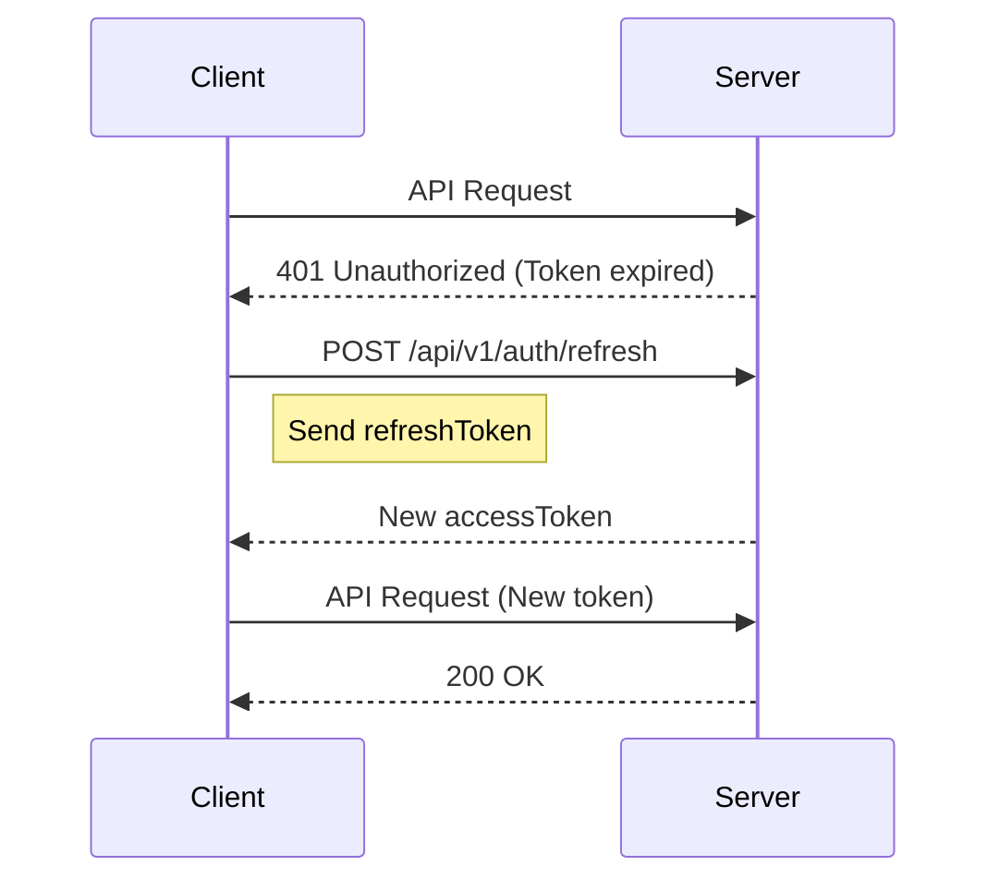
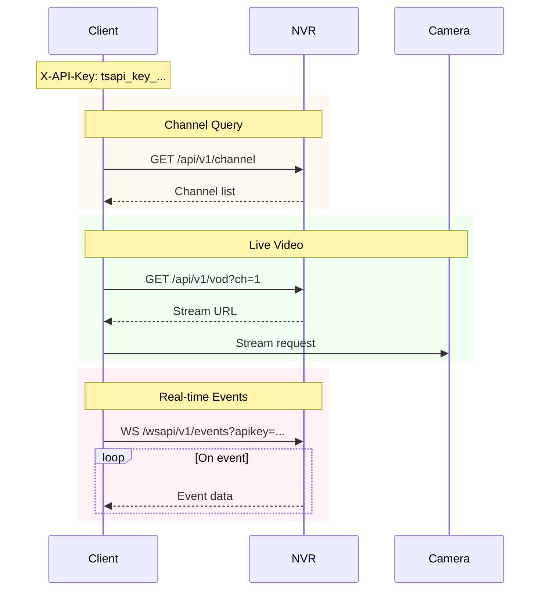
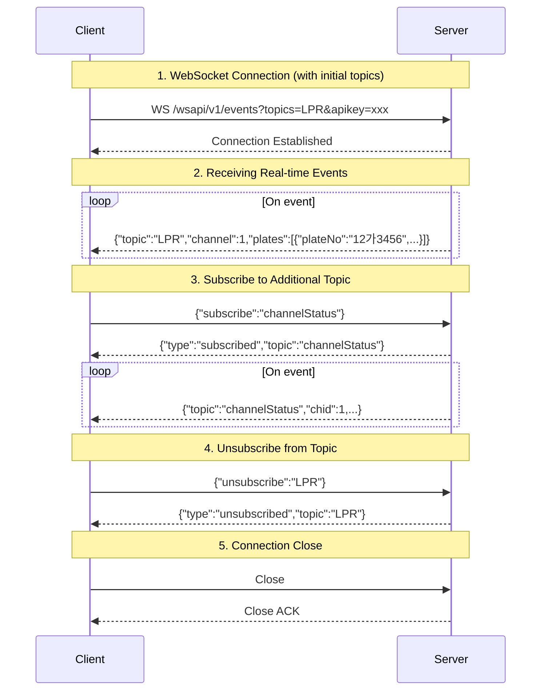
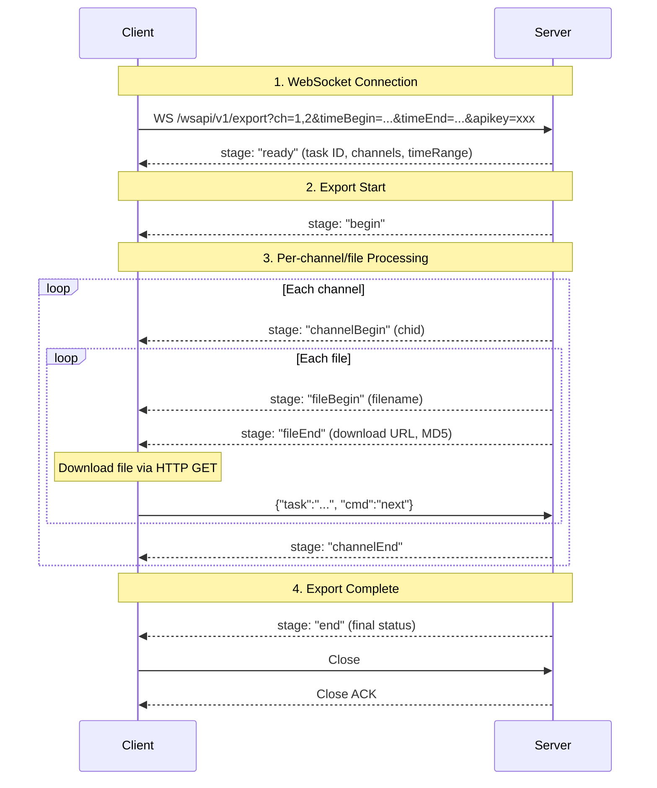

# TS-API v1 Programming Guide

**English** | [한국어](tsapi-v1.ko.md)

> **See also:** [Migration Guide](MIGRATION.md) · [Changelog](CHANGELOG.md)

## Table of Contents

1. [Overview](#1-overview)
2. [API Call Flow](#2-api-call-flow)
   - [2.1. Basic Flow (JWT Authentication)](#21-basic-flow-jwt-authentication)
   - [2.2. Recording Search and Playback Flow](#22-recording-search-and-playback-flow)
   - [2.3. Token Refresh Flow](#23-token-refresh-flow)
   - [2.4. API Key Flow (No Login Required)](#24-api-key-flow-no-login-required)
3. [Authentication](#3-authentication)
   - [3.1. Authentication Scope by Method](#31-authentication-scope-by-method)
   - [3.2. API Key Permission Model](#32-api-key-permission-model)
   - [3.3. JWT Authentication](#33-jwt-authentication)
   - [3.4. Storage / Media File Authentication](#34-storage--media-file-authentication)
   - [3.5. API Key Authentication](#35-api-key-authentication)
4. [Server Info](#4-server-info)
5. [System](#5-system)
   - [5.1. System Info](#51-system-info)
   - [5.2. System Health](#52-system-health)
   - [5.3. HDD S.M.A.R.T](#53-hdd-smart)
   - [5.4. System Control](#54-system-control)
6. [Channel](#6-channel)
   - [6.1. List Channels](#61-list-channels)
   - [6.2. Channel Status](#62-channel-status)
   - [6.3. Channel Info](#63-channel-info)
   - [6.4. Add Channel](#64-add-channel)
   - [6.5. Delete Channel](#65-delete-channel)
7. [Channel Control](#7-channel-control)
   - [7.1. PTZ Control](#71-ptz-control)
   - [7.2. Preset Control](#72-preset-control)
   - [7.3. Relay Output](#73-relay-output)
   - [7.4. Auxiliary Output](#74-auxiliary-output)
   - [7.5. Reboot Camera](#75-reboot-camera)
8. [Recording](#8-recording)
   - [8.1. Recording Days](#81-recording-days)
   - [8.2. Recording Minutes](#82-recording-minutes)
9. [Event](#9-event)
   - [9.1. Event Types](#91-event-types)
   - [9.2. Realtime Event Topics](#92-realtime-event-topics)
   - [9.3. Event Log](#93-event-log)
   - [9.4. Event Trigger (Event Backup)](#94-event-trigger-event-backup)
10. [LPR (License Plate Recognition)](#10-lpr-license-plate-recognition)
    - [10.1. LPR Source List (Recognition Point/Zone)](#101-lpr-source-list-recognition-pointzone)
    - [10.2. LPR Log](#102-lpr-log)
    - [10.3. Similar Plate Search](#103-similar-plate-search)
11. [Object Detection](#11-object-detection)
    - [11.1. Object Types](#111-object-types)
    - [11.2. Object Attributes](#112-object-attributes)
    - [11.3. Object Search](#113-object-search)
12. [Face Search](#12-face-search)
    - [12.1. Search by Image](#121-search-by-image)
    - [12.2. Search by Time](#122-search-by-time)
13. [VOD](#13-vod)
    - [13.1. Stream URLs](#131-stream-urls)
    - [13.2. Playback URLs](#132-playback-urls)
    - [13.3. Watch Page (Embeddable Player)](#133-watch-page-embeddable-player)
14. [Emergency](#14-emergency)
    - [14.1. Emergency Call List](#141-emergency-call-list)
15. [Push](#15-push)
    - [15.1. Send Push Event](#151-send-push-event)
16. [Parking](#16-parking)
    - [16.1. Parking Lot](#161-parking-lot)
    - [16.2. Parking Lot Status](#162-parking-lot-status)
    - [16.3. Parking Spot (LPR Zone)](#163-parking-spot-lpr-zone)
    - [16.4. Parking Spot Status](#164-parking-spot-status)
17. [Realtime Event Subscription (WebSocket API)](#17-realtime-event-subscription-websocket-api)
    - [17.1. Connection Flow](#171-connection-flow)
    - [17.2. Endpoints](#172-endpoints)
    - [17.3. Authentication](#173-authentication)
    - [17.4. Event Subscription](#174-event-subscription)
18. [Data Export — Recording Backup (WebSocket API)](#18-data-export--recording-backup-websocket-api)
    - [18.1. Export Flow](#181-export-flow)
    - [18.2. Endpoint](#182-endpoint)

**Appendix**
- [A. Error Codes](#a-error-codes)
- [B. Time Format](#b-time-format)
- [C. Code Examples](#c-code-examples)
  - [curl](#curl)
  - [JavaScript](#javascript)
  - [Python](#python)
  - [C#](#c-sharp)
  - [Go](#go)
  - [Java](#java)
  - [Kotlin](#kotlin)
  - [Swift](#swift)
  - [PowerShell](#powershell)

---

## 1. Overview

TS-API v1 is a RESTful path-based API.

**Base URL**: `http://{host}:{port}/api/v1`

**Content-Type**: `application/json`

> **Note**: Channel numbers (`ch`, `chid`) are 1-based throughout the API.

---

## 2. API Call Flow

### 2.1. Basic Flow (JWT Authentication)



**Step-by-step description:**

| Step | Description |
|------|-------------|
| **1. Authentication** | Log in with user ID and password. The server returns an `accessToken` (for API calls) and a `refreshToken` (for token renewal). |
| **2. Channel Info Query** | Retrieve the list of registered camera channels with the `Authorization: Bearer {accessToken}` header. |
| **3. Live Stream Request** | Request a live video stream URL for a specific channel via the VOD API. Play the returned URL in an FLV/RTMP player. |
| **4. Real-time Event Subscription** | Receive real-time events (LPR, status changes, etc.) via WebSocket. Specify events to subscribe using the `topics` parameter at connection time. |
| **5. PTZ Control** | Control the camera's pan/tilt/zoom. The server forwards commands to the camera via the ONVIF protocol. |

### 2.2. Recording Search and Playback Flow



**Step-by-step description:**

| Step | Description |
|------|-------------|
| **1. Recording Days Query** | Retrieve the list of dates with recorded footage for a specific channel. Useful for displaying recording availability in a calendar UI. |
| **2. Event Log Search** | Search for events (motion, LPR, etc.) within a specified time range. Use the timestamps in the results to play back specific moments. |
| **3. Playback at Specific Time** | Specify the playback start time in ISO 8601 format via the `when` parameter. The server returns a playback URL for the recording at that time. |

### 2.3. Token Refresh Flow



**Step-by-step description:**

| Step | Description |
|------|-------------|
| **Token Expiry** | When the `accessToken` expires, the server returns `401 Unauthorized`. |
| **Token Refresh** | Use the `refreshToken` to obtain a new `accessToken` without re-logging in. |
| **Retry Request** | Retry the failed API call with the newly issued `accessToken`. |

> **Note**: `accessToken` is valid for 1 hour and `refreshToken` for 7 days. If the `refreshToken` has also expired, a new login is required.

### 2.4. API Key Flow (No Login Required)

No login required. Suitable for server-to-server integration, VMS, monitoring centers, and long-running services.



**Step-by-step description:**

| Step | Description |
|------|-------------|
| **API Key** | Include the `X-API-Key` header or `?apikey=` query parameter in all requests. No login or token refresh required, making it ideal for server-to-server integration. |
| **Channel Query** | Retrieve the channel list via REST API. Uses the same endpoints as JWT authentication. |
| **Live Video** | Obtain a stream URL via the VOD API and receive the video stream directly from the camera. |
| **Real-time Events** | Connect via WebSocket to receive events in real-time. Authenticate using the `apikey` query parameter. |

---

## 3. Authentication

v1 API supports two authentication methods:
1. **JWT** - For web browsers and mobile apps (with token expiration)
2. **API Key** - For external system integration (long-term/permanent token)

| Method | Use Case | Expiration | Token Management |
|--------|----------|------------|------------------|
| API Key | External integration (VMS, monitoring center, IoT) | None (permanent until revoked) | No management needed |
| JWT Login | Web dashboard, mobile app, interactive client | Access: 1h, Refresh: 7d | Must refresh before expiry |

### 3.1. Authentication Scope by Method

| Auth Method | v1 Data Endpoints | v1 WebSocket | Storage/Media | v0 Endpoints |
|-------------|:-----------------:|:------------:|:-------------:|:------------:|
| JWT (Bearer Token) | ✅ | ✅ | ✅ | ✅ |
| API Key (X-API-Key) | ✅ | ✅ | ✅ | ❌ |
| Session Cookie | ✅ | ❌ | ❌ | ✅ |

> **Note**: All **v1** endpoints accept both JWT Bearer Token and API Key authentication.
>
> ⚠️ **v0 endpoints reject API Key**: API Key authentication (`X-API-Key` header) is **not accepted** on v0 endpoints (`/api/info`, `/api/enum`, `/api/system`, `/api/find`, etc.). v0 endpoints only accept session cookie authentication. Use v1 endpoints with API Key for external integrations.
>
> **API Key** is recommended for external system integration. **JWT** is recommended for web/mobile clients.
>
> ⚠️ **Deprecated**: `GET /api/v1/auth?login=...` (credentials in URL) is **deprecated and blocked** in v1 for security reasons (credentials exposed in URL/logs). Only `POST /api/v1/auth/login` is supported.

### 3.2. API Key Permission Model

API Key permissions determine which endpoints are accessible:

| Permission | Endpoints |
|------------|-----------|
| Remote | Channel, VOD, Event (realtime/type), LPR (source), Parking, System, Info |
| Playback | Recording, Event (log), LPR (log), Object (log) |
| Settings | API Key CRUD (`/api/v1/auth/apikey`) |
| Control | PTZ control, relay output, event trigger |
| DataExport | Recording data export |

> Endpoints return `403 Forbidden` if the API Key does not have the required permission.

---

### 3.3. JWT Authentication

#### 3.3.1. Login
```http
POST /api/v1/auth/login
Content-Type: application/json

{"auth": "YWRtaW46MTIzNA=="}
```
> **Note:** The `auth` field is Base64-encoded `username:password`. Example: `base64("admin:1234")` = `"YWRtaW46MTIzNA=="`

**Response:**
```json
{
  "accessToken": "eyJhbGc...",
  "refreshToken": "eyJhbGc...",
  "expiresIn": 3600,
  "tokenType": "Bearer",
  "user": {"username": "admin", "role": "admin"}
}
```

#### 3.3.2. API Call
```http
GET /api/v1/channel
Authorization: Bearer eyJhbGc...
```

#### 3.3.3. Token Refresh
```http
POST /api/v1/auth/refresh
Content-Type: application/json

{"refreshToken": "eyJhbGc..."}
```

**Response:**
```json
{
  "accessToken": "eyJhbGc...",
  "refreshToken": "eyJhbGc...",
  "expiresIn": 3600,
  "tokenType": "Bearer"
}
```

> ⚠️ **Token Rotation**: Each refresh request invalidates the old refresh token and returns a new one. Always store the new `refreshToken` from the response.

#### 3.3.4. Logout
```http
POST /api/v1/auth/logout
Content-Type: application/json

{"refreshToken": "eyJhbGc..."}
```

---

### 3.4. Storage / Media File Authentication

Media file paths (`/storage`, `/event-storage`, `/download`) require authentication via URL query parameter.

**Supported methods:**
- `?token={accessToken}` — JWT access token
- `?apikey={apiKey}` — API Key

> ⚠️ `Authorization` header cannot be used for direct ``, `<video>` src attributes. Use URL query parameters instead.

**Examples:**
```
GET /storage/r/0/0/0/31/31103.mp4?token=eyJhbGc...
GET /storage/snapshot/1/latest.jpg?apikey=tsapi_key_a1b2c3d4...
GET /event-storage/lpr/2024/01/01/event001.jpg?token=eyJhbGc...
GET /download/export_20240101.mp4?token=eyJhbGc...
```

| Path | Description |
|------|-------------|
| `/storage/r/{path}` | Recorded video files |
| `/storage/snapshot/{ch}/latest.jpg` | Latest snapshot image |
| `/event-storage/{path}` | Event-related media (LPR images, etc.) |
| `/download/{file}` | Exported files |

---

### 3.5. API Key Authentication

API Key is suitable for external system integration (monitoring center, VMS, etc.).
Can be used permanently without expiration; administrators can revoke at any time.

> ⚠️ API Key authentication is supported on **v1 endpoints only**. v0 endpoints (`/api/*`) reject `X-API-Key` with `401 Unauthorized`.

#### 3.5.1. Issue API Key (admin only)

> **Note**: You can also issue API Keys through the web interface by logging in as an administrator and navigating to the **"API Key"** page.

```http
POST /api/v1/auth/apikey
Authorization: Bearer {admin_token}
Content-Type: application/json

{
  "name": "Monitoring Center",
  "permissions": ["remote", "playback"],
  "channels": [1, 2, 3, 4],
  "ipWhitelist": ["192.168.1.0/24"],
  "expiresAt": null
}
```

**Permission Values:**

| Value | Description |
|-------|-------------|
| `remote` | Basic access (channel, VOD, event type/realtime, LPR source, parking, system, info) |
| `playback` | Recording search, event/LPR/object logs |
| `settings` | API Key CRUD, system settings |
| `control` | PTZ control, relay output, event trigger |
| `dataExport` | Recording data export |
| `*` | All permissions (super) |

> `channel:read` and `vod:read` are aliases for `remote`. `admin` is an alias for `settings`.

**Response:**
```json
{
  "id": "key_abc123",
  "key": "tsapi_key_a1b2c3d4e5f6...",
  "name": "Monitoring Center",
  "message": "Store this API key securely. It will not be shown again."
}
```

#### 3.5.2. Using API Key

**Header method:**
```http
GET /api/v1/channel
X-API-Key: tsapi_key_a1b2c3d4e5f6...
```

**URL parameter method (for video streams):**
```
http://server/api/v1/vod?ch=1&apikey=tsapi_key_a1b2c3d4...
```

#### 3.5.3. List API Keys
```http
GET /api/v1/auth/apikey
Authorization: Bearer {admin_token}
```

#### 3.5.4. Revoke API Key
```http
DELETE /api/v1/auth/apikey/{keyId}
Authorization: Bearer {admin_token}
```

> **Examples:** [JavaScript](examples/javascript/01-login.js) · [Python](examples/python/01_login.py) · [C#](examples/csharp/01_Login.cs) · [Go](examples/go/01_login/) · [Java](examples/java/V1_01_Login.java) · [Kotlin](examples/kotlin/V1_01_Login.kt) · [Swift](examples/swift/01-login.swift) · [PowerShell](examples/powershell/01-login.ps1) · [curl](examples/curl/01-login.sh)

---

## 4. Server Info

Retrieves server and product information.

> **No authentication required** — This endpoint is accessible without any authentication, except for the `whoAmI` parameter which requires JWT or session authentication.

| Endpoint | Auth | Description |
|----------|:----:|-------------|
| `GET /api/v1/info?apiVersion` | - | API version query (e.g., "TS-API@1.0.1") |
| `GET /api/v1/info?siteName` | - | Site name query |
| `GET /api/v1/info?timezone` | - | Server timezone query (name, bias) |
| `GET /api/v1/info?product` | - | Product info query (name, version) |
| `GET /api/v1/info?license` | - | License info query (type, maxChannels) |
| `GET /api/v1/info?whoAmI` | ✅ | Current logged-in user info |
| `GET /api/v1/info?all` | ✅* | Retrieve all info at once |

> \* `?all` includes `whoAmI`, so authentication is required to get user info. If unauthenticated, `whoAmI` is omitted from the response and returns HTTP 401 status.

**Parameters**:

| Parameter | Type | Description |
|-----------|------|-------------|
| `all` | Flag | Include all info |
| `apiVersion` | Flag | API version |
| `siteName` | Flag | Site name |
| `product` | Flag | Product info |
| `license` | Flag | License info |
| `whoAmI` | Flag | Authenticated user info |
| `timezone` | Flag | Timezone info |

**Example** (no auth needed):
```bash
curl "http://localhost/api/v1/info?apiVersion&product&license"
```

**Example** (with auth for whoAmI):
```bash
curl "http://localhost/api/v1/info?all" -H "Authorization: Bearer eyJhbGc..."
```

**Response** (genuine license with ANPR / object detection / parking guidance enabled):
```json
{
  "apiVersion": "TS-API@1.0.1",
  "siteName": "Main Office",
  "timezone": {"name": "Asia/Seoul", "bias": "+09:00"},
  "product": {"name": "TS-NVR", "version": "2.14.1"},
  "license": {
    "type": "genuine",
    "maxChannels": 64,
    "nLprZone": 36,
    "nChObjDetection": 36,
    "nChFaceRecognition": 10,
    "nChTrafficCount": 10,
    "nChSpeedometer": 10,
    "nChPeopleCount": 10,
    "fisheyeCamSupports": true,
    "mediaType": "USB dongle",
    "extension": ["lprExt", "objectDetection", "parkingGuide"]
  }
}
```

**Response** (trial example):
```json
{
  "license": {
    "type": "trial",
    "maxChannels": 16,
    "trialDays": 30,
    "leftDays": 15,
    "mediaType": "Software"
  }
}
```

**Response Fields**:

| Field | Type | When | Description |
|-------|------|------|-------------|
| `apiVersion` | String | Always | API version |
| `siteName` | String | Always | NVR site name |
| `timezone.name` | String | Always | Timezone name |
| `timezone.bias` | String | Always | Timezone offset |
| `product.name` | String | Always | Product name |
| `product.version` | String | Always | Product version |
| `license.type` | String | Always | `freeware`, `genuine`, `limited`, `trial` |
| `license.maxChannels` | Int | Always | Maximum channel count |
| `license.expire` | String | `type=limited` | Expiration timestamp (ISO 8601) |
| `license.trialDays` | Int | `type=trial` | Trial total days |
| `license.leftDays` | Int | `type=trial` | Trial days remaining |
| `license.nLprZone` | Int | LPR-capable build | Number of LPR recognition zones |
| `license.nDevEmCall` | Int | Emergency-call build | Emergency call devices (backward-compat — always returns `0`) |
| `license.nChObjDetection` | Int | Object detection license active | Object detection channels |
| `license.nChFaceRecognition` | Int | Face recognition license active | Face recognition channels |
| `license.nChTrafficCount` | Int | Traffic count license active | Traffic count channels |
| `license.nChSpeedometer` | Int | Vehicle speed license active | Vehicle speedometer channels |
| `license.nChPeopleCount` | Int | People count license active | People count channels |
| `license.fisheyeCamSupports` | Boolean | Fisheye dewarping license active | `true` is emitted only when active; the field is omitted otherwise |
| `license.maxVehicles` | Int | ANPR + non-default value | Concurrent LPR vehicle tracking count |
| `license.mediaType` | String | Always | `"USB dongle"` or `"Software"` |
| `license.extension` | Array | At least one extension active | Extension feature tokens (see table below) |
| `whoAmI.uid` | String | whoAmI requested | User ID |
| `whoAmI.name` | String | whoAmI requested | User name |
| `whoAmI.accessRights` | Object | whoAmI requested | Access rights |

**`license.extension` tokens**:

| Token | Description |
|-------|-------------|
| `lprExt` | License plate recognition (ANPR/LPR support) |
| `emergencyCall` | Emergency call device integration |
| `packing` | Packing (SEMES Lot Search, etc.) |
| `objectDetection` | Object detection |
| `faceRecognition` | Face recognition (external FR server integration) |
| `sharedFrameBuffer` | Shared frame buffer |
| `vehicleTracking` | Vehicle tracking |
| `parkingGuide` | Parking guidance |
| `parkingSpot` | Parking spot occupancy detection |

---

## 5. System

System information and control API.

### 5.1. System Info

Retrieves system hardware and software information.

| Endpoint | Description |
|----------|-------------|
| `GET /api/v1/system/info` | Full system information |
| `GET /api/v1/system/info?item=os` | OS info (name, version, architecture) |
| `GET /api/v1/system/info?item=cpu` | CPU info (model, core count, clock) |
| `GET /api/v1/system/info?item=storage` | Storage info (disk list, capacity) |
| `GET /api/v1/system/info?item=network` | Network info (interface, IP) |
| `GET /api/v1/system/info?item=storage,network` | Query multiple items |

**Parameters**:

| Parameter | Type | Required | Default | Description |
|-----------|------|----------|---------|-------------|
| `item` | String | N | All | Items to query (comma-separated: `os`, `cpu`, `storage`, `network`) |

> **Note**: Storage info is returned as the `disk` field in the response (requested as `item=storage` but response field name is `disk`). When requesting network info, the `lastUpdate` field is also included.

**Response Fields**:

| Field | Type | Description |
|-------|------|-------------|
| `os` | Object | OS information (name, version, architecture) |
| `cpu` | Object | CPU information (model, cores, clock) |
| `mainboard` | Object | Mainboard information |
| `memory` | Object | Memory information |
| `graphicAdapter` | Object | Graphics adapter information |
| `monitor` | Object | Monitor information |
| `storage` | Object | Storage information |
| `networkAdapter` | Object | Network adapter information |

### 5.2. System Health

Retrieves real-time system status.

| Endpoint | Description |
|----------|-------------|
| `GET /api/v1/system/health` | Full system status |
| `GET /api/v1/system/health?item=cpu` | CPU usage (%) |
| `GET /api/v1/system/health?item=memory` | Memory usage (total, used, free) |
| `GET /api/v1/system/health?item=disk` | Disk usage (total, used, free) |
| `GET /api/v1/system/health?item=memory,disk` | Query multiple items |

**Parameters**:

| Parameter | Type | Required | Description |
|-----------|------|----------|-------------|
| `item` | String | N | Items to query (comma-separated): `cpu`, `memory`, `disk`, `recording`, `network`, `all`, `supported` |

**Response Fields**:

| Field | Type | Description |
|-------|------|-------------|
| `lastUpdate` | String | Last update time (ISO 8601) |
| `cpu` | Array | CPU status list (when `item` includes `cpu`) |
| `cpu[].usage.total` | Int | Total CPU usage (%) |
| `cpu[].usage.threads` | Array | Per-core usage (%) |
| `cpu[].temperatureKelvin.current` | Float | Current temperature (K) |
| `cpu[].temperatureKelvin.critical` | Float | Critical temperature (K) |
| `memory` | Object | Memory status (when `item` includes `memory`) |
| `memory.totalPhysical` | Int | Total physical memory (bytes) |
| `memory.freePhysical` | Int | Free physical memory (bytes) |
| `memory.totalVirtual` | Int | Total virtual memory (bytes) |
| `memory.freeVirtual` | Int | Free virtual memory (bytes) |
| `disk` | Array | Disk (partition) status list (when `item` includes `disk`) |
| `disk[].mount` | String | Mount path (e.g., `"C:"`) |
| `disk[].fileSystem` | String | File system (e.g., `"NTFS"`) |
| `disk[].volumeName` | String | Volume name |
| `disk[].totalSpace` | Int | Total capacity (bytes) |
| `disk[].freeSpace` | Int | Free capacity (bytes) |
| `disk[].totalTimePercent` | Int | Total disk busy time (%) |
| `disk[].readTimePercent` | Int | Read time (%) |
| `disk[].writeTimePercent` | Int | Write time (%) |
| `disk[].totalBytesPerSec` | Int | Total transfer rate (bytes/sec) |
| `disk[].readBytesPerSec` | Int | Read rate (bytes/sec) |
| `disk[].writeBytesPerSec` | Int | Write rate (bytes/sec) |
| `recording` | Object | Recording storage status (when `item` includes `recording`) |
| `recording.current` | String | Current recording path |
| `recording.storage` | Array | Recording storage list |
| `recording.storage[].path` | String | Storage path |
| `recording.storage[].usage` | Int | Usage status code |
| `recording.storage[].comment` | String | Status description |
| `network` | Array | Network interface status (when `item` includes `network`) |
| `network[].name` | String | Interface name |
| `network[].totalBytesPerSec` | Int | Total transfer rate (bytes/sec) |
| `network[].recvBytesPerSec` | Int | Receive rate (bytes/sec) |
| `network[].sendBytesPerSec` | Int | Send rate (bytes/sec) |
| `network[].curBandwidth` | Int | Current bandwidth (bps) |

### 5.3. HDD S.M.A.R.T

Retrieves disk health status.

| Endpoint | Description |
|----------|-------------|
| `GET /api/v1/system/hddsmart` | All/Specific disk S.M.A.R.T information |
| `GET /api/v1/system/hddsmart?disk=1` | Specific disk S.M.A.R.T information |

**Parameters**:

| Parameter | Type | Required | Description |
|-----------|------|----------|-------------|
| `disk` | Int | N | Disk number (all disks if omitted) |

**Response**: Returns an array of S.M.A.R.T information for each disk.

| Field | Type | Description |
|-------|------|-------------|
| `[].name` | String | Disk name (e.g., `"PhysicalDrive0"`) |
| `[].model` | String | Disk model name |
| `[].code` | Int | S.M.A.R.T support status code (0: Not tested, 1: Not supported, 2: Supported) |
| `[].message` | String | Status message (`"Not tested yet"`, `"Not supported"`, `"Supported"`) |
| `[].smart` | Array | S.M.A.R.T attribute list (only included when supported) |
| `[].smart[].id` | Int | Attribute ID |
| `[].smart[].attribute` | String | Attribute name |
| `[].smart[].critical` | Boolean | Whether this is a critical attribute |
| `[].smart[].value` | Int | Current value |
| `[].smart[].worst` | Int | Worst value |
| `[].smart[].threshold` | Int | Threshold value |
| `[].smart[].raw` | Int | Raw value |
| `[].smart[].rawHex` | String | Raw value (hexadecimal string) |

### 5.4. System Control

System control commands. **Admin privileges required**

| Endpoint | Description |
|----------|-------------|
| `POST /api/v1/system/restart` | Restart NVR server process |
| `POST /api/v1/system/reboot` | Reboot system (OS) |

**Response**:

| Field | Type | Description |
|-------|------|-------------|
| `code` | Int | Result code (0: success) |
| `message` | String | Result message |

> **Examples:** [JavaScript](examples/javascript/08-system-info.js) · [Python](examples/python/08_system_info.py) · [C#](examples/csharp/08_SystemInfo.cs) · [Go](examples/go/08_system/) · [Java](examples/java/V1_08_SystemInfo.java) · [Kotlin](examples/kotlin/V1_08_SystemInfo.kt) · [Swift](examples/swift/08-system-info.swift) · [PowerShell](examples/powershell/08-system-info.ps1) · [curl](examples/curl/08-system-info.sh)

---

## 6. Channel

Channel (camera) list and management API.

### 6.1. List Channels

Retrieves registered channel list.

| Endpoint | Description |
|----------|-------------|
| `GET /api/v1/channel` | Channel list (basic info) |
| `GET /api/v1/channel?staticSrc` | Include static source info (RTSP URL, etc.) |
| `GET /api/v1/channel?caps` | Include camera capabilities (PTZ, relay, etc.) |

**Response**:
```json
[
  {
    "chid": 1,
    "displayName": "CH1. Front Door",
    "title": "Front Door",
    "caps": {"pantilt": true, "zoom": true}
  },
  {
    "chid": 2,
    "displayName": "CH2. Parking Lot",
    "title": "Parking Lot"
  }
]
```

| Field | Type | Description |
|-------|------|-------------|
| `chid` | Int | Channel ID (starts from 1) |
| `title` | String | Channel name (user-configured or camera address) |
| `displayName` | String | Display name (`"CH{N}. {title}"` format) |
| `src` | Object | Static source URL (only included with `staticSrc`) |
| `caps` | Object | Camera capabilities (only included with `caps`) |

**`caps` Object Fields** (with `?caps`):

| Field | Type | Description |
|-------|------|-------------|
| `caps.pantilt` | Boolean | Pan/tilt support |
| `caps.zoom` | Boolean | Zoom support |
| `caps.focus` | Boolean | Focus support |
| `caps.iris` | Boolean | Iris support |
| `caps.home` | Boolean | Home position support |
| `caps.maxPreset` | Int | Maximum preset count |
| `caps.aux` | Int | Auxiliary output count |
| `caps.relayOutputs` | Int | Relay output count |
| `caps.reboot` | Boolean | Remote reboot support |

**`src` Array Item Fields** (with `?staticSrc`):

| Field | Type | Description |
|-------|------|-------------|
| `src[].protocol` | String | Protocol (`rtmp`, `flv`, etc.) |
| `src[].profile` | String | Profile (`main`, `sub`) |
| `src[].src` | String | Stream URL |
| `src[].type` | String | Stream type |
| `src[].label` | String | Resolution label |
| `src[].size` | Array | `[width, height]` |

### 6.2. Channel Status

Retrieves channel connection status.

| Endpoint | Description |
|----------|-------------|
| `GET /api/v1/channel/status` | All channel status |
| `GET /api/v1/channel/status?ch=1,2,3` | Specific channels only |
| `GET /api/v1/channel/status?verbose=true` | Include detailed status (error messages, etc.) |
| `GET /api/v1/channel/status?recordingStatus` | Include recording status |

**Parameters**:

| Parameter | Type | Required | Default | Description |
|-----------|------|----------|---------|-------------|
| `ch` | String | N | All | Channel numbers (comma-separated, e.g., `"1,2,3"`) |
| `verbose` | Boolean | N | false | Include detailed status (error messages, etc.) |
| `recordingStatus` | Flag | N | - | Include recording status (pass key only without value) |

**Response**:
```json
[
  {
    "chid": 1,
    "status": {"code": 0, "message": "Connected"},
    "recording": true
  },
  {
    "chid": 2,
    "status": {"code": -1, "message": "Disconnected"},
    "recording": false
  }
]
```

**Response Fields**:

| Field | Type | Description |
|-------|------|-------------|
| `chid` | Int | Channel number |
| `title` | String | Channel name |
| `displayName` | String | Display name |
| `status.code` | Int | Status code |
| `status.message` | String | Status message |

**Status Codes**:

| code | Description |
|------|-------------|
| 0 | Connected |
| -1 | Disconnected |
| -2 | Connecting |
| -3 | Authentication Failed |

### 6.3. Channel Info

Retrieves channel details and camera capabilities.

| Endpoint | Description |
|----------|-------------|
| `GET /api/v1/channel/info` | All channel details |
| `GET /api/v1/channel/info?caps` | Include camera capabilities |
| `GET /api/v1/channel/info?caps&reload` | Re-query capabilities from camera |
| `GET /api/v1/channel/{id}/info?caps` | Specific channel details |

**Example**:
```bash
curl "http://localhost/api/v1/channel/1/info?caps"
```

### 6.4. Add Channel

Registers a new channel. **Admin privileges required**

```http
POST /api/v1/channel
Content-Type: application/json

{
  "name": "New Camera",
  "source": "rtsp://192.168.1.100/stream"
}
```

### 6.5. Delete Channel

Deletes channel. **Admin privileges required**

| Endpoint | Description |
|----------|-------------|
| `DELETE /api/v1/channel/{id}` | Delete single channel |
| `DELETE /api/v1/channel/1,2,3` | Delete multiple channels |

> **Examples:** [JavaScript](examples/javascript/02-channels.js) · [Python](examples/python/02_channels.py) · [C#](examples/csharp/02_Channels.cs) · [Go](examples/go/02_channels/) · [Java](examples/java/V1_02_Channels.java) · [Kotlin](examples/kotlin/V1_02_Channels.kt) · [Swift](examples/swift/02-channels.swift) · [PowerShell](examples/powershell/02-channels.ps1) · [curl](examples/curl/02-channels.sh)

---

## 7. Channel Control

Camera PTZ, preset, and relay control API.

### 7.1. PTZ Control

Controls camera Pan/Tilt/Zoom.

| Endpoint | Description |
|----------|-------------|
| `GET /api/v1/channel/{id}/ptz?home` | Move to home position |
| `GET /api/v1/channel/{id}/ptz?move=x,y` | Pan/Tilt movement (x,y: -1.0 ~ 1.0) |
| `GET /api/v1/channel/{id}/ptz?zoom=z` | Zoom control (z: -1.0=zoom out, 1.0=zoom in) |
| `GET /api/v1/channel/{id}/ptz?focus=f` | Focus control (f: -1.0=near, 1.0=far) |
| `GET /api/v1/channel/{id}/ptz?iris=i` | Iris control (i: -1.0=close, 1.0=open) |
| `GET /api/v1/channel/{id}/ptz?stop` | Stop PTZ movement |

**Parameters**:

| Parameter | Type | Description |
|-----------|------|-------------|
| `home` | Flag | Move to home position (pass key only without value) |
| `move` | String | Pan/Tilt movement (format: `"x,y"`, range: -1.0 to 1.0) |
| `zoom` | Float | Zoom control (-1.0=zoom out, 0=stop, 1.0=zoom in) |
| `focus` | Float | Focus control (-1.0=near, 0=stop, 1.0=far) |
| `iris` | Float | Iris control (-1.0=close, 0=stop, 1.0=open) |
| `stop` | Flag | Stop all PTZ movement (pass key only without value) |

```
              0,-1
               ↑
               |
   -1,0 ←── (0,0) ──→ 1,0        -1 ←──── 0 ────→ 1
               |                         zoom
               ↓                         focus
              0,1                         iris
             move
```

> **Note**: PTZ commands are executed through the camera's ONVIF service. May return 500 error if the camera doesn't support ONVIF or the connection is unstable.

**Example**:
```bash
# Move camera 1 to home position
curl "http://localhost/api/v1/channel/1/ptz?home"

# Pan/Tilt (Move upper right)
curl "http://localhost/api/v1/channel/1/ptz?move=0.3,-0.2"

# Zoom in
curl "http://localhost/api/v1/channel/1/ptz?zoom=0.5"

# Stop all PTZ movement
curl "http://localhost/api/v1/channel/1/ptz?stop"
```

**Response:**

| Field | Type | Description |
|-------|------|-------------|
| `code` | Int | Result code (0: success) |
| `message` | String | Error message |

### 7.2. Preset Control

Manages camera presets (saved positions).

| Endpoint | Description |
|----------|-------------|
| `GET /api/v1/channel/{id}/preset` | Preset list |
| `GET /api/v1/channel/{id}/preset?reload` | Re-query from camera |
| `POST /api/v1/channel/{id}/preset?name=xxx` | Save current position as preset |
| `PUT /api/v1/channel/{id}/preset/{token}` | Update preset (to current position) |
| `DELETE /api/v1/channel/{id}/preset/{token}` | Delete preset |
| `GET /api/v1/channel/{id}/preset/{token}/go` | Move to preset |

**GET Response:**

| Field | Type | Description |
|-------|------|-------------|
| `chid` | Int | Channel number |
| `preset` | Array | Preset list |
| `preset[].token` | String | Preset token |
| `preset[].name` | String | User-defined name |
| `preset[].devName` | String | Device-defined name |

**POST Parameter:**

| Parameter | Type | Required | Description |
|-----------|------|----------|-------------|
| `name` | String | Y | Preset name (query parameter) |

**PUT Parameter:**

| Parameter | Type | Required | Description |
|-----------|------|----------|-------------|
| `name` | String | Y | New preset name (query parameter) |

**Example**:
```bash
# List presets of channel 1
curl "http://localhost/api/v1/channel/1/preset"

# Go to preset
curl "http://localhost/api/v1/channel/1/preset/preset1/go"
```

### 7.3. Relay Output

Controls camera relay output (door lock, warning light, etc.).

| Endpoint | Description |
|----------|-------------|
| `GET /api/v1/channel/{id}/relay` | Relay output list |
| `PUT /api/v1/channel/{id}/relay/{uuid}?state=on` | Relay ON |
| `PUT /api/v1/channel/{id}/relay/{uuid}?state=off` | Relay OFF |

**GET Response:**

| Field | Type | Description |
|-------|------|-------------|
| `chid` | Int | Channel number |
| `relay` | Array | Relay list |
| `relay[].token` | String | Relay token |
| `relay[].name` | String | Relay name |

**PUT Parameter:**

| Parameter | Type | Required | Description |
|-----------|------|----------|-------------|
| `state` | String | Y | `on` or `off` |

### 7.4. Auxiliary Output

Controls camera auxiliary output.

| Endpoint | Description |
|----------|-------------|
| `PUT /api/v1/channel/{id}/aux/{port}?state=on` | Auxiliary output ON |
| `PUT /api/v1/channel/{id}/aux/{port}?state=off` | Auxiliary output OFF |

**Parameter:**

| Parameter | Type | Required | Description |
|-----------|------|----------|-------------|
| `state` | String | Y | `on` or `off` |

### 7.5. Reboot Camera

Remotely reboots camera. **Admin privileges required**

| Endpoint | Description |
|----------|-------------|
| `POST /api/v1/channel/{id}/reboot` | Reboot camera (ONVIF) |

**Response:**

| Field | Type | Description |
|-------|------|-------------|
| `code` | Int | Result code (0: success) |
| `message` | String | Result message |

> **Examples:** [JavaScript](examples/javascript/03-ptz-control.js) · [Python](examples/python/03_ptz_control.py) · [C#](examples/csharp/03_PtzControl.cs) · [Go](examples/go/03_ptz/) · [Java](examples/java/V1_03_PtzControl.java) · [Kotlin](examples/kotlin/V1_03_PtzControl.kt) · [Swift](examples/swift/03-ptz-control.swift) · [PowerShell](examples/powershell/03-ptz-control.ps1) · [curl](examples/curl/03-ptz-control.sh)

---

## 8. Recording

Recording data search API. Used for calendar UI implementation.

### 8.1. Recording Days

Retrieves dates with recording data.

| Endpoint | Description |
|----------|-------------|
| `GET /api/v1/recording/days` | Recording days for all channels |
| `GET /api/v1/recording/days?ch=1` | Recording days for specific channel |
| `GET /api/v1/recording/days?ch=1,2,3` | Recording days for multiple channels |
| `GET /api/v1/recording/days?timeBegin=...&timeEnd=...` | Recording days within specific period |

**Parameters**:

| Parameter | Type | Required | Default | Description |
|-----------|------|----------|---------|-------------|
| `ch` | String | N | All | Channel numbers (comma-separated, e.g., `"1,2,3"`) |
| `timeBegin` | DateTime | N | - | Search start time (ISO 8601) |
| `timeEnd` | DateTime | N | - | Search end time (ISO 8601) |

> **Note**: The `X-Host` header is required. Set automatically on standard web browser requests.

**Response**:
```json
{
  "timeBegin": "2024-01-01T00:00:00",
  "timeEnd": "2024-01-31T23:59:59",
  "data": [
    {"year": 2024, "month": 1, "days": [1, 2, 3, 5, 8, 10]}
  ]
}
```

| Field | Type | Description |
|-------|------|-------------|
| `timeBegin` | DateTime | Query start time |
| `timeEnd` | DateTime | Query end time |
| `data` | Array | Per-channel recording data |
| `data[].chid` | Int | Channel number |
| `data[].data[].year` | Int | Year |
| `data[].data[].month` | Int | Month |
| `data[].data[].days` | Array\<Int\> | Days with recordings |

### 8.2. Recording Minutes

Retrieves minute-level recording data. Used for timeline UI.

| Endpoint | Description |
|----------|-------------|
| `GET /api/v1/recording/minutes?timeBegin=...&timeEnd=...` | Recording segments (minute-level) |
| `GET /api/v1/recording/minutes?ch=1&timeBegin=...&timeEnd=...` | Recording segments for specific channel |

**Parameters**:

| Parameter | Type | Required | Default | Description |
|-----------|------|----------|---------|-------------|
| `ch` | String | N | All | Channel numbers (comma-separated) |
| `timeBegin` | DateTime | Y | - | Search start time (ISO 8601) |
| `timeEnd` | DateTime | Y | - | Search end time (ISO 8601) |

**Response**:
```json
{
  "timeBegin": "2024-01-01T00:00:00",
  "timeEnd": "2024-01-01T23:59:59",
  "data": [
    {"chid": 1, "minutes": "111111110000..."}
  ]
}
```

`minutes` is a string where each character represents one minute of the queried period.
- The first character (index 0) corresponds to the `timeBegin` minute, the second character to the next minute, and so on.
- `'1'` = recording exists for that minute, `'0'` = no recording
- For a full day (24 hours), the string length is 1440 characters (24 × 60 minutes)

For example, if `timeBegin` is `2024-01-01T00:00:00` and `minutes` is `"111111110000..."`:

| Index | Time | Value | Meaning |
|-------|------|-------|---------|
| 0 | 00:00 | `1` | Recording exists |
| 1 | 00:01 | `1` | Recording exists |
| ... | ... | `1` | ... |
| 7 | 00:07 | `1` | Recording exists |
| 8 | 00:08 | `0` | No recording |
| ... | ... | `0` | ... |
| 1439 | 23:59 | `0` | No recording |

In this example, channel 1 has recordings only during the 00:00–00:07 interval.

| Field | Type | Description |
|-------|------|-------------|
| `timeBegin` | DateTime | Query start time |
| `timeEnd` | DateTime | Query end time |
| `data` | Array | Per-channel recording data |
| `data[].chid` | Int | Channel number |
| `data[].minutes` | String | Minute-level recording bitmap string (`'1'`=recording exists, `'0'`=none) |

> **Examples:** [JavaScript](examples/javascript/04-recording-search.js) · [Python](examples/python/04_recording_search.py) · [C#](examples/csharp/04_RecordingSearch.cs) · [Go](examples/go/04_recording/) · [Java](examples/java/V1_04_RecordingSearch.java) · [Kotlin](examples/kotlin/V1_04_RecordingSearch.kt) · [Swift](examples/swift/04-recording-search.swift) · [PowerShell](examples/powershell/04-recording-search.ps1) · [curl](examples/curl/04-recording-search.sh)

---

## 9. Event

Event query, subscription, and trigger API.

### 9.1. Event Types

Retrieves event types supported by the system.

| Endpoint | Description |
|----------|-------------|
| `GET /api/v1/event/type` | Event type list (default language) |
| `GET /api/v1/event/type?lang=en-US` | Event types in specific language |
| `GET /api/v1/event/type?lang=ko-KR` | Event types in Korean |

**Parameters:**

| Parameter | Type | Required | Description |
|-----------|------|----------|-------------|
| `lang` | String | N | Language code (e.g., `en-US`, `ko-KR`) |

**Response**:
```json
[
  {
    "id": 0,
    "name": "시스템 로그",
    "code": [
      {"id": 1, "name": "시스템 시작"},
      {"id": 2, "name": "시스템 종료"}
    ]
  },
  {
    "id": 1,
    "name": "카메라",
    "code": [
      {"id": 100, "name": "연결됨"},
      {"id": 101, "name": "연결 끊김"}
    ]
  }
]
```

| Field | Type | Description |
|-------|------|-------------|
| `id` | Int | Event type ID |
| `name` | String | Event type name (by language) |
| `code` | Array | Sub-event code list for this type |
| `code[].id` | Int | Event code ID |
| `code[].name` | String | Event code name (by language) |

### 9.2. Realtime Event Topics

Retrieves available topics for real-time event subscription.

| Endpoint | Description |
|----------|-------------|
| `GET /api/v1/event/realtime` | Available subscription topics |

**Response**:
```json
[
  "channelStatus",
  "emergencyCall",
  "LPR",
  "systemEvent",
  "motionChanges",
  "recordingStatus",
  "parkingCount",
  "parkingSpot",
  "object",
  "bodyTemperature",
  "vehicleTracking"
]
```

> **Note**: The response is a string array of available topic names. Use these values in the `topics` parameter when connecting to the WebSocket event subscription endpoint (`/wsapi/v1/events?topics=...`).

### 9.3. Event Log

Searches stored event logs.

| Endpoint | Description |
|----------|-------------|
| `GET /api/v1/event/log` | Recent events |
| `GET /api/v1/event/log?timeBegin=...&timeEnd=...` | Events in specific period |
| `GET /api/v1/event/log?at=10&maxCount=20` | Pagination (20 from index 10) |
| `GET /api/v1/event/log?sort=asc` | Sort ascending (default: desc) |
| `GET /api/v1/event/log?type=0` | Specific event type only |
| `GET /api/v1/event/log?ch=1,2` | Specific channels only |

**Parameters**:

| Parameter | Type | Required | Default | Description |
|-----------|------|----------|---------|-------------|
| `timeBegin` | DateTime | N | - | Search start time (ISO 8601) |
| `timeEnd` | DateTime | N | - | Search end time (ISO 8601) |
| `at` | Int | N | 0 | Start index (pagination) |
| `maxCount` | Int | N | 50 | Maximum results |
| `sort` | String | N | `"desc"` | Sort order (`"asc"` or `"desc"`) |
| `type` | Int | N | - | Event type ID filter |
| `ch` | String | N | - | Channel filter (comma-separated, e.g., `"1,2,3"`) |

**Response**:
```json
{
  "totalCount": 100,
  "at": 0,
  "data": [
    {
      "id": 1,
      "type": 1,
      "typeName": "Camera",
      "code": 100,
      "codeName": "Connected",
      "chid": 1,
      "timeRange": ["2024-01-01T10:00:00"]
    }
  ]
}
```

| Field | Type | Description |
|-------|------|-------------|
| `totalCount` | Int | Total search results |
| `at` | Int | Current start index |
| `data[].id` | Int | Event ID |
| `data[].type` | Int | Event type ID |
| `data[].typeName` | String | Event type name |
| `data[].code` | Int | Event code |
| `data[].codeName` | String | Event code name |
| `data[].chid` | Int | Related channel ID |
| `data[].timeRange` | Array | Event time range |

### 9.4. Event Trigger (Event Backup)

Triggers PTZ preset movement and/or event backup recording on specified channels. Used for external system integration (e.g., access control, fire alarm, intrusion detection).

> Requires the **Event Backup** license. Returns `404` if the license is not installed.

| Endpoint | Description | Permission |
|----------|-------------|------------|
| `PUT /api/v1/event/trigger` | Trigger PTZ preset and/or event backup | `Control` |

**Request**:

```http
PUT /api/v1/event/trigger
Content-Type: application/json

{
  "chid": 1,
  "timestamp": "2024-01-15T14:30:00",
  "tasks": [
    {
      "command": "presetGo",
      "token": "preset_token_1"
    },
    {
      "command": "eventBackup",
      "preAlarm": "30s",
      "postAlarm": "2m",
      "chids": [1, 2, 3]
    }
  ]
}
```

**Request Fields**:

| Field | Type | Required | Description |
|-------|------|----------|-------------|
| `chid` | Int | Y | Primary channel ID (1-based) |
| `timestamp` | DateTime | N | Event time (ISO 8601). Defaults to current server time |
| `tasks` | Array | Y | Array of task objects to execute |

**Task Commands**:

| Command | Description |
|---------|-------------|
| `presetGo` | Move camera to a PTZ preset position |
| `eventBackup` | Start recording and schedule backup to event storage |

**`presetGo` Request Fields**:

| Field | Type | Required | Description |
|-------|------|----------|-------------|
| `command` | String | Y | `"presetGo"` |
| `token` | String | Y | PTZ preset token (from ONVIF preset list) |

**`eventBackup` Request Fields**:

| Field | Type | Required | Description |
|-------|------|----------|-------------|
| `command` | String | Y | `"eventBackup"` |
| `preAlarm` | String/Int | N | Pre-event duration. String (`"30s"`, `"5m"`) or seconds. Default: 5 min, max: 1 hour |
| `postAlarm` | String/Int | N | Post-event duration. String (`"30s"`, `"5m"`) or seconds. Default: 60 min, max: 1 hour |
| `chids` | Array\<Int\> | N | Channel IDs to backup (1-based). Defaults to `[chid]` |

> Duration format: numeric value (seconds) or string with suffix — `s` (seconds), `m` (minutes), `h` (hours). Examples: `30`, `"30s"`, `"5m"`, `"1h"`.

**Response**:

```json
{
  "eventId": 12345,
  "videoURLs": [
    "/event-storage/c/20240115/143000/ch1-20240115-143000.mp4",
    "/event-storage/c/20240115/143000/ch2-20240115-143000.mp4",
    "/event-storage/c/20240115/143000/ch3-20240115-143000.mp4"
  ]
}
```

| Field | Type | Description |
|-------|------|-------------|
| `eventId` | Int | Event log ID |
| `videoURLs` | Array\<String\> | Backup video URLs (available after post-alarm recording completes) |

> The backup runs asynchronously. `videoURLs` are returned immediately but the video files become available only after the post-alarm period has elapsed and the backup is completed.

> **Examples:** [JavaScript](examples/javascript/05-event-log.js) · [Python](examples/python/05_event_log.py) · [C#](examples/csharp/05_EventLog.cs) · [Go](examples/go/05_events/) · [Java](examples/java/V1_05_EventLog.java) · [Kotlin](examples/kotlin/V1_05_EventLog.kt) · [Swift](examples/swift/05-event-log.swift) · [PowerShell](examples/powershell/05-event-log.ps1) · [curl](examples/curl/05-event-log.sh)

---

## 10. LPR (License Plate Recognition)

License plate recognition API.

### 10.1. LPR Source List (Recognition Point/Zone)

Retrieves LPR source (recognition point/zone) list.

| Endpoint | Description |
|----------|-------------|
| `GET /api/v1/lpr/source` | LPR source list |

**Response**:
```json
[
  {
    "id": 1,
    "code": "GATE-IN",
    "name": "Entrance Gate",
    "linkedChannel": [1, 2],
    "tag": "Normal"
  }
]
```

| Field | Type | Description |
|-------|------|-------------|
| `id` | Int | Source ID |
| `code` | String | Source code |
| `name` | String | Source name |
| `linkedChannel` | Array\<Int\> | Linked channel list |
| `tag` | String | Status tag (`Normal`, `ReadOnly`, `NotUsed`) |

### 10.2. LPR Log

Searches license plate recognition logs.

| Endpoint | Description |
|----------|-------------|
| `GET /api/v1/lpr/log` | Recent records |
| `GET /api/v1/lpr/log?keyword=1234` | Plate search (partial match) |
| `GET /api/v1/lpr/log?timeBegin=...&timeEnd=...` | Specific period search |
| `GET /api/v1/lpr/log?src=1,2` | Specific LPR source search |
| `GET /api/v1/lpr/log?at=0&maxCount=50` | Pagination |
| `GET /api/v1/lpr/log?sort=asc` | Sort ascending |
| `GET /api/v1/lpr/log?export=true` | CSV export format |

**Parameters**:

| Parameter | Type | Required | Default | Description |
|-----------|------|----------|---------|-------------|
| `keyword` | String | N | - | Plate keyword (partial match) |
| `timeBegin` | DateTime | Y | - | Search start time (ISO 8601) |
| `timeEnd` | DateTime | Y | - | Search end time (ISO 8601) |
| `src` | String | N | - | LPR source filter (comma-separated) |
| `at` | Int | N | 0 | Start index (pagination) |
| `maxCount` | Int | N | 50 | Maximum results |
| `sort` | String | N | `"desc"` | Sort order (`"asc"` or `"desc"`) |
| `export` | Boolean | N | false | When true, returns CSV format |

> **Note**: `timeBegin` and `timeEnd` are required. `export=true` requests may take a long time on large datasets, so set an appropriate timeout.

**Response**:
```json
{
  "totalCount": 50,
  "at": 0,
  "data": [
    {
      "id": 1,
      "plateNo": "12가3456",
      "score": 95.5,
      "timeRange": ["2024-01-01T10:00:00"],
      "srcCode": "GATE-IN",
      "srcName": "Entrance Gate",
      "direction": "entry",
      "image": ["http://host/lpr/image1.jpg"],
      "vod": [{"chid": 1, "videoSrc": "http://host/watch?ch=1&when=..."}]
    }
  ]
}
```

| Field | Type | Description |
|-------|------|-------------|
| `totalCount` | Int | Total result count |
| `at` | Int | Current offset |
| `data` | Array | Recognition result list |
| `data[].id` | Int | Record ID |
| `data[].plateNo` | String | License plate number |
| `data[].score` | Float | Recognition confidence |
| `data[].timeRange` | Array | `[startTime, endTime]` (ISO 8601) |
| `data[].srcCode` | String | LPR source code |
| `data[].srcName` | String | LPR source name |
| `data[].direction` | String | Direction (`entry`, `exit`) |
| `data[].image` | Array\<String\> | Image URL list |
| `data[].vod` | Array | Linked video info |
| `data[].vod[].chid` | Int | Channel number |
| `data[].vod[].videoSrc` | String | Video URL |

### 10.3. Similar Plate Search

Searches plates by partial or full keyword. Returns all plates containing the keyword, useful for partial number lookup or misrecognition recovery.

For example, if you only know the four-digit number `1234`, searching with `keyword=1234` returns all recognized plates containing that number, such as `"12가1234"`, `"56나1234"`, etc.

| Endpoint | Description |
|----------|-------------|
| `GET /api/v1/lpr/similar?keyword=1234` | Search plates containing `1234` |
| `GET /api/v1/lpr/similar?keyword=12가` | Search plates containing `12가` |

**Parameters**:

| Parameter | Type | Required | Description |
|-----------|------|----------|-------------|
| `keyword` | String | Y | Plate keyword (partial or full). Returns all plates containing this string. |

**Response:** Array of plate number strings containing the keyword (ordered by most recent)
```json
["12가1234", "56나1234", "78다1234", ...]
```

> **Examples:** [JavaScript](examples/javascript/06-lpr-search.js) · [Python](examples/python/06_lpr_search.py) · [C#](examples/csharp/06_LprSearch.cs) · [Go](examples/go/06_lpr/) · [Java](examples/java/V1_06_LprSearch.java) · [Kotlin](examples/kotlin/V1_06_LprSearch.kt) · [Swift](examples/swift/06-lpr-search.swift) · [PowerShell](examples/powershell/06-lpr-search.ps1) · [curl](examples/curl/06-lpr-search.sh)

---

## 11. Object Detection

API for recording and querying metadata output from AI cameras equipped with object detection capabilities. An AI camera that supports object detection must be connected to use this feature.

> **Note**: Object Detection API requires a corresponding license. Returns 404 if the license is not activated.

### 11.1. Object Types

Retrieves detectable object types.

| Endpoint | Description |
|----------|-------------|
| `GET /api/v1/object/type` | Detectable object type list |

**Response**:
```json
[
  "face",
  "human",
  "vehicle"
]
```

### 11.2. Object Attributes

Retrieves searchable attributes per object type.

| Endpoint | Description |
|----------|-------------|
| `GET /api/v1/object/attr` | All object attributes |
| `GET /api/v1/object/attr?type=face` | Face object attributes |
| `GET /api/v1/object/attr?type=human` | Human object attributes |
| `GET /api/v1/object/attr?type=vehicle` | Vehicle object attributes |

**Parameters**:

| Parameter | Type | Required | Description |
|-----------|------|----------|-------------|
| `type` | String | N | Object type filter (`face`, `human`, `vehicle`). All types if omitted. |

**Response**:
```json
{
  "face": {
    "gender": ["female", "male"],
    "age": ["young", "adult", "middle", "senior"],
    "hat": [true, false],
    "glasses": [true, false],
    "mask": [true, false]
  }
}
```

### 11.3. Object Search

Searches detected objects by attributes.

| Endpoint | Description |
|----------|-------------|
| `GET /api/v1/object/log` | All objects |
| `GET /api/v1/object/log?objectType=face` | Face only |
| `GET /api/v1/object/log?objectType=human&gender=male` | Male only |
| `GET /api/v1/object/log?objectType=human&upper=red` | Red upper clothing |
| `GET /api/v1/object/log?objectType=vehicle&vehicleType=car` | Cars only |
| `GET /api/v1/object/log?objectType=vehicle&color=white` | White vehicle |
| `GET /api/v1/object/log?timeBegin=...&timeEnd=...` | Specific period |
| `GET /api/v1/object/log?ch=1,2` | Specific channels only |

**Parameters**:

| Parameter | Type | Required | Default | Description |
|-----------|------|----------|---------|-------------|
| `timeBegin` | DateTime | N | - | Search start time (ISO 8601) |
| `timeEnd` | DateTime | N | - | Search end time (ISO 8601) |
| `ch` | String | N | All | Channel numbers (comma-separated) |
| `objectType` | String | N | All | `human`, `face`, `vehicle` |
| `gender` | String | N | - | `male`, `female` |
| `vehicleType` | String | N | - | `car`, `truck`, `bus`, `bicycle`, `motorcycle` |
| `at` | Int | N | 0 | Page offset |
| `maxCount` | Int | N | 100 | Maximum results |
| `sort` | String | N | `desc` | `asc` or `desc` |

**Response**:

| Field | Type | Description |
|-------|------|-------------|
| `totalCount` | Int | Total result count |
| `at` | Int | Current offset |
| `data` | Array | Object list |
| `data[].timestamp` | DateTime | Detection time |
| `data[].chid` | Int | Channel number |
| `data[].type` | String | Object type |
| `data[].attributes` | Object | Object attributes |
| `data[].image` | String | Image URL |

---

## 12. Face Search

API for finding a person in recorded video using a photo image. Compares deep learning-based facial feature vectors to search for similar faces. An AI camera with object detection capabilities must be connected to use this feature.

> **Note**: Face Search requires a corresponding license. Returns 404 if the license is not activated.

### 12.1. Search by Image

Searches for faces similar to the uploaded image.

| Endpoint | Description |
|----------|-------------|
| `POST /api/v1/face/search` | Image-based face search |

```http
POST /api/v1/face/search
Content-Type: multipart/form-data

file: <image_file>
threshold: 0.7
timeBegin: 2024-01-01
timeEnd: 2024-01-31
ch: 1,2,3
```

**Parameters**:
| Parameter | Type | Description |
|-----------|------|-------------|
| `file` | File | Face image to search (JPEG, PNG) |
| `threshold` | Float | Similarity threshold (0.0~1.0, default 0.7) |
| `timeBegin` | DateTime | Search start time |
| `timeEnd` | DateTime | Search end time |
| `ch` | String | Channel filter (comma-separated) |
| `maxCount` | Int | Maximum results |

**Response**:

| Field | Type | Description |
|-------|------|-------------|
| `totalCount` | Int | Result count |
| `code` | Int | Result code |
| `data` | Array | Search result list |
| `data[].chid` | Int | Channel number |
| `data[].timestamp` | DateTime | Detection time |
| `data[].threshold` | Float | Similarity score |
| `data[].faceImg` | String | Face image URL |
| `data[].orgImg` | String | Original image URL |

### 12.2. Search by Time

Retrieves all faces detected in a specific period.

| Endpoint | Description |
|----------|-------------|
| `GET /api/v1/face/search?timeBegin=...&timeEnd=...` | Face list by period |
| `GET /api/v1/face/search?ch=1&timeBegin=...&timeEnd=...` | Face list for specific channel |

**Parameters**:

| Parameter | Type | Required | Description |
|-----------|------|----------|-------------|
| `ch` | String | N | Channel numbers (comma-separated) |
| `timeBegin` | DateTime | Y | Search start time |
| `timeEnd` | DateTime | Y | Search end time |

---

## 13. VOD

Retrieves live stream and recording playback URLs.

### 13.1. Stream URLs

| Endpoint | Description |
|----------|-------------|
| `GET /api/v1/vod` | All channel live stream URLs |
| `GET /api/v1/vod?when=now` | Live stream (explicit) |
| `GET /api/v1/vod?ch=1` | Specific channel stream |
| `GET /api/v1/vod?ch=1,2,3` | Multiple channel streams |
| `GET /api/v1/vod?protocol=rtmp` | RTMP streams only |
| `GET /api/v1/vod?protocol=flv` | HTTP-FLV streams only |
| `GET /api/v1/vod?stream=sub` | Substream (low resolution) |
| `GET /api/v1/vod?stream=main` | Main stream (high resolution) |

### 13.2. Playback URLs

Retrieves recording playback URLs.

| Endpoint | Description |
|----------|-------------|
| `GET /api/v1/vod?ch=1&when=2024-01-08T09:30:00` | Playback at specific time |
| `GET /api/v1/vod?id=1304&next` | Next recording segment |
| `GET /api/v1/vod?id=1304&prev` | Previous recording segment |

**Response**:
```json
[
  {
    "chid": 1,
    "title": "Front Door",
    "displayName": "CH1. Front Door",
    "src": [
      {
        "protocol": "rtmp",
        "profile": "main",
        "src": "rtmp://host/live/ch1main",
        "type": "rtmp/mp4",
        "label": "1080p",
        "size": [1920, 1080]
      },
      {
        "protocol": "flv",
        "profile": "main",
        "src": "https://host/live?port=1935&app=live&stream=ch1main",
        "type": "video/x-flv",
        "label": "1080p",
        "size": [1920, 1080]
      },
      {
        "protocol": "rtmp",
        "profile": "sub",
        "src": "rtmp://host/live/ch1sub",
        "type": "rtmp/mp4",
        "label": "VGA",
        "size": [640, 480]
      },
      {
        "protocol": "flv",
        "profile": "sub",
        "src": "https://host/live?port=1935&app=live&stream=ch1sub",
        "type": "video/x-flv",
        "label": "VGA",
        "size": [640, 480]
      }
    ]
  }
]
```

**Parameters**:

| Parameter | Type | Required | Default | Description |
|-----------|------|----------|---------|-------------|
| `ch` | String | N | All | Channel numbers (comma-separated, e.g., `"1,2,3"`) |
| `when` | String | N | `"now"` | `"now"`=live, ISO 8601=recording playback |
| `protocol` | String | N | All | Protocol filter (see table below) |
| `stream` | String | N | All | Stream type (`"main"`=high resolution, `"sub"`=low resolution) |
| `id` | Int | N | - | VOD segment ID (for recording navigation) |
| `next` | Flag | N | - | Next recording segment (used with `id`) |
| `prev` | Flag | N | - | Previous recording segment (used with `id`) |

| Response Field | Type | Description |
|----------------|------|-------------|
| `chid` | Int | Channel ID |
| `title` | String | Channel name |
| `src` | Array | Stream URL list |
| `src[].protocol` | String | Protocol name |
| `src[].profile` | String | Stream profile (`"main"`, `"sub"`) |
| `src[].src` | String | Stream URL |
| `src[].type` | String | MIME type |
| `src[].label` | String | Resolution label (e.g., `"1080p"`) |
| `src[].size` | number[] | Resolution `[width, height]` |

**Available Protocols**:
| Protocol | Description | Condition |
|----------|-------------|-----------|
| `rtmp` | RTMP stream | Always |
| `flv` | HTTP-FLV stream | HTTP-FLV enabled |

> **Note**: The `X-Host` header is required. Set automatically on standard web browser requests. When calling directly, include the `X-Host: {host}:{port}` header.

> **Examples:** [JavaScript](examples/javascript/07-vod-stream.js) · [Python](examples/python/07_vod_stream.py) · [C#](examples/csharp/07_VodStream.cs) · [Go](examples/go/07_vod/) · [Java](examples/java/V1_07_VodStream.java) · [Kotlin](examples/kotlin/V1_07_VodStream.kt) · [Swift](examples/swift/07-vod-stream.swift) · [PowerShell](examples/powershell/07-vod-stream.ps1) · [curl](examples/curl/07-vod-stream.sh)

### 13.3. Watch Page (Embeddable Player)

Returns an HTML page with an embedded video player. Useful for embedding live or recorded video in external systems (iframe, notification links, etc.).

| Endpoint | Description |
|----------|-------------|
| `GET /watch?ch=1` | Live video of channel 1 |
| `GET /watch?ch=1&when=2024-01-01T10:30:00` | Recorded video at specific time |
| `GET /watch?ch=1&id=1304` | Recorded video by segment ID |

**Parameters**:

| Parameter | Type | Required | Default | Description |
|-----------|------|----------|---------|-------------|
| `ch` | String | N | `"1"` | Channel number (1-based) |
| `when` | DateTime | N | - | ISO 8601 timestamp for recorded playback (omit for live) |
| `id` | String | N | - | VOD segment ID for recorded playback |
| `duration` | String | N | `"1h"` | Recording search window duration |
| `showTitle` | Boolean | N | false | Show video title overlay |
| `showPlaytime` | Boolean | N | false | Show current playback time overlay |
| `noContextMenu` | Boolean | N | false | Disable right-click context menu |
| `token` | String | N | - | JWT access token for authentication |
| `apikey` | String | N | - | API Key for authentication |

> **Note**: Authentication is optional when opening the URL. If no valid session exists, a login dialog is displayed. The `token` or `apikey` parameter can pre-authenticate the session.

**Response**: `text/html` — HTML page with embedded video player.

**Example** (iframe embedding):
```html
<iframe src="http://nvr-host/watch?ch=1&showTitle=true&noContextMenu=true&apikey=tsapi_key_..."
        width="640" height="360" frameborder="0"></iframe>
```

---

## 14. Emergency

Emergency call API.

> **Note**: Emergency API requires a corresponding license. Returns 404 if the license is not activated.

### 14.1. Emergency Call List

Retrieves registered emergency call device list.

| Endpoint | Description |
|----------|-------------|
| `GET /api/v1/emergency` | Emergency call device list |

**Response**:
```json
[
  {
    "id": 1,
    "code": "EM-001",
    "name": "Fire Alarm",
    "linkedChannel": [1, 2, 3]
  }
]
```

| Field | Type | Description |
|-------|------|-------------|
| `id` | Int | Device ID |
| `code` | String | Device code |
| `name` | String | Device name |
| `linkedChannel` | Array | Linked camera channel ID list |

> **Examples:** [JavaScript](examples/javascript/11-emergency.js) · [Python](examples/python/11_emergency.py) · [C#](examples/csharp/11_Emergency.cs) · [Go](examples/go/11_emergency/) · [Java](examples/java/V1_11_Emergency.java) · [Kotlin](examples/kotlin/V1_11_Emergency.kt) · [Swift](examples/swift/11-emergency.swift) · [PowerShell](examples/powershell/11-emergency.ps1) · [curl](examples/curl/11-emergency.sh)

---

## 15. Push (LPR Camera, Emergency Bell Integration)

Sends events to NVR from external sources. Used for LPR camera and emergency bell integration.

> **Note**: Push API requires a corresponding license. Returns 404 if the license is not activated.

### 15.1. Send Push Event

| Endpoint | Description |
|----------|-------------|
| `POST /api/v1/push` | Send event data |

**Supported Topics**:
| Topic | Description |
|-------|-------------|
| `LPR` | License plate recognition data |
| `emergencyCall` | Emergency call event (alarm start/stop) |

#### 15.1.1. LPR Push

Sends license plate data from external LPR cameras.

```http
POST /api/v1/push
Content-Type: application/json

{
  "topic": "LPR",
  "src": "1",
  "plateNo": "12가3456",
  "when": "2024-01-01T12:00:00"
}
```

| Field | Type | Required | Description |
|-------|------|----------|-------------|
| `topic` | String | Y | Fixed as `"LPR"` |
| `src` | String | Y | LPR source ID |
| `plateNo` | String | Y | Recognized plate |
| `when` | DateTime | Y | Recognition time (ISO 8601) |

#### 15.1.2. Emergency Call Push

Sends emergency call device status.

```http
POST /api/v1/push
Content-Type: application/json

{
  "topic": "emergencyCall",
  "device": "dev1",
  "src": "1",
  "event": "callStart",
  "camera": "1,2",
  "when": "2024-01-01T10:00:00"
}
```

| Field | Type | Required | Description |
|-------|------|----------|-------------|
| `topic` | String | Y | Fixed as `"emergencyCall"` |
| `device` | String | Y | Device identifier |
| `src` | String | Y | Source ID |
| `event` | String | Y | `"callStart"` (alarm start) or `"callEnd"` (alarm stop) |
| `camera` | String | Y | Linked camera channels (comma-separated, e.g., `"1,2"`) |
| `when` | DateTime | Y | Event time (ISO 8601) |

> ⚠️ **Warning**: Sending `callStart` triggers the actual emergency alarm. Always send `callEnd` to stop the alarm.

> **Examples:** [JavaScript](examples/javascript/09-push-notification.js) · [Python](examples/python/09_push.py) · [C#](examples/csharp/09_Push.cs) · [Go](examples/go/09_push/) · [Java](examples/java/V1_09_Push.java) · [Kotlin](examples/kotlin/V1_09_Push.kt) · [Swift](examples/swift/09-push.swift) · [PowerShell](examples/powershell/09-push.ps1) · [curl](examples/curl/09-push.sh)

---

## 16. Parking

Parking management API. Supports two concepts: parking lot and parking spot.

### 16.1. Parking Lot

Counter-based entry/exit management per parking lot.

| Endpoint | Description |
|----------|-------------|
| `GET /api/v1/parking/lot` | Parking lot list |

**Response**:
```json
[
  {
    "id": 1,
    "name": "Main Lot",
    "type": "counter",
    "maxCount": 100,
    "parkingSpots": [101, 102, 103]
  },
  {
    "id": 2,
    "name": "All",
    "type": "group",
    "maxCount": 300,
    "member": [1, 3]
  }
]
```

| Field | Type | Description |
|-------|------|-------------|
| `id` | number | Parking lot ID |
| `name` | string | Parking lot name |
| `type` | string | `"counter"` (entry/exit counting) or `"group"` (aggregated from members) |
| `maxCount` | number | Maximum parking capacity |
| `member` | number[] | (group only) Member parking lot IDs |
| `parkingSpots` | number[] | (optional) Associated parking spot IDs (LprSrc IDs for CountBySpots mode) |

### 16.2. Parking Lot Status

Returns parking occupancy status per lot.

| Endpoint | Description |
|----------|-------------|
| `GET /api/v1/parking/lot/status` | All lot status |
| `GET /api/v1/parking/lot/status?id=1,2` | Specific lot status |

**Parameters**:

| Parameter | Type | Required | Description |
|-----------|------|----------|-------------|
| `id` | String | N | Parking lot IDs (comma-separated, all if omitted) |

**Response**:
```json
[
  {
    "id": 1,
    "name": "Main Lot",
    "maxCount": 100,
    "count": 45,
    "available": 55
  }
]
```

| Field | Type | Description |
|-------|------|-------------|
| `id` | Int | Parking lot ID |
| `name` | String | Parking lot name |
| `maxCount` | Int | Maximum parking capacity |
| `count` | Int | Current parked count |
| `available` | Int | Available spots |

### 16.3. Parking Spot (LPR Zone)

Lists all LPR (license plate recognition) zones configured in the system. Returns all zone types including parking spots, entrances, exits, no-parking zones, and recognition-only zones.

| Endpoint | Description |
|----------|-------------|
| `GET /api/v1/parking/spot` | All LPR zones (all types) |
| `GET /api/v1/parking/spot?ch=1` | Zones for specific channel |
| `GET /api/v1/parking/spot?id=1,2,3` | Specific zone query |
| `GET /api/v1/parking/spot?category=disabled` | Filter by category |

**Parameters**:

| Parameter | Type | Required | Description |
|-----------|------|----------|-------------|
| `ch` | String | N | Channel numbers (comma-separated) |
| `id` | String | N | Zone IDs (comma-separated) |

**Response**:
```json
[
  {
    "id": 1,
    "chid": 1,
    "name": "A-001",
    "type": "spot",
    "category": "normal",
    "occupied": true,
    "vehicle": {
      "plateNo": "12가3456",
      "score": 95
    }
  },
  {
    "id": 2,
    "chid": 1,
    "name": "Main Gate",
    "type": "entrance",
    "category": null
  }
]
```

> For parking spots (`type:"spot"`), occupancy status and vehicle plate number are also returned. For more detailed occupancy info (parking start time, vehicle image, etc.), use the [Parking Spot Status](#164-parking-spot-status) API.

| Field | Type | Description |
|-------|------|-------------|
| `id` | number | Zone ID |
| `chid` | number | Channel ID |
| `name` | string | Zone name |
| `type` | string | Zone type (see table below) |
| `category` | string\|null | Spot category (only for `type:"spot"`, see table below). `null` for non-spot types. |
| `occupied` | boolean | (spot only) Whether the spot is occupied |
| `vehicle` | object\|null | (spot only) Vehicle info when occupied. Omitted when not occupied. |
| `vehicle.plateNo` | string | Vehicle plate number |
| `vehicle.score` | number | Recognition score |

**`type` Zone Types:**

| Value | Description |
|-------|-------------|
| `spot` | Parking spot — tracks vehicle occupancy |
| `entrance` | Entrance — recognizes entering vehicles |
| `exit` | Exit — recognizes exiting vehicles |
| `noParking` | No parking — prohibited zone (violation detection) |
| `recognition` | Recognition only — performs plate recognition without tracking occupancy |

**`category` Spot Categories** (when `type:"spot"`):

| Value | Description |
|-------|-------------|
| `normal` | General parking |
| `disabled` | Accessible / handicapped |
| `compact` | Compact car only |
| `eco_friendly` | Eco-friendly vehicle |
| `ev_charging` | EV charging |
| `women_family` | Women / family priority |

### 16.4. Parking Spot Status

Retrieves real-time spot occupancy. Returns only parking spots (`type:"spot"`).

| Endpoint | Description |
|----------|-------------|
| `GET /api/v1/parking/spot/status` | All spot status |
| `GET /api/v1/parking/spot/status?ch=1` | Spot status for specific channel (1-based) |
| `GET /api/v1/parking/spot/status?image=true` | Include thumbnail image |
| `GET /api/v1/parking/spot/status?occupied=true` | Occupied spots only |
| `GET /api/v1/parking/spot/status?occupied=false` | Empty spots only |

**Parameters**:

| Parameter | Type | Required | Description |
|-----------|------|----------|-------------|
| `ch` | String | N | Channel numbers (comma-separated) |
| `id` | String | N | Spot IDs (comma-separated) |
| `image` | Boolean | N | Include image data |

**Response**:
```json
[
  {
    "id": 1,
    "chid": 1,
    "name": "A-001",
    "category": "normal",
    "occupied": true,
    "vehicle": {
      "plateNo": "12가3456",
      "score": 95,
      "ev": false,
      "bike": false,
      "since": "2024-01-01T10:00:00"
    }
  }
]
```

| Field | Type | Description |
|-------|------|-------------|
| `id` | Int | Spot ID |
| `chid` | Int | Channel number |
| `name` | String | Spot name |
| `category` | String | Category (`normal`, `disabled`, `ev_charging`, etc.) |
| `occupied` | Boolean | Occupancy status |
| `vehicle` | Object\|null | Vehicle info |
| `vehicle.plateNo` | String | License plate number |
| `vehicle.score` | Float | Recognition confidence |
| `vehicle.ev` | Boolean | Electric vehicle |
| `vehicle.bike` | Boolean | Two-wheeler |
| `vehicle.since` | DateTime\|null | Parked since |
| `vehicle.image` | String | (with `image=true`) Vehicle image path |
| `vehicle.plate` | Object | (with `image=true`) Plate coordinates (`left`, `top`, `right`, `bottom`) |
| `vehicle.imageSize` | Object | (with `image=true`) Image dimensions (`width`, `height`) |

> **Examples:** [JavaScript](examples/javascript/10-parking.js) · [Python](examples/python/10_parking.py) · [C#](examples/csharp/10_Parking.cs) · [Go](examples/go/10_parking/) · [Java](examples/java/V1_10_Parking.java) · [Kotlin](examples/kotlin/V1_10_Parking.kt) · [Swift](examples/swift/10-parking.swift) · [PowerShell](examples/powershell/10-parking.ps1) · [curl](examples/curl/10-parking.sh)

---

## 17. Realtime Event Subscription (WebSocket API)

WebSocket API for real-time event subscription.

### 17.1. Connection Flow



**Step-by-step description:**

| Step | Description |
|------|-------------|
| **1. WebSocket Connection** | Connect to the WebSocket endpoint. Specify initial subscription topics via the `topics` URL query parameter, and authenticate with `apikey` or `token`. |
| **2. Receiving Real-time Events** | The server automatically pushes JSON messages when events occur for subscribed topics. |
| **3. Subscribe to Additional Topic** | You can subscribe to additional topics while connected. Send a `{"subscribe":"topicName"}` message and the server responds with `{"type":"subscribed"}` along with initial data for that topic. Filter parameters (`ch`, `lot`, `spot`, etc.) can be included. |
| **4. Unsubscribe from Topic** | Send `{"unsubscribe":"topicName"}` to stop receiving events for that topic. The server responds with `{"type":"unsubscribed"}`. |
| **5. Connection Close** | When the client closes the WebSocket, all subscriptions are automatically released. |

### 17.2. Endpoints

| Endpoint | Description |
|----------|-------------|
| `/wsapi/v1/events` | Real-time event subscription (LPR, status changes, object detection, etc.) |
| `/wsapi/v1/export` | Recording data export (backup) |

### 17.3. Authentication

WebSocket v1 API supports the following authentication methods:

| Method | Header | Query Parameter |
|--------|--------|-----------------|
| JWT Bearer Token | `Authorization: Bearer {token}` | `?token={accessToken}` |
| API Key | `X-API-Key: {apiKey}` | `?apikey={apiKey}` |

> **Note**: Browser WebSocket API does not support custom headers, so query parameters (`?token=`, `?apikey=`) are provided as alternatives. Non-browser clients (Node.js, Python, Go, etc.) can use either headers or query parameters.
>
> **Important**: `?session=` and `?auth=` are **not supported** on v1 WebSocket endpoints (v0 only).

### 17.4. Event Subscription

```
ws://{host}:{port}/wsapi/v1/events?topics={topics}&token={accessToken}
ws://{host}:{port}/wsapi/v1/events?topics={topics}&apikey={apiKey}
```

**Parameters:**

| Parameter | Description |
|-----------|-------------|
| `topics` | Event topics to subscribe (comma-separated) |
| `ch` | Channel filter (optional) |
| `lot` | Parking lot ID filter (optional, v1 only) |
| `spot` | Parking spot ID filter (optional, v1 only) |
| `verbose` | Include detailed info (true/false) |
| `indent` | JSON indentation (0-8) |
| `lang` | Language code (en-US, ko-KR, etc.) |
| `objectTypes` | Object type filter (human, face, vehicle) |

**Topics:**

| Topic | Description | Condition |
|-------|-------------|-----------|
| `channelStatus` | Channel connection status change | Always |
| `emergencyCall` | Emergency call event | Emergency call license |
| `LPR` | License plate recognition event | Always |
| `systemEvent` | System event (start, shutdown, error, etc.) | Always |
| `motionChanges` | Motion detection status change | Always |
| `recordingStatus` | Recording status change | Recording enabled |
| `parkingCount` | Parking lot count change | Parking guide license |
| `parkingSpot` | Parking spot occupancy change | Parking spot license |
| `object` | Object detection (face, human, vehicle) | Object detection license |
| `bodyTemperature` | Body temperature measurement | Body temperature license |
| `vehicleTracking` | Vehicle tracking event | Vehicle tracking license |

**Runtime Topic Subscribe/Unsubscribe:**

You can add or remove topic subscriptions at any time after connection by sending WebSocket messages.

Subscribe:
```json
{"subscribe": "channelStatus", "ch": [1, 2]}
```

Unsubscribe:
```json
{"unsubscribe": "channelStatus"}
```

**Responses:**

| Response | Description |
|----------|-------------|
| `{"type":"subscribed","topic":"..."}` | Subscription successful. Depending on the topic, initial state data may also be sent. |
| `{"type":"unsubscribed","topic":"..."}` | Unsubscription successful. |
| `{"type":"error","topic":"...","message":"..."}` | Unknown topic or invalid request. |

> **Note**: Re-subscribing to the same topic automatically replaces the existing subscription (useful for changing filters).

**Parking Spot Event Filters:**

The `parkingSpot` topic supports three filter types that can be combined with OR logic:
- `ch=1,2` — zones belonging to specified channels (1-based)
- `lot=1,2` — zones in specified parking lots
- `spot=100,200` — specific zone IDs

When no filter is specified, all zones are included.

**parkingSpot Response Format:**

On initial connection, `event` is `"currentStatus"` — all zone types are included (spot, entrance, exit, noParking, recognition).
Subsequent updates use `event: "statusChanged"` — only parking spots (`type:"spot"`) trigger status change events.

```json
{
  "timestamp": "2024-01-01T10:00:00+09:00",
  "topic": "parkingSpot",
  "event": "currentStatus",
  "spots": [
    {
      "id": 123,
      "chid": 1,
      "name": "A-001",
      "type": "spot",
      "category": "normal",
      "occupied": true,
      "vehicle": {
        "plateNo": "12가3456",
        "score": 95.5,
        "ev": false,
        "bike": false,
        "since": "2024-01-01T09:30:00+09:00"
      }
    },
    {
      "id": 200,
      "chid": 1,
      "name": "Main Gate",
      "type": "entrance",
      "category": null,
      "vehicle": null
    }
  ]
}
```

| Field | Type | Description |
|-------|------|-------------|
| `type` | string | Zone type: `"spot"`, `"entrance"`, `"exit"`, `"noParking"`, `"recognition"` |
| `category` | string\|null | Spot category (only for `type:"spot"`). `null` for non-spot types. |
| `occupied` | boolean | (spot only) Whether the spot is occupied |
| `vehicle` | object\|null | Vehicle info. For spots: full vehicle object when occupied. For non-spot types: may contain `plateNo` and `score` from last recognition. |

**Example:**

```javascript
// Subscribe to LPR and channel status with API Key auth
const ws = new WebSocket(
  'ws://localhost/wsapi/v1/events?topics=LPR,channelStatus&apikey=tsapi_key_...'
);

ws.onopen = () => {
  console.log('Connected');
};

ws.onmessage = (event) => {
  const data = JSON.parse(event.data);

  switch(data.topic) {
    case 'LPR':
      // v1.0.1: data.plates (array), v1.0.0: data (single object) — handle both
      (data.plates || [data]).forEach(p => console.log('Plate:', p.plateNo, 'Score:', p.score));
      break;
    case 'channelStatus':
      console.log('Channel', data.chid, 'Status:', data.status);
      break;
  }
};

ws.onclose = () => {
  console.log('Disconnected');
};
```

**Parking Spot Monitoring Examples:**

```javascript
// Monitor all parking spots
const ws1 = new WebSocket(
  'ws://localhost/wsapi/v1/events?topics=parkingSpot&apikey=tsapi_key_...'
);

// Monitor spots in specific channels
const ws2 = new WebSocket(
  'ws://localhost/wsapi/v1/events?topics=parkingSpot&ch=1,2&apikey=tsapi_key_...'
);

// Monitor spots in specific parking lots
const ws3 = new WebSocket(
  'ws://localhost/wsapi/v1/events?topics=parkingSpot&lot=1,2&apikey=tsapi_key_...'
);

// Monitor specific spots
const ws4 = new WebSocket(
  'ws://localhost/wsapi/v1/events?topics=parkingSpot&spot=100,200,300&apikey=tsapi_key_...'
);

// Combined filters (OR logic): ch=1 OR lot=2 OR spot=300
const ws5 = new WebSocket(
  'ws://localhost/wsapi/v1/events?topics=parkingSpot&ch=1&lot=2&spot=300&apikey=tsapi_key_...'
);

// Monitor parking lot counts with lot filter
const ws6 = new WebSocket(
  'ws://localhost/wsapi/v1/events?topics=parkingCount&lot=1,2,3&apikey=tsapi_key_...'
);

ws1.onmessage = (event) => {
  const data = JSON.parse(event.data);
  if (data.topic === 'parkingSpot') {
    console.log('Event:', data.event); // "currentStatus" or "statusChanged"
    data.spots.forEach(spot => {
      if (spot.type === 'spot') {
        console.log(`Spot ${spot.name}: ${spot.occupied ? 'Occupied' : 'Empty'}`);
        if (spot.vehicle) {
          console.log(`  Vehicle: ${spot.vehicle.plateNo}`);
        }
      } else {
        console.log(`Zone ${spot.name} (${spot.type})`);
      }
    });
  }
};
```

### 17.5. Dynamic Subscribe / Unsubscribe (v1 only)

v1 WebSocket connections support dynamic topic management via `send()` messages after connection.
This allows:
- Connecting **without initial topics** and subscribing later
- Adding/removing topics at runtime without reconnecting
- Changing per-topic filters (channel, objectTypes, lot, spot) by re-subscribing

#### Connection without topics

v1 allows connecting without `topics` parameter. Subscribe to topics later via `send()`:

```
ws://{host}:{port}/wsapi/v1/events?apikey={apiKey}
```

#### Client → Server Messages

**Subscribe:**

```json
{"subscribe": "channelStatus"}
{"subscribe": "channelStatus", "ch": [1, 2, 3]}
{"subscribe": "object", "objectTypes": ["human", "vehicle"]}
{"subscribe": "parkingSpot", "lot": [1, 2], "spot": [100, 200]}
{"subscribe": "LPR", "ch": [1]}
```

| Field | Type | Description |
|-------|------|-------------|
| `subscribe` | string | Topic name to subscribe |
| `ch` | number[] | Channel filter (optional) |
| `objectTypes` | string[] | Object type filter: `"human"`, `"face"`, `"vehicle"` (optional) |
| `lot` | number[] | Parking lot ID filter (optional) |
| `spot` | number[] | Parking spot ID filter (optional) |

**Unsubscribe:**

```json
{"unsubscribe": "channelStatus"}
```

| Field | Type | Description |
|-------|------|-------------|
| `unsubscribe` | string | Topic name to unsubscribe |

#### Server → Client Responses

```json
{"type": "subscribed", "topic": "channelStatus"}
{"type": "unsubscribed", "topic": "channelStatus"}
{"type": "error", "topic": "unknownTopic", "message": "unknown topic"}
{"type": "error", "message": "unknown command"}
{"type": "error", "message": "invalid JSON"}
```

| type | Description |
|------|-------------|
| `subscribed` | Topic successfully subscribed. Initial data (if any) follows immediately. |
| `unsubscribed` | Topic successfully unsubscribed |
| `error` | Error with optional `topic` and `message` fields |

#### Re-subscribe to update filters

Sending `subscribe` for an already-subscribed topic replaces the existing subscription with new filter parameters:

```javascript
// Initial: subscribe ch 1 only
ws.send(JSON.stringify({ subscribe: 'channelStatus', ch: [1] }));

// Later: update to ch 1, 2, 3
ws.send(JSON.stringify({ subscribe: 'channelStatus', ch: [1, 2, 3] }));
```

#### Example

```javascript
const ws = new WebSocket('ws://localhost/wsapi/v1/events?apikey=tsapi_key_...');

ws.onopen = () => {
  // Subscribe to topics dynamically after connection
  ws.send(JSON.stringify({ subscribe: 'channelStatus' }));
  ws.send(JSON.stringify({ subscribe: 'LPR', ch: [1, 2] }));
};

ws.onmessage = (event) => {
  const data = JSON.parse(event.data);

  // Handle control messages
  if (data.type === 'subscribed') {
    console.log(`Subscribed to ${data.topic}`);
    return;
  }
  if (data.type === 'unsubscribed') {
    console.log(`Unsubscribed from ${data.topic}`);
    return;
  }
  if (data.type === 'error') {
    console.error(`Error: ${data.message}`);
    return;
  }

  // Handle event data
  switch (data.topic) {
    case 'LPR':
      // v1.0.1: data.plates (array), v1.0.0: data (single object) — handle both
      (data.plates || [data]).forEach(p => console.log('Plate:', p.plateNo));
      break;
    case 'channelStatus':
      console.log('Channel', data.chid, 'Status:', data.status);
      break;
  }
};

// Later: unsubscribe from a topic
ws.send(JSON.stringify({ unsubscribe: 'channelStatus' }));

// Later: add new topic
ws.send(JSON.stringify({ subscribe: 'object', objectTypes: ['human'] }));
```

> **Note**: v0 WebSocket (`/wsapi/subscribeEvents`) does NOT support dynamic subscribe/unsubscribe. Messages sent on v0 connections are ignored.

> **Examples:**
> - Events: [JavaScript](examples/javascript/12-websocket-events.js) · [Python](examples/python/12_websocket_events.py) · [C#](examples/csharp/12_WebSocketEvents.cs) · [Go](examples/go/12_ws_events/) · [Java](examples/java/V1_12_WebSocketEvents.java) · [Kotlin](examples/kotlin/V1_12_WebSocketEvents.kt) · [Swift](examples/swift/12-websocket-events.swift) · [PowerShell](examples/powershell/12-websocket-events.ps1) · [curl](examples/curl/12-websocket-events.sh)
> - Parking Lot: [JavaScript](examples/javascript/13-websocket-parking-lot.js) · [Python](examples/python/13_websocket_parking_lot.py) · [C#](examples/csharp/13_WebSocketParkingLot.cs) · [Go](examples/go/13_ws_parking_lot/) · [Java](examples/java/V1_13_WebSocketParkingLot.java) · [Kotlin](examples/kotlin/V1_13_WebSocketParkingLot.kt) · [Swift](examples/swift/13-websocket-parking-lot.swift) · [PowerShell](examples/powershell/13-websocket-parking-lot.ps1) · [curl](examples/curl/13-websocket-parking-lot.sh)
> - Parking Spot: [JavaScript](examples/javascript/14-websocket-parking-spot.js) · [Python](examples/python/14_websocket_parking_spot.py) · [C#](examples/csharp/14_WebSocketParkingSpot.cs) · [Go](examples/go/14_ws_parking_spot/) · [Java](examples/java/V1_14_WebSocketParkingSpot.java) · [Kotlin](examples/kotlin/V1_14_WebSocketParkingSpot.kt) · [Swift](examples/swift/14-websocket-parking-spot.swift) · [PowerShell](examples/powershell/14-websocket-parking-spot.ps1) · [curl](examples/curl/14-websocket-parking-spot.sh)

---

## 18. Data Export — Recording Backup (WebSocket API)

WebSocket API for backing up recorded video as video files.

### 18.1. Export Flow



**Step-by-step:**

| Step | stage | Description |
|------|-------|-------------|
| **1. Connect** | `ready` | After WebSocket connection, the server validates parameters and issues a task ID. If `status.code` is non-zero, an error occurred. |
| **2. Start** | `begin` | The export task has started. |
| **3-1. Channel start** | `channelBegin` | Begins processing recorded data for the channel. |
| **3-2. Channel skip** | `channelSkip` | Sent when no recorded data exists for the channel in the specified time range. |
| **3-3. File start** | `fileBegin` | Starts creating a new video file. May occur multiple times if split by `mediaSize`. |
| **3-4. File writing** | `fileWriting` | Periodically sends progress when `statusInterval` parameter is set. |
| **3-5. File complete** | `fileEnd` | File is ready for download. **Server waits for client response.** Client must send `next`, `wait`, or `cancel` within the `ttl` time. |
| **3-6. Channel complete** | `channelEnd` | All files for this channel have been processed. |
| **4. Complete** | `end` | All channels have been processed. Check `status.code` for final result. |

#### Server Messages (Server → Client)

**`ready` — Task ready:**

```json
{
  "stage": "ready",
  "status": {
    "code": 0,
    "message": "Success"
  },
  "task": {
    "id": "task-uuid",
    "ch": [1, 2],
    "timeRange": ["2024-01-01T00:00:00", "2024-01-01T01:00:00"],
    "mediaSize": 1073741824,
    "subtitleFormat": "srt"
  }
}
```

**`ready` error codes:**

| code | Description |
|------|-------------|
| `0` | Success |
| `-1` | No recorded data in specified time range |
| `-2` | Invalid parameters |
| `-3` | Cannot save to recording storage |
| `-4` | Cannot create/write to folder |
| `-5` | Insufficient disk space |

**`fileEnd` — File ready for download:**

```json
{
  "stage": "fileEnd",
  "overallProgress": "30%",
  "timestamp": "2024-01-01T12:40:00",
  "channel": {
    "chid": 1,
    "progress": "100%",
    "file": {
      "fid": 0,
      "ttl": 10000,
      "download": [
        {
          "fileName": "CH01_20240101_120000.mp4",
          "src": "http://host/download/task-uuid/CH01_20240101_120000.mp4",
          "md5": "abc123..."
        },
        {
          "fileName": "CH01_20240101_120000.srt",
          "src": "http://host/download/task-uuid/CH01_20240101_120000.srt",
          "md5": "def456..."
        }
      ]
    }
  }
}
```

| Field | Description |
|-------|-------------|
| `overallProgress` | Overall export progress |
| `channel.chid` | Channel number |
| `channel.progress` | Progress for this channel |
| `channel.file.fid` | File sequence number (0-based) |
| `channel.file.ttl` | Response timeout (ms). Client must send a command within this time. |
| `channel.file.download` | Downloadable file list (video + subtitle) |
| `download[].fileName` | File name |
| `download[].src` | Download URL (HTTP GET) |
| `download[].md5` | MD5 checksum (when `md5=true` requested) |

**`end` — Export complete:**

```json
{
  "stage": "end",
  "overallProgress": "100%",
  "timestamp": "2024-01-01T13:00:00",
  "status": {
    "code": 0,
    "message": "Success"
  }
}
```

#### Client Commands (Client → Server)

After receiving a `fileEnd` message, send one of the following commands within the `ttl` time:

```json
{"task": "{taskId}", "cmd": "next"}
```

| cmd | Description |
|-----|-------------|
| `next` | Download complete, proceed to next file. Server cleans up temporary files and starts processing the next file. |
| `wait` | More time needed for download. Server resets the `ttl` timer and waits again. Use for large file downloads. |
| `cancel` | Cancel the export task. Server stops processing and sends an `end` message. |

> **Note**: If no response is received within the `ttl` time, the server sends a `timeoutAlert` message. If still no response, the task is automatically cancelled.

### 18.2. Endpoint

```
ws://{host}:{port}/wsapi/v1/export?ch={channels}&timeBegin={start}&timeEnd={end}&apikey={apiKey}
```

**Parameters:**

| Parameter | Description |
|-----------|-------------|
| `ch` | Channel list (comma-separated) |
| `timeBegin` | Start time (ISO 8601) |
| `timeEnd` | End time (ISO 8601) |
| `md5` | Include MD5 checksum (true/false) |
| `password` | Encryption password (base64) |
| `mediaSize` | Media file size limit (e.g., `1GB`, `100MB`) |
| `subtitleFormat` | Subtitle format (srt, vtt, ass, ssa) |
| `statusInterval` | Progress update interval during file writing (e.g., `5s`, `1m`. Default: disabled) |
| `lang` | Language code (e.g., `ko-KR`, `en-US`) |
| `indent` | JSON indentation (0-8) |

**Example:**

```javascript
const params = new URLSearchParams({
  ch: '1,2',
  timeBegin: '2024-01-01T00:00:00',
  timeEnd: '2024-01-01T01:00:00',
  apikey: 'tsapi_key_...'
});

const ws = new WebSocket(`ws://localhost/wsapi/v1/export?${params}`);

ws.onmessage = (event) => {
  const data = JSON.parse(event.data);

  switch(data.stage) {
    case 'ready':
      if (data.status.code !== 0) {
        console.error('Error:', data.status.message);
        ws.close();
        return;
      }
      console.log('Task ID:', data.task.id);
      break;
    case 'fileEnd':
      // Download files
      data.channel.file.download.forEach(f => {
        console.log('Download:', f.src);
      });
      // Proceed to next file
      ws.send(JSON.stringify({ task: data.task.id, cmd: 'next' }));
      break;
    case 'end':
      console.log('Export complete, code:', data.status.code);
      ws.close();
      break;
  }
};
```

> **Examples:** [JavaScript](examples/javascript/15-websocket-export.js) · [Python](examples/python/15_websocket_export.py) · [C#](examples/csharp/15_WebSocketExport.cs) · [Go](examples/go/15_ws_export/) · [Java](examples/java/V1_15_WebSocketExport.java) · [Kotlin](examples/kotlin/V1_15_WebSocketExport.kt) · [Swift](examples/swift/15-websocket-export.swift) · [PowerShell](examples/powershell/15-websocket-export.ps1) · [curl](examples/curl/15-websocket-export.sh)

---

## Appendix

### A. Error Codes

| HTTP Status | Description |
|-------------|-------------|
| 200 | Success |
| 400 | Bad Request |
| 401 | Unauthorized |
| 403 | Forbidden |
| 404 | Not Found |
| 500 | Internal Server Error |

When an error occurs, the following JSON response body is returned along with the HTTP status code:

```json
{
  "code": -1,
  "message": "Invalid channel"
}
```

### B. Time Format

All time parameters and responses in the API use [ISO 8601](https://en.wikipedia.org/wiki/ISO_8601) format.

| Format | Example | Description |
|--------|---------|-------------|
| Local time | `2024-01-01T10:30:00` | Without timezone offset, interpreted as server local time. |
| UTC | `2024-01-01T10:30:00Z` | `Z` suffix denotes UTC (Coordinated Universal Time). |
| With timezone | `2024-01-01T10:30:00+09:00` | Explicit UTC offset using `+HH:MM` or `-HH:MM`. |

> **Note**: When timezone offset is omitted from time parameters (`timeBegin`, `timeEnd`, `when`, etc.), they are treated as **server local time**.

### C. Code Examples

Example code for each API feature, available in 9 languages.

[curl](#curl) · [JavaScript](#javascript) · [Python](#python) · [C#](#c-sharp) · [Go](#go) · [Java](#java) · [Kotlin](#kotlin) · [Swift](#swift) · [PowerShell](#powershell)

<a id="javascript"></a>**JavaScript** (`examples/javascript/`)

| # | Feature | File |
|---|---------|------|
| 01 | Authentication (Login) | [01-login.js](examples/javascript/01-login.js) |
| 02 | Channel List | [02-channels.js](examples/javascript/02-channels.js) |
| 03 | PTZ Control | [03-ptz-control.js](examples/javascript/03-ptz-control.js) |
| 04 | Recording Search | [04-recording-search.js](examples/javascript/04-recording-search.js) |
| 05 | Event Log | [05-event-log.js](examples/javascript/05-event-log.js) |
| 06 | LPR Search | [06-lpr-search.js](examples/javascript/06-lpr-search.js) |
| 07 | VOD Stream | [07-vod-stream.js](examples/javascript/07-vod-stream.js) |
| 08 | System Info | [08-system-info.js](examples/javascript/08-system-info.js) |
| 09 | Push Notification | [09-push-notification.js](examples/javascript/09-push-notification.js) |
| 10 | Parking | [10-parking.js](examples/javascript/10-parking.js) |
| 11 | Emergency Call | [11-emergency.js](examples/javascript/11-emergency.js) |
| 12 | WS Event Subscription | [12-websocket-events.js](examples/javascript/12-websocket-events.js) |
| 13 | WS Parking Lot | [13-websocket-parking-lot.js](examples/javascript/13-websocket-parking-lot.js) |
| 14 | WS Parking Spot | [14-websocket-parking-spot.js](examples/javascript/14-websocket-parking-spot.js) |
| 15 | WS Data Export | [15-websocket-export.js](examples/javascript/15-websocket-export.js) |

<a id="python"></a>**Python** (`examples/python/`)

| # | Feature | File |
|---|---------|------|
| 01 | Authentication (Login) | [01_login.py](examples/python/01_login.py) |
| 02 | Channel List | [02_channels.py](examples/python/02_channels.py) |
| 03 | PTZ Control | [03_ptz_control.py](examples/python/03_ptz_control.py) |
| 04 | Recording Search | [04_recording_search.py](examples/python/04_recording_search.py) |
| 05 | Event Log | [05_event_log.py](examples/python/05_event_log.py) |
| 06 | LPR Search | [06_lpr_search.py](examples/python/06_lpr_search.py) |
| 07 | VOD Stream | [07_vod_stream.py](examples/python/07_vod_stream.py) |
| 08 | System Info | [08_system_info.py](examples/python/08_system_info.py) |
| 09 | Push Notification | [09_push.py](examples/python/09_push.py) |
| 10 | Parking | [10_parking.py](examples/python/10_parking.py) |
| 11 | Emergency Call | [11_emergency.py](examples/python/11_emergency.py) |
| 12 | WS Event Subscription | [12_websocket_events.py](examples/python/12_websocket_events.py) |
| 13 | WS Parking Lot | [13_websocket_parking_lot.py](examples/python/13_websocket_parking_lot.py) |
| 14 | WS Parking Spot | [14_websocket_parking_spot.py](examples/python/14_websocket_parking_spot.py) |
| 15 | WS Data Export | [15_websocket_export.py](examples/python/15_websocket_export.py) |

<a id="c-sharp"></a>**C#** (`examples/csharp/`)

| # | Feature | File |
|---|---------|------|
| 01 | Authentication (Login) | [01_Login.cs](examples/csharp/01_Login.cs) |
| 02 | Channel List | [02_Channels.cs](examples/csharp/02_Channels.cs) |
| 03 | PTZ Control | [03_PtzControl.cs](examples/csharp/03_PtzControl.cs) |
| 04 | Recording Search | [04_RecordingSearch.cs](examples/csharp/04_RecordingSearch.cs) |
| 05 | Event Log | [05_EventLog.cs](examples/csharp/05_EventLog.cs) |
| 06 | LPR Search | [06_LprSearch.cs](examples/csharp/06_LprSearch.cs) |
| 07 | VOD Stream | [07_VodStream.cs](examples/csharp/07_VodStream.cs) |
| 08 | System Info | [08_SystemInfo.cs](examples/csharp/08_SystemInfo.cs) |
| 09 | Push Notification | [09_Push.cs](examples/csharp/09_Push.cs) |
| 10 | Parking | [10_Parking.cs](examples/csharp/10_Parking.cs) |
| 11 | Emergency Call | [11_Emergency.cs](examples/csharp/11_Emergency.cs) |
| 12 | WS Event Subscription | [12_WebSocketEvents.cs](examples/csharp/12_WebSocketEvents.cs) |
| 13 | WS Parking Lot | [13_WebSocketParkingLot.cs](examples/csharp/13_WebSocketParkingLot.cs) |
| 14 | WS Parking Spot | [14_WebSocketParkingSpot.cs](examples/csharp/14_WebSocketParkingSpot.cs) |
| 15 | WS Data Export | [15_WebSocketExport.cs](examples/csharp/15_WebSocketExport.cs) |

<a id="go"></a>**Go** (`examples/go/`)

| # | Feature | Directory |
|---|---------|-----------|
| 01 | Authentication (Login) | [01_login/](examples/go/01_login/) |
| 02 | Channel List | [02_channels/](examples/go/02_channels/) |
| 03 | PTZ Control | [03_ptz/](examples/go/03_ptz/) |
| 04 | Recording Search | [04_recording/](examples/go/04_recording/) |
| 05 | Event Log | [05_events/](examples/go/05_events/) |
| 06 | LPR Search | [06_lpr/](examples/go/06_lpr/) |
| 07 | VOD Stream | [07_vod/](examples/go/07_vod/) |
| 08 | System Info | [08_system/](examples/go/08_system/) |
| 09 | Push Notification | [09_push/](examples/go/09_push/) |
| 10 | Parking | [10_parking/](examples/go/10_parking/) |
| 11 | Emergency Call | [11_emergency/](examples/go/11_emergency/) |
| 12 | WS Event Subscription | [12_ws_events/](examples/go/12_ws_events/) |
| 13 | WS Parking Lot | [13_ws_parking_lot/](examples/go/13_ws_parking_lot/) |
| 14 | WS Parking Spot | [14_ws_parking_spot/](examples/go/14_ws_parking_spot/) |
| 15 | WS Data Export | [15_ws_export/](examples/go/15_ws_export/) |

<a id="java"></a>**Java** (`examples/java/`)

| # | Feature | File |
|---|---------|------|
| 01 | Authentication (Login) | [V1_01_Login.java](examples/java/V1_01_Login.java) |
| 02 | Channel List | [V1_02_Channels.java](examples/java/V1_02_Channels.java) |
| 03 | PTZ Control | [V1_03_PtzControl.java](examples/java/V1_03_PtzControl.java) |
| 04 | Recording Search | [V1_04_RecordingSearch.java](examples/java/V1_04_RecordingSearch.java) |
| 05 | Event Log | [V1_05_EventLog.java](examples/java/V1_05_EventLog.java) |
| 06 | LPR Search | [V1_06_LprSearch.java](examples/java/V1_06_LprSearch.java) |
| 07 | VOD Stream | [V1_07_VodStream.java](examples/java/V1_07_VodStream.java) |
| 08 | System Info | [V1_08_SystemInfo.java](examples/java/V1_08_SystemInfo.java) |
| 09 | Push Notification | [V1_09_Push.java](examples/java/V1_09_Push.java) |
| 10 | Parking | [V1_10_Parking.java](examples/java/V1_10_Parking.java) |
| 11 | Emergency Call | [V1_11_Emergency.java](examples/java/V1_11_Emergency.java) |
| 12 | WS Event Subscription | [V1_12_WebSocketEvents.java](examples/java/V1_12_WebSocketEvents.java) |
| 13 | WS Parking Lot | [V1_13_WebSocketParkingLot.java](examples/java/V1_13_WebSocketParkingLot.java) |
| 14 | WS Parking Spot | [V1_14_WebSocketParkingSpot.java](examples/java/V1_14_WebSocketParkingSpot.java) |
| 15 | WS Data Export | [V1_15_WebSocketExport.java](examples/java/V1_15_WebSocketExport.java) |

<a id="kotlin"></a>**Kotlin** (`examples/kotlin/`)

| # | Feature | File |
|---|---------|------|
| 01 | Authentication (Login) | [V1_01_Login.kt](examples/kotlin/V1_01_Login.kt) |
| 02 | Channel List | [V1_02_Channels.kt](examples/kotlin/V1_02_Channels.kt) |
| 03 | PTZ Control | [V1_03_PtzControl.kt](examples/kotlin/V1_03_PtzControl.kt) |
| 04 | Recording Search | [V1_04_RecordingSearch.kt](examples/kotlin/V1_04_RecordingSearch.kt) |
| 05 | Event Log | [V1_05_EventLog.kt](examples/kotlin/V1_05_EventLog.kt) |
| 06 | LPR Search | [V1_06_LprSearch.kt](examples/kotlin/V1_06_LprSearch.kt) |
| 07 | VOD Stream | [V1_07_VodStream.kt](examples/kotlin/V1_07_VodStream.kt) |
| 08 | System Info | [V1_08_SystemInfo.kt](examples/kotlin/V1_08_SystemInfo.kt) |
| 09 | Push Notification | [V1_09_Push.kt](examples/kotlin/V1_09_Push.kt) |
| 10 | Parking | [V1_10_Parking.kt](examples/kotlin/V1_10_Parking.kt) |
| 11 | Emergency Call | [V1_11_Emergency.kt](examples/kotlin/V1_11_Emergency.kt) |
| 12 | WS Event Subscription | [V1_12_WebSocketEvents.kt](examples/kotlin/V1_12_WebSocketEvents.kt) |
| 13 | WS Parking Lot | [V1_13_WebSocketParkingLot.kt](examples/kotlin/V1_13_WebSocketParkingLot.kt) |
| 14 | WS Parking Spot | [V1_14_WebSocketParkingSpot.kt](examples/kotlin/V1_14_WebSocketParkingSpot.kt) |
| 15 | WS Data Export | [V1_15_WebSocketExport.kt](examples/kotlin/V1_15_WebSocketExport.kt) |

<a id="swift"></a>**Swift** (`examples/swift/`)

| # | Feature | File |
|---|---------|------|
| 01 | Authentication (Login) | [01-login.swift](examples/swift/01-login.swift) |
| 02 | Channel List | [02-channels.swift](examples/swift/02-channels.swift) |
| 03 | PTZ Control | [03-ptz-control.swift](examples/swift/03-ptz-control.swift) |
| 04 | Recording Search | [04-recording-search.swift](examples/swift/04-recording-search.swift) |
| 05 | Event Log | [05-event-log.swift](examples/swift/05-event-log.swift) |
| 06 | LPR Search | [06-lpr-search.swift](examples/swift/06-lpr-search.swift) |
| 07 | VOD Stream | [07-vod-stream.swift](examples/swift/07-vod-stream.swift) |
| 08 | System Info | [08-system-info.swift](examples/swift/08-system-info.swift) |
| 09 | Push Notification | [09-push.swift](examples/swift/09-push.swift) |
| 10 | Parking | [10-parking.swift](examples/swift/10-parking.swift) |
| 11 | Emergency Call | [11-emergency.swift](examples/swift/11-emergency.swift) |
| 12 | WS Event Subscription | [12-websocket-events.swift](examples/swift/12-websocket-events.swift) |
| 13 | WS Parking Lot | [13-websocket-parking-lot.swift](examples/swift/13-websocket-parking-lot.swift) |
| 14 | WS Parking Spot | [14-websocket-parking-spot.swift](examples/swift/14-websocket-parking-spot.swift) |
| 15 | WS Data Export | [15-websocket-export.swift](examples/swift/15-websocket-export.swift) |

<a id="powershell"></a>**PowerShell** (`examples/powershell/`)

| # | Topic | File |
|---|-------|------|
| 01 | Authentication (Login) | [01-login.ps1](examples/powershell/01-login.ps1) |
| 02 | Channel List | [02-channels.ps1](examples/powershell/02-channels.ps1) |
| 03 | PTZ Control | [03-ptz-control.ps1](examples/powershell/03-ptz-control.ps1) |
| 04 | Recording Search | [04-recording-search.ps1](examples/powershell/04-recording-search.ps1) |
| 05 | Event Log | [05-event-log.ps1](examples/powershell/05-event-log.ps1) |
| 06 | LPR Search | [06-lpr-search.ps1](examples/powershell/06-lpr-search.ps1) |
| 07 | VOD Stream | [07-vod-stream.ps1](examples/powershell/07-vod-stream.ps1) |
| 08 | System Info | [08-system-info.ps1](examples/powershell/08-system-info.ps1) |
| 09 | Push Notification | [09-push.ps1](examples/powershell/09-push.ps1) |
| 10 | Parking | [10-parking.ps1](examples/powershell/10-parking.ps1) |
| 11 | Emergency Call | [11-emergency.ps1](examples/powershell/11-emergency.ps1) |
| 12 | WS Event Subscription | [12-websocket-events.ps1](examples/powershell/12-websocket-events.ps1) |
| 13 | WS Parking Lot | [13-websocket-parking-lot.ps1](examples/powershell/13-websocket-parking-lot.ps1) |
| 14 | WS Parking Spot | [14-websocket-parking-spot.ps1](examples/powershell/14-websocket-parking-spot.ps1) |
| 15 | WS Data Export | [15-websocket-export.ps1](examples/powershell/15-websocket-export.ps1) |

<a id="curl"></a>**curl / Shell** (`examples/curl/`)

| # | Topic | File |
|----|-------|------|
| 01 | Authentication (Login) | [01-login.sh](examples/curl/01-login.sh) |
| 02 | Channel List | [02-channels.sh](examples/curl/02-channels.sh) |
| 03 | PTZ Control | [03-ptz-control.sh](examples/curl/03-ptz-control.sh) |
| 04 | Recording Search | [04-recording-search.sh](examples/curl/04-recording-search.sh) |
| 05 | Event Log | [05-event-log.sh](examples/curl/05-event-log.sh) |
| 06 | LPR Search | [06-lpr-search.sh](examples/curl/06-lpr-search.sh) |
| 07 | VOD Stream | [07-vod-stream.sh](examples/curl/07-vod-stream.sh) |
| 08 | System Info | [08-system-info.sh](examples/curl/08-system-info.sh) |
| 09 | Push Notification | [09-push.sh](examples/curl/09-push.sh) |
| 10 | Parking | [10-parking.sh](examples/curl/10-parking.sh) |
| 11 | Emergency Call | [11-emergency.sh](examples/curl/11-emergency.sh) |
| 12 | WS Event Subscription | [12-websocket-events.sh](examples/curl/12-websocket-events.sh) |
| 13 | WS Parking Lot | [13-websocket-parking-lot.sh](examples/curl/13-websocket-parking-lot.sh) |
| 14 | WS Parking Spot | [14-websocket-parking-spot.sh](examples/curl/14-websocket-parking-spot.sh) |
| 15 | WS Data Export | [15-websocket-export.sh](examples/curl/15-websocket-export.sh) |
